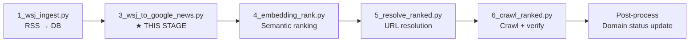
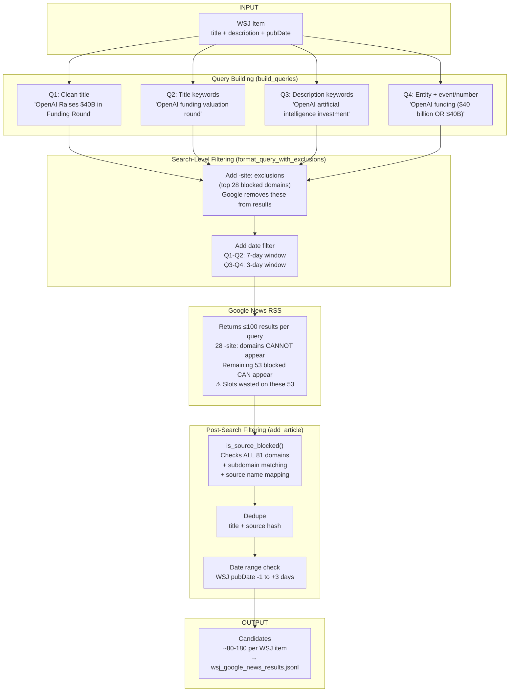
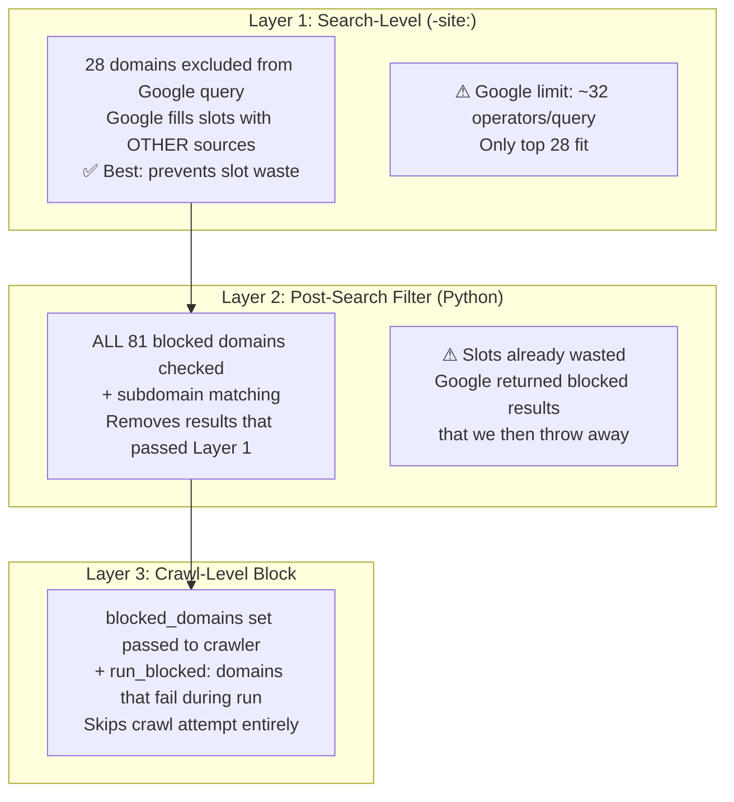

<!-- Updated: 2026-02-23 -->
# Google News Search Pipeline

Detailed documentation for `3_wsj_to_google_news.py` — the search stage that finds free article candidates for each WSJ item.

---

## Pipeline Position



---

## End-to-End Flow



---

## Domain Blocking — Three Layers



### What Each Layer Catches

| Domain | Layer 1 (-site:) | Layer 2 (post-filter) | Layer 3 (crawl) | Net result |
|--------|:-:|:-:|:-:|---|
| facebook.com | ✅ removed at search | backup check | backup check | Never appears |
| reuters.com | ❌ not in top 28 | ✅ removed | backup check | Wastes Google slot, then removed |
| ca.finance.yahoo.com | ✅ via -site:yahoo.com | ✅ subdomain match | ✅ subdomain match | Fully covered |
| some-new-blocked.com | ❌ just added to DB | ✅ in full blocked set | ✅ in full blocked set | Wastes slot first time, then caught |

---

## Scenarios

### Scenario 1: Typical (e.g., "OpenAI funding")

```
Google returns 100 results per query × 3 queries = 300 raw
  - 28 -site: domains: 0 appear (removed at search level)
  - 53 other blocked: ~40 appear across queries (reuters, nytimes...)
  - Non-blocked: ~260 appear
After dedup: ~180 unique
After post-filter (removes 53 blocked): ~140 usable candidates
→ Embedding ranking picks top 5 → Crawl with fallback
✅ Result: Plenty of candidates
```

### Scenario 2: High-profile news (e.g., "Trump tariffs")

```
Google returns 100 × 4 queries = 400 raw
  - 53 other blocked: ~80 appear (big outlets cover this heavily)
  - Non-blocked: ~320 appear
After dedup + post-filter: ~100 usable
→ Top 5 → Crawl
✅ Result: OK but ~80 slots wasted (reuters/bloomberg/nytimes dominate)
```

### Scenario 3: Niche topic (e.g., "Myanmar education reform")

```
Google returns 20 × 2 queries = 40 raw
  - 53 other blocked: ~15 appear
  - Non-blocked: ~25 appear
After dedup + post-filter: ~15 usable
→ Top 5 → Crawl
⚠ Result: Tight. 15 wasted slots hurt more here.
```

### Scenario 4: Worst case (very niche + tight date)

```
Google returns 8 × 2 queries = 16 raw
  - 53 other blocked: ~10 appear
  - Non-blocked: ~6 appear
After dedup + post-filter: ~4 usable
→ Maybe 1-2 above embedding threshold
❌ Result: High risk of no good candidate. WSJ item may fail.
```

---

## Current Problem: -site: Priority

Google allows ~32 operators per query. We use 28 for `-site:` + 2 for date = 30.

**Which 28 domains get -site: exclusion matters.** Currently sorted by domain name length (shorter first). This is a poor proxy for Google News frequency:

| In -site: (length-sorted) | Google News freq | Should be in? |
|---|---|---|
| azat.tv (7 chars) | 0 appearances | ❌ No — never appears |
| wqow.com (8 chars) | 0 appearances | ❌ No — never appears |
| reuters.com (11 chars) | 234 appearances | ✅ Yes — high frequency |
| nytimes.com (11 chars) | 139 appearances | ✅ Yes — high frequency |
| bloomberg.com (13 chars) | 93 appearances | ✅ Yes — high frequency |

### Why `fail_count` from DB Doesn't Work

`wsj_domain_status.fail_count` tracks **crawl failures**, not search appearances:

```
reuters.com    → fail_count = 0  (never crawled — blocked before crawl stage)
bloomberg.com  → fail_count = 0  (same reason)
facebook.com   → fail_count = 0  (same reason)
```

Blocked domains are filtered out before crawling, so they never accumulate fail_count.

**Note**: As of 2026-02-23, "domain blocked" crawl errors are excluded from `fail_count`/`success_count` aggregation. Previously, circular blocking (domain blocked → error recorded → fail_count increases) inflated failure counts for domains like facebook.com (58 failures / 0 successes, yet still "active"). The aggregation now skips these rows from counts but still ensures the domain stays `status='blocked'` — if a domain has only "domain blocked" errors and no real crawl data, it's preserved as blocked.

### Solution: `search_hit_count` Tracking

Implemented in `3_wsj_to_google_news.py`:

1. **Track**: Module-level `_search_hit_counter` dict counts every domain appearance in Google News results BEFORE the `is_source_blocked()` filter.
2. **Save**: `save_search_hit_counts()` flushes accumulated counts to `wsj_domain_status.search_hit_count` at end of each pipeline run (additive across runs).
3. **Prioritize**: `format_query_with_exclusions()` sorts DB-blocked domains by `search_hit_count DESC` (falls back to domain length ASC if column doesn't exist).

```
DB migration required:
ALTER TABLE wsj_domain_status ADD COLUMN IF NOT EXISTS search_hit_count INTEGER DEFAULT 0;
```

After a few pipeline runs, the sort order self-corrects: reuters.com (234 hits) → position 1, azat.tv (0 hits) → dropped off the 28-slot list.

---

## Key Functions

| Function | Purpose |
|---|---|
| `build_queries()` | Generate 1-4 search queries (clean title + LLM queries) |
| `format_query_with_exclusions()` | Add -site: for top 28 blocked domains (sorted by search_hit_count) |
| `add_date_filter()` | Add date range to query (±1 day = 3-day window) |
| `search_google_news()` | HTTP GET to Google News RSS, parse XML |
| `search_multi_query()` | Fire all queries, union + dedup + filter |
| `is_source_blocked()` | Check domain against all blocked + subdomains + non-English |
| `_is_domain_blocked()` | Subdomain-aware domain matching |
| `_dedupe_subdomains()` | Remove child domains when parent exists |

## Query Strategy

| Query | Source | Purpose |
|---|---|---|
| Q1 | Clean title (strip "- WSJ" branding) | Most reliable — news titles are search-optimized |
| Q2 | `llm_search_queries[0]` (from 2_wsj_preprocess.py) | LLM-optimized alternative phrasing |
| Q3 | `llm_search_queries[1]` | Different angle / entities |
| Q4 | `llm_search_queries[2]` | Broader coverage |

All queries use 3-day window (pubDate ±1 day). If no LLM queries, only Q1 is used.

---

## Data Flow

```
Input:  scripts/output/wsj_items.jsonl          (from 1_wsj_ingest.py --export)
Output: scripts/output/wsj_google_news_results.jsonl  (candidates per WSJ item)
        scripts/output/wsj_instrumentation.jsonl       (per-query metrics)
        scripts/output/wsj_searched_ids.json           (IDs to mark as searched)
```

---

## Changelog

### 2026-02-21

| Change | Before | After |
|--------|--------|-------|
| Date window | Q1-Q2: 7 days, Q3-Q4: 5 days | **All queries: 3 days (±1 day)** |
| `-site:` exclusions | wsj.com only | **wsj + reuters + bloomberg + ft + nytimes + barrons** |
| `load_wsj_jsonl` | Hardcoded 9-field dict reconstruction | **Pass-through (all JSONL fields preserved)** |
| Domain blocking | Hardcoded list + DB | **DB-only** (`wsj_domain_status`) |
| Source filtering | `EXCLUDED_SOURCES` + `SOURCE_NAME_TO_DOMAIN` | **Removed** (DB handles all) |
| Post-fetch date check | Python-side re-validation | **Removed** (Google `after:/before:` sufficient) |
