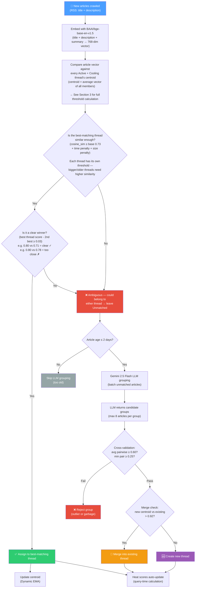
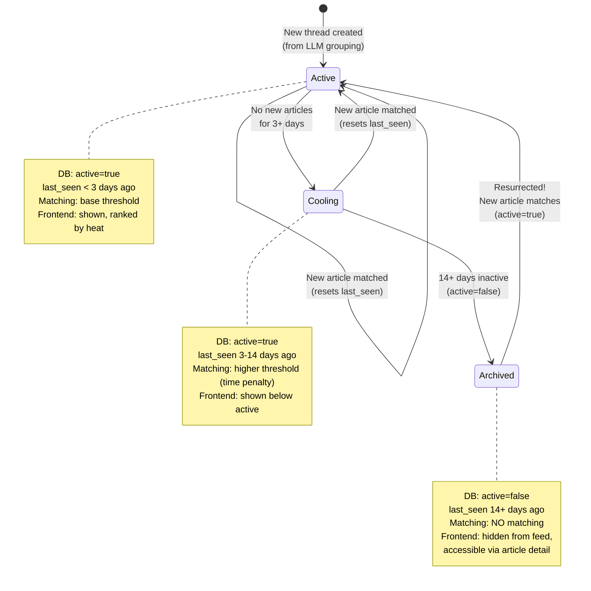
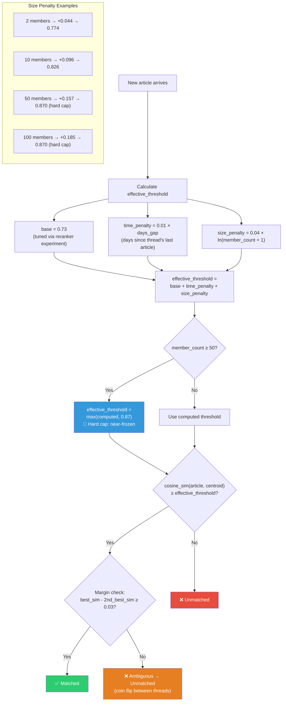
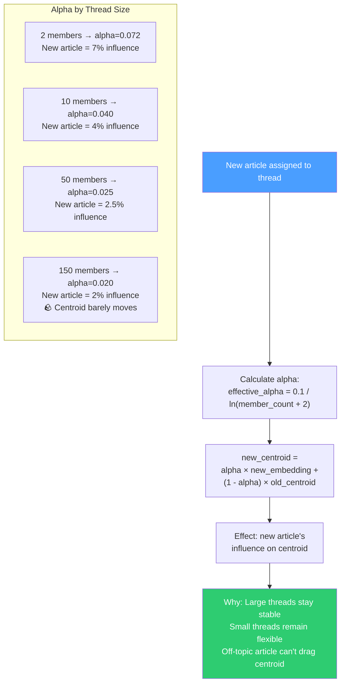
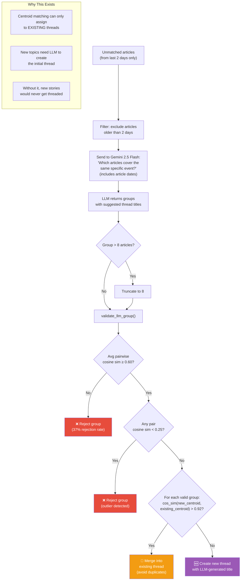
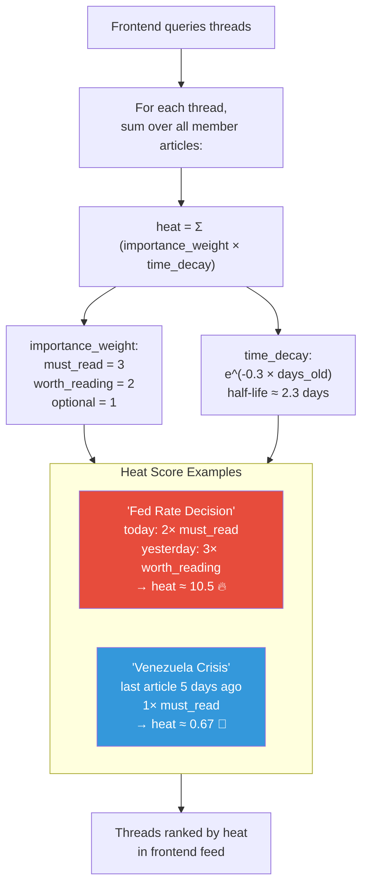
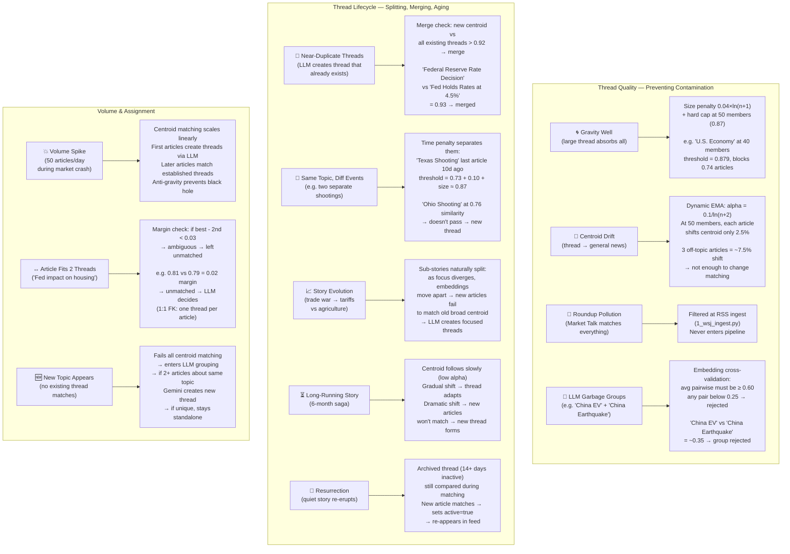
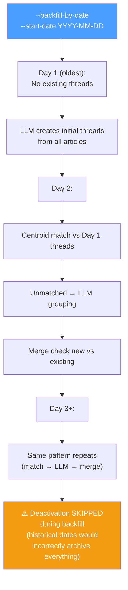
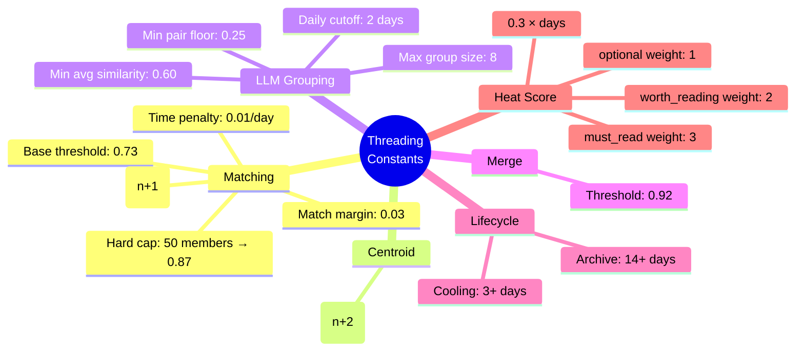

<!-- Updated: 2026-02-28 -->
# News Threading System — Visual Guide (Mermaid)

Companion to `1.2-news-threading.md`. Every section visualized as Mermaid diagrams.

---

## 1. Daily Pipeline Flow

---

## 2. Thread Lifecycle

---

## 3. Dynamic Threshold (Anti-Gravity)

---

## 4. Centroid Update (Dynamic EMA)

---

## 5. LLM Grouping + Cross-Validation

---

## 6. Heat Score

---

## 7. Edge Cases

---

## 8. Backfill Strategy

---

## 9. Algorithm Constants

