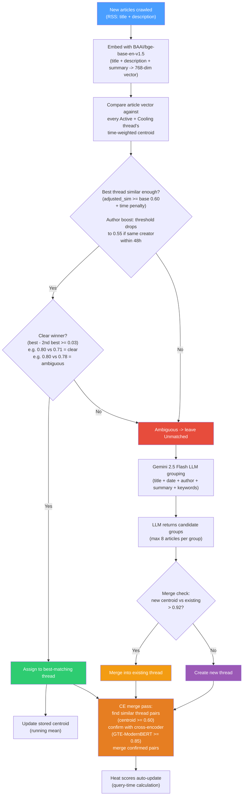
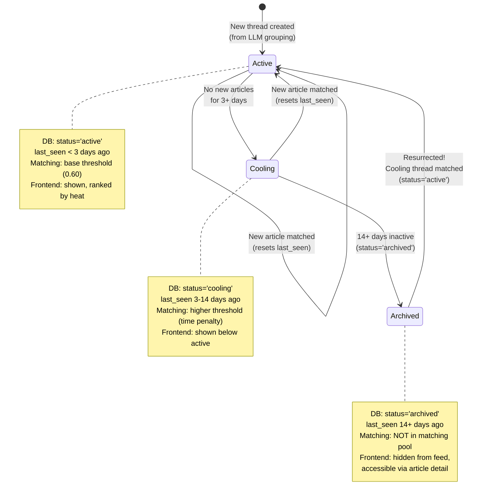
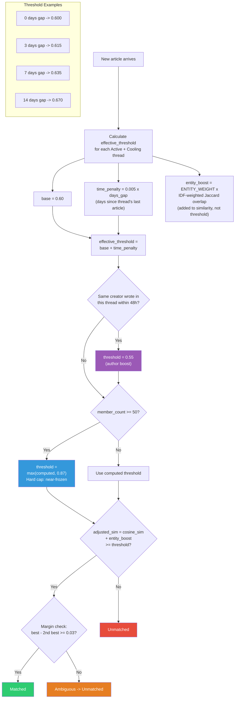
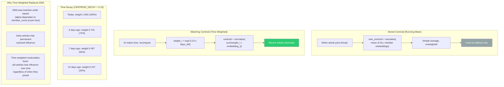
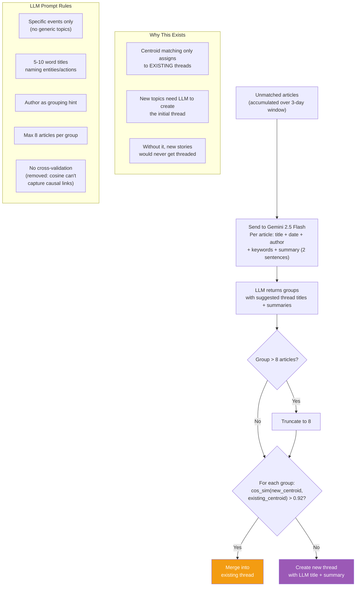
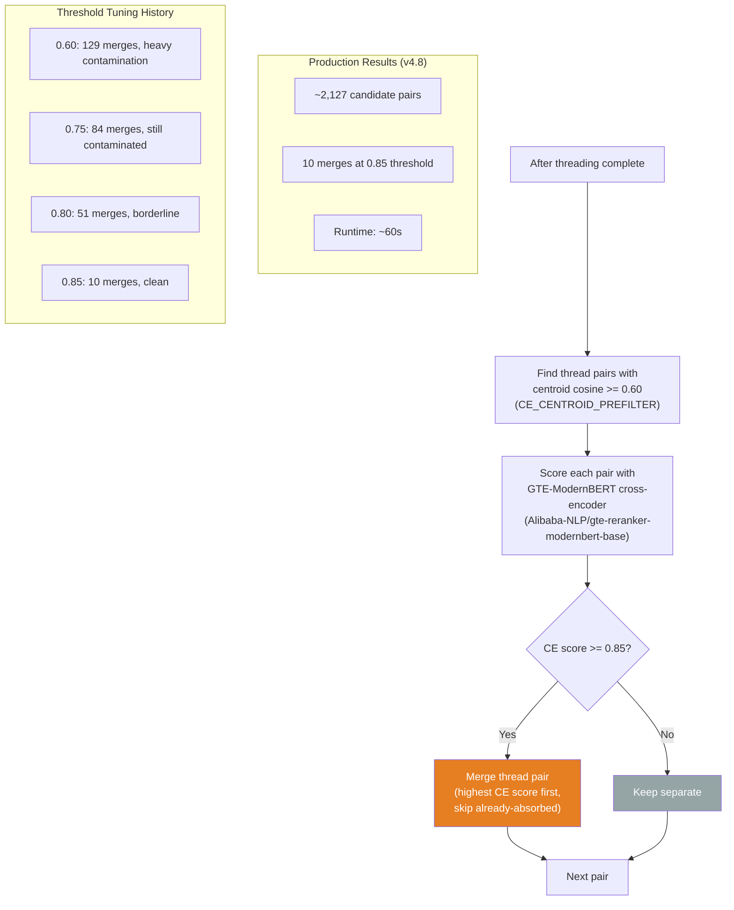
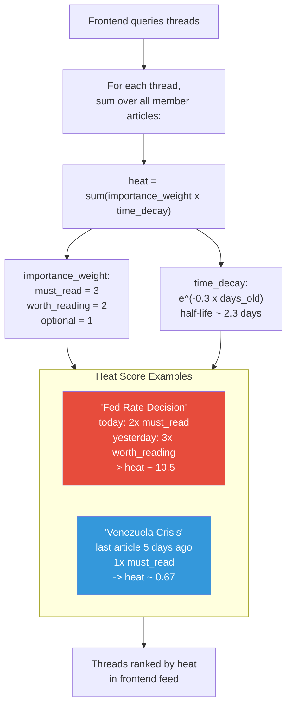
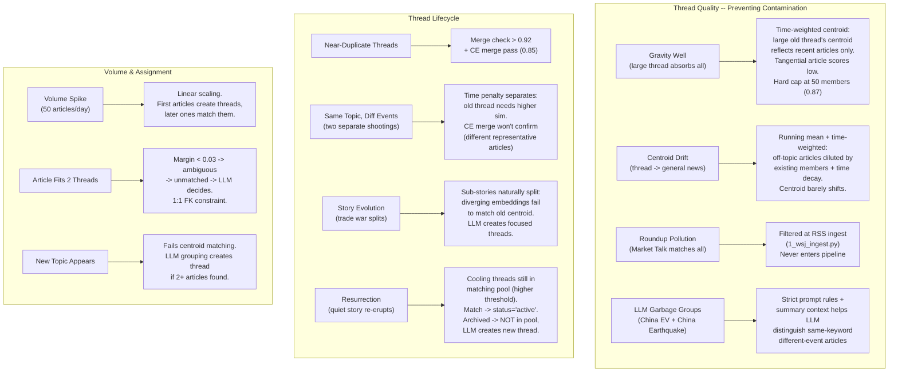
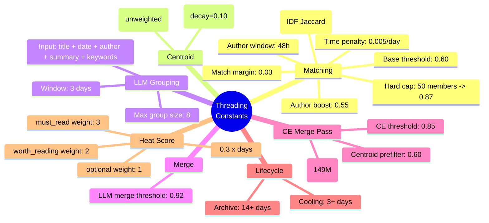

<!-- Updated: 2026-03-05 -->
# News Threading System — Visual Guide (Mermaid)

Companion to `1.3-news-threading.md`. Every section visualized as Mermaid diagrams.

---

## 1. Daily Pipeline Flow

---

## 2. Thread Lifecycle

---

## 3. Dynamic Threshold

---

## 4. Centroid: Storage vs Matching

---

## 5. LLM Grouping

---

## 6. CE Merge Pass

---

## 7. Heat Score

---

## 8. Edge Cases

---

## 9. Backfill Strategy

```mermaid
flowchart TD
    subgraph GOLDEN ["Golden Seed (Recommended)"]
        G1["--seed-golden path/to/golden.json"]
        G2["Resets all thread assignments"]
        G3["Creates 170 threads from<br/>golden dataset v2.1 (612 articles)"]
        G4["Then run normal pipeline<br/>to match remaining articles"]
        G1 --> G2 --> G3 --> G4
    end

    subgraph CHRONO ["Chronological Backfill (Legacy)"]
        C1["--backfill-by-date --start-date YYYY-MM-DD"]
        C2["Day 1: LLM creates initial threads"]
        C3["Day 2+: centroid match -> LLM -> merge"]
        C4["WARNING: Can create mega-threads<br/>due to snowball at low threshold"]
        C1 --> C2 --> C3 --> C4
    end

    style G4 fill:#2ecc71,color:#fff
    style C4 fill:#e74c3c,color:#fff
```

---

## 10. Algorithm Constants

