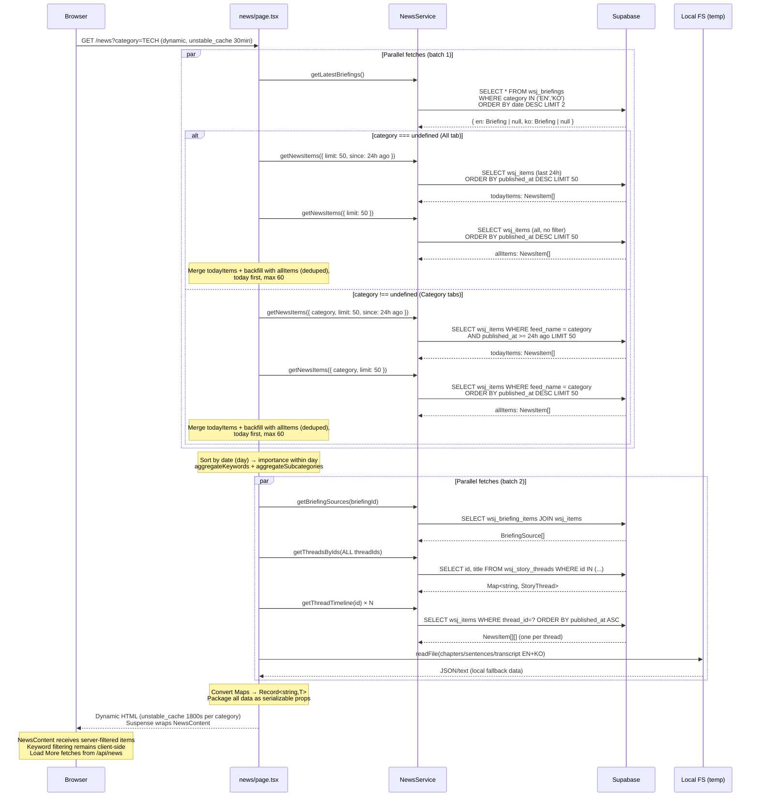
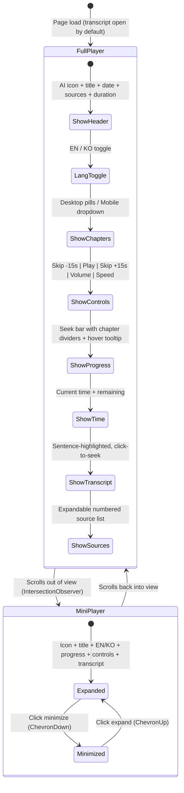
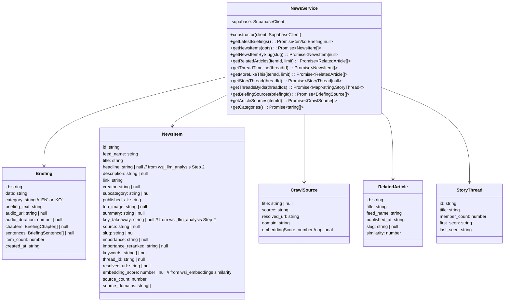
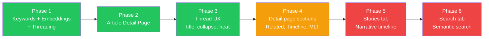

<!-- Updated: 2026-03-04 -->
<!-- NOTE: Updated to reflect SOURCE_SIMILARITY_THRESHOLD=0.75, embedding_score in queries, BriefingPlayer logo styling, and UNSAFE_SOURCE_DOMAINS filtering. -->
# News Platform — Frontend

Technical guide for the `/news` page and supporting components. WSJ-style 3-column layout with in-card thread carousels, bilingual audio briefing player, and keyword filtering. Powered by the news pipeline. Branded as Araverus.

**Dynamic + Cache Architecture**: The page has evolved to **route-based category segments** for independent ISR caching. Each category has its own cached page: `/news` (all), `/news/c/tech`, `/news/c/markets`, etc. — each revalidates every 24h independently. The shared data module (`src/app/news/_lib/data.ts`) provides `getNewsData()` and `getStoriesData()` to all routes. Category tabs use `Link` navigation (layout persists, briefing player keeps playing). Server filters articles by `feed_name`; no client-side category filtering. A Load More API route (`/api/news`) enables pagination beyond the initial fetch.

For backend pipeline & threading algorithm details, see `docs/1-news-backend.md` and `docs/1.2-news-threading.md`.

---

## Architecture Overview

```mermaid
graph TB
    subgraph "Supabase (Data)"
        DB_ITEMS[wsj_items<br/>title, feed_name, link, subcategory,<br/>slug, importance, keywords, thread_id]
        DB_CRAWL[wsj_crawl_results<br/>top_image, source, relevance_flag]
        DB_LLM[wsj_llm_analysis<br/>summary, keywords]
        DB_BRIEF[wsj_briefings<br/>briefing_text, audio_url, date,<br/>chapters JSONB, sentences JSONB]
        DB_JUNC[wsj_briefing_items<br/>briefing_id ↔ wsj_item_id]
        DB_THREADS[wsj_story_threads<br/>title, member_count, first_seen, last_seen]
        DB_EMBED[wsj_embeddings<br/>vector(768), BAAI/bge-base-en-v1.5]
    end

    subgraph "Server Layer"
        SVC[NewsService<br/>src/lib/news-service.ts]
        PAGE[news/page.tsx<br/>Server Component]
        LOCAL[Local FS fallback<br/>notebooks/tts_outputs/text/]
    end

    subgraph "Client Components"
        SHELL[NewsShell<br/>Header + Sidebar wrapper]
        CONTENT[NewsContent 🖥️<br/>useSearchParams() filtering<br/>+ full UI rendering]
        PLAYER[BriefingPlayer<br/>HTML5 Audio + Framer Motion<br/>EN/KO toggle, chapters, transcript]
        CARDS[ArticleCard 🖥️<br/>featured / standard<br/>+ thread carousel]
        SRCLIST[SourceList 🖥️<br/>Collapsible source links<br/>detail page only]
        KWPILLS[KeywordPills<br/>Micro-interaction chips with # prefix]
        FILTER[FilterPanel 🖥️<br/>Slide-in right panel: subcategory + keyword filter]
    end

    DB_ITEMS --> SVC
    DB_CRAWL --> SVC
    DB_LLM --> SVC
    DB_BRIEF --> SVC
    DB_JUNC --> SVC
    DB_THREADS --> SVC
    DB_EMBED --> SVC

    SVC --> PAGE
    LOCAL -.->|temp hack| PAGE
    PAGE -->|Suspense| SHELL
    SHELL --> CONTENT
    CONTENT --> PLAYER
    CONTENT --> CARDS
    CONTENT --> KWPILLS
    CONTENT --> FILTER
```

---

## Component Tree

```mermaid
graph LR
    subgraph "news/layout.tsx"
        LAYOUT["NewsLayout<br/>(metadata only)"]
    end

    subgraph "news/page.tsx (Server, unstable_cache 30min)"
        PAGE[NewsPage<br/>unstable_cache 1800s] --> SHELL[NewsShell 🖥️<br/>Client wrapper]
        SHELL --> HEADER[Header<br/>shared component]
        SHELL --> SIDEBAR[Sidebar<br/>shared component]

        PAGE -->|Suspense| NC[NewsContent 🖥️<br/>useSearchParams filtering]
        NC --> TABS[Tab Nav<br/>Today / Stories / Search]
        NC --> CATS[Category Pills<br/>All / Markets / Tech / ...]
        NC --> FP[FilterPanel 🖥️<br/>Slide-in right panel with subcategory + keyword filter]
        NC --> BP[BriefingPlayer 🔊<br/>Client Component (dynamic import)<br/>EN/KO + chapters + transcript]
        NC --> AC[ArticleCard 🖥️<br/>Client Component<br/>featured / standard + thread carousel]
        NC --> BELOW[Below-fold grid<br/>Remaining articles]
    end

    subgraph "news/[slug]/page.tsx (Server)"
        DETAIL[ArticlePage] --> SL[SourceList 🖥️<br/>Collapsible source links]
        DETAIL --> REL[RelatedSection]
        DETAIL --> TL[TimelineSection]
    end
```

---

## Page Layout

### Primary: WSJ 3-Column with In-Card Thread Carousels

```
┌───────────────────────────────────────────────────────────────────┐
│ Header (shared) — Logo | Toggle | Search | Login                  │
├───────────────────────────────────────────────────────────────────┤
│ Today  Stories  Search                                            │  ← tabs (typography-only)
│ [All] [Markets] [Tech] [Economy] [World] [Politics]  [⊞ Filter]  │  ← category pills + toggle
├───────────────────────────────────────────────────────────────────┤
│                                                                    │
│  ┌─ Left 3/12 ──┐  ┌─ Center 6/12 ──────────┐  ┌─ Right 3/12 ─┐│
│  │ standard      │  │ BriefingPlayer          │  │ standard      ││
│  │ cards [1-5]   │  │ Featured hero card [0]  │  │ standard      ││
│  │ (no images)   │  │ + below-fold 2-col [12+]│  │ cards [6-11]  ││
│  │ + thread ◀▶   │  │ + thread ◀▶             │  │ + thread ◀▶   ││
│  └───────────────┘  └────────────────────────┘  └──────────────┘│
│                                                                    │
│  ── Below fold: 3-col grid of remaining stories [16+] ──────────  │
└───────────────────────────────────────────────────────────────────┘
```

#### Article Sorting & Deduplication (date-first, importance within day, thread-aware)

Articles are sorted in `sortByDateThenImportance()` before slicing into columns:
1. **Calendar date** (newest day first): Groups articles by date, ensuring today's articles always appear before yesterday's
2. **Importance** (within same day): `must_read` → `worth_reading` → `optional` (null treated as optional). Uses `importance_reranked` when available, falls back to `importance`.
3. **Crawled**: Articles with `summary` (crawled + LLM analyzed) rank higher — richer card content
4. **Thread preference**: Articles with `thread_id` rank higher (threaded stories are more significant)
5. **Recency**: Newer articles first within the same tier

**Thread-based Deduplication (24h boundary)**:
- **Within 24 hours**: All thread members appear as independent cards (full coverage, readers see all angles)
- **After 24 hours**: Only the highest-ranked article per thread is shown (dedup older threads, reduce visual clutter). Remaining thread members are accessible via in-card carousel navigation.

#### Featured Hero Selection
The featured center hero is **not** simply `items[0]`. `NewsContent.tsx` finds the first `must_read` article with a summary via `findIndex()`. This ensures the most important article gets the hero slot regardless of its position in the date-sorted list. Falls back to `items[0]` if no `must_read` article exists.

#### Card Slicing
- `featured` → center hero (first `must_read` with summary, or `items[0]`)
- `remaining` → all items except the featured one
- `leftStories = remaining[0..4]` → left column (5 cards, no images)
- `rightStories = remaining[5..10]` → right column (6 standard cards)
- `belowFold = remaining[11..]` → center 2-col grid (first 4) + 3-col grid (rest)

#### Thread Carousel (in-card)
Cards with `thread_id` show a thread indicator at the bottom:
```
┌─────────────────────────────────────┐
│ ★ ECONOMY  12h ago                  │
│ U.K. Inflation Slowed in January    │
│ UK inflation fell to 3.0%...        │
│ [inflation] [Bank of England]       │
│ via 5 sources                       │
│─────────────────────────────────────│
│ ◀  8/8  ▶  US Inflation Slows... 📰│  ← thread indicator
└─────────────────────────────────────┘
```
- Starts at **the card's own article** in the timeline (found via `itemId`), falls back to latest article if not found
- ◀ navigates to older articles, ▶ to newer
- Framer Motion slide animation (0.25s)
- Disabled at boundaries (first/last)

### Mobile (partial — player done, article grid TBD)

```
Mobile (< 768px):
┌──────────────────────────┐
│ BriefingPlayer (order-first)│  ← full player at top
│ AI icon (white bg) + title + EN/KO     │
│ ▼ Chapter dropdown (select) │  ← pills replaced by dropdown
│ ⏪ ▶ ⏩ 🔊 1.25x           │  ← controls + volume + speed
│ [───────●────────] 3:42     │  ← progress bar
│ Transcript (text-xs)         │  ← responsive font
│ Double-tap left/right = skip │
├──────────────────────────┤
│ Articles (single column)     │
├──────────────────────────┤
│ Mini-player (fixed bottom)   │  ← when scrolled past
│ Minimize/expand toggle       │
└──────────────────────────┘
```

---

## Data Flow



---

## File Map

| File | Type | Purpose |
|------|------|---------|
| `src/app/news/layout.tsx` | Server | Metadata only (`title`, `description`) |
| `src/app/news/loading.tsx` | Server | Skeleton UI shown during server data fetching (Next.js auto-wraps with Suspense) |
| `src/app/news/page.tsx` | Server | Data fetching (unstable_cache 30min), server-side category filtering via searchParams, `generateMetadata()` for SEO, sorts by date→importance |
| `src/app/news/_components/NewsContent.tsx` | Client | Keyword filtering (client-side), featured hero selection, Load More button, renders nav bar + article grid + briefing player |
| `src/app/api/news/route.ts` | Server | Load More API: `GET /api/news?category=X&offset=N&limit=N` → `{ items, hasMore }`, Cache-Control 30min |
| `src/app/news/[slug]/page.tsx` | Server | Article detail page with metadata, related articles, story timeline |
| `src/app/news/[slug]/_components/ArticleHeroImage.tsx` | Client | Hero image wrapper with `onError` fallback — hides container when image fails to load |
| `src/app/news/[slug]/_components/RelatedSection.tsx` | Server | Numbered list with similarity score bars (pgvector, 7-day, excludes timeline articles) |
| `src/app/news/[slug]/_components/TimelineSection.tsx` | Client | Collapsible vertical timeline — shows last 5, "Show N older..." expand, sticky "Show less" bar |
| `src/app/news/_components/NewsShell.tsx` | Client | Header + Sidebar wrapper (sidebar starts closed, shifts content on open). Mobile: `pt-14`, desktop: `pt-20` |
| `src/app/news/_components/BriefingPlayer.tsx` | Client | Bilingual audio player with chapters, transcript, sticky mini-player, theme object |
| `src/app/news/_components/ArticleCard.tsx` | Client | Article display (featured/standard) + framer-motion thread carousel |
| `src/app/news/_components/SourceList.tsx` | Client | Collapsible source list for article detail page — shows WSJ + crawl candidates with favicons |
| `src/app/news/_components/FilterPanel.tsx` | Client | Filter slide-in right panel (fixed positioning, floats on viewport right edge desktop), backdrop overlay on mobile |
| `src/app/news/_components/KeywordPills.tsx` | Server | Inline dot-separated keyword text with optional link behavior + active state |
| ~~`src/app/news/_components/ThreadSection.tsx`~~ | ~~Client~~ | **Deleted** — replaced by in-card thread carousels |
| `src/lib/news-service.ts` | Server | `NewsService` class (Supabase queries, bilingual briefings, threads, related articles) |
| `src/app/globals.css` | Shared | WSJ design tokens (`--color-news-*`) |
| `next.config.ts` | Config | `remotePatterns` for external images |
| `public/audio/` | Static | TTS audio files (WAV, served statically) |
| `notebooks/tts_outputs/text/` | Local | Chapters, sentences, transcript JSON/text (temp fallback) |

---

## Page Helper Functions

Defined in `src/app/news/page.tsx` (server-side, not exported):

### `sortByDateThenImportance(items: NewsItem[])`
Sorts articles by calendar date (newest day first), then within same day by importance → crawled → threaded → recency.

### `aggregateKeywords(items: NewsItem[])`
Collects keywords from all articles, counts occurrences, returns top 20 sorted by frequency.

### `aggregateSubcategories(items: NewsItem[])`
Collects subcategories from all articles, capitalizes for display (short names like "ai" → "AI", others → "Trade"), returns all sorted by frequency.

### `threadPropsFor(item: NewsItem)` (in `NewsContent.tsx`)
Returns `{ threadTimeline, threadTitle }` for an article. Looks up pre-fetched `threadTimelines` and `threadMeta` objects (`Record<string, T>`, converted from Maps for serialization). Returns `null` for articles without `thread_id`.

---

## URL Routes & Parameters

### Route Segments (ISR 24h)

Categories are now implemented as **route segments** instead of query params — each page is independently ISR cached:

| Route | Audience | ISR TTL | Data Source |
|-------|----------|---------|-------------|
| `/news` | All articles (all feeds) | 86400s | `getNewsData()` — no feed_name filter |
| `/news/c/tech` | Tech articles | 86400s | `getNewsData(feedName: 'TECH')` |
| `/news/c/markets` | Markets articles | 86400s | `getNewsData(feedName: 'BUSINESS_MARKETS')` |
| `/news/c/economy` | Economy articles | 86400s | `getNewsData(feedName: 'ECONOMY')` |
| `/news/c/world` | World articles | 86400s | `getNewsData(feedName: 'WORLD')` |
| `/news/c/politics` | Politics articles | 86400s | `getNewsData(feedName: 'POLITICS')` |

**Legacy URL redirect**: Old `/news?category=TECH` URLs redirect (301) to `/news/c/tech` via `next.config.ts`.

**Navigation**: Category tabs in `NewsContent.tsx` use `<Link>` to navigate between routes. Layout persists (no full-page reload), and the `BriefingPlayer` continues playing across category switches.

**Shared Data Module**: `src/app/news/_lib/data.ts` exports:
- `getNewsData(feedName?: string)` — fetches articles, optionally filtered by `feed_name`
- `getStoriesData()` — fetches threaded stories for the Stories tab
- `CATEGORY_SLUG_MAP` — maps route slugs to feed names (`{ tech: 'TECH', markets: 'BUSINESS_MARKETS', ... }`)

### Search Params (within each route)

Query parameters only affect **within-page filtering** (no route changes):

| Param | Example | Purpose |
|-------|---------|---------|
| `tab` | `?tab=stories` | Switch tab (default: `today`) — read in `NewsContent` via `useSearchParams()` |
| `keywords` | `?keywords=Fed,Trade` | Multi-select OR filter by keyword/subcategory (comma-separated) |
| `keyword` | `?keyword=Fed` | Legacy single-keyword filter (auto-migrated to `keywords`) |

Example: `/news/c/tech?tab=stories&keywords=AI,Trade` — load Tech category Stories tab with AI+Trade filter.

**Critical**: `searchParams` is read **only** in the Client Component `NewsContent` via `useSearchParams()`, never in the Server Component `page.tsx`. This preserves ISR caching (see `docs/2.3-caching-strategy.md` Rule #1).

### Tab Structure

| Tab | Content | Status |
|-----|---------|--------|
| **Today** | Audio player + thread groups + keyword filter + category filter | Implemented |
| **Stories** | Narrative timeline — story threads across days/weeks | Placeholder |
| **Search** | Semantic search over all articles via pgvector | Placeholder |

### Category Slug Map

```typescript
// src/app/news/_lib/data.ts
export const CATEGORY_SLUG_MAP: Record<string, string> = {
  tech: 'TECH',
  markets: 'BUSINESS_MARKETS',
  economy: 'ECONOMY',
  world: 'WORLD',
  politics: 'POLITICS',
}

// UI Constants (for breadcrumbs, category labels)
export const CATEGORY_LABELS: Record<string, string> = {
  '': 'All News',
  tech: 'Tech',
  markets: 'Markets',
  economy: 'Economy',
  world: 'World',
  politics: 'Politics',
}
```

All categories are rendered as tabs/pills in `NewsContent.tsx`:
- Active category determined by route segment `/news/c/[category]` or `/news` (all)
- Tab navigation uses `<Link href={`/news/c/${slug}`}>` (no full reload, layout persists)

---

## Component Props

### BriefingPlayer

```typescript
interface BriefingPlayerProps {
  date: string              // "Feb 17, 2026"
  duration: number          // seconds (0 = auto-detect from metadata)
  sourceCount?: number      // from briefingSources.length (actual articles covered)
  sources?: BriefingSource[] // from wsj_briefing_items join
  en?: BriefingLangData     // English audio + chapters + transcript + sentences
  ko?: BriefingLangData     // Korean audio + chapters + transcript + sentences
  defaultLang?: 'en' | 'ko' // defaults to 'en'
}

interface BriefingLangData {
  audioUrl: string
  chapters?: BriefingChapter[]   // chapter markers on seek bar
  transcript?: string            // full text for plain reading view
  sentences?: BriefingSentence[] // sentence-level timestamps for highlighting
}

interface BriefingChapter {
  title: string
  position: number // 0.0–1.0 ratio into audio duration
}

interface BriefingSentence {
  text: string
  start: number // seconds
  end: number   // seconds
}

interface BriefingSource {
  title: string
  feed_name: string
  link: string
  source: string | null
}
```

#### Theme System
Uses a `const T` theme object with semantic color tokens (wrapper, text, muted, dim, surface, accent, etc.) replacing 52+ hardcoded Tailwind classes. Chrome metallic gradient accent: `from-gray-300 via-gray-500 to-gray-300`.

#### Player Controls
- **Play/Pause**: Large white circle button with scale animation
- **Skip +/-15s**: RotateCcw / RotateCw buttons with "15" overlay
- **Seek**: Click-to-seek gradient progress bar with YouTube-style segment dividers (no dots) + mouse-following hover tooltip showing time + chapter name
- **Speed**: Hover to show popup dropdown (above controls), click to cycle through 1x / 1.25x / 1.5x / 2x. Same pattern for full and mini player.
- **Volume**: Hover to show vertical popup slider (`writing-mode: vertical-lr`), click to mute/unmute. Same pattern for full and mini player.
- **EN/KO Toggle**: Switch between English and Korean audio (resets playback position)
- **Chapters**: Desktop: equal-width pill buttons with glow ring (`ring-2 ring-white/40 shadow-glow`) on active, `hover:scale-105 hover:-translate-y-0.5`. Mobile: dropdown select showing current chapter, tap to expand list.
- **Transcript**: Default open. Sentence-level highlighting grouped by chapter headings (gray-300 color). Click any sentence to seek to its start. Custom smooth scroll animation (800ms cubic ease-in-out, targets upper 1/3 of container). Auto-scroll works even when paused.
- **Sources**: Expandable scrollable list (Framer Motion) with numbered articles (larger font), categories, external links. Custom thin scrollbar styling.
- **Keyboard**: Space (play/pause), Arrow Left/Right (+/-15s), Arrow Up/Down (volume — updates UI state), M (mute)
- **Mobile**: Double-tap left/right side of controls area to skip -/+15s. Responsive font sizes (text-xs sm:text-sm).
- **Resume**: Saves playback position to localStorage keyed by `briefing-resume:{date}:{lang}`. New briefing dates always start at 0:00; same-day revisits resume where the user left off. (Audio URL is a fixed path `briefing-{lang}-latest.mp3` that gets overwritten daily, so URL alone can't distinguish briefings.)

#### Sticky Mini-Player
When the full player scrolls out of view (IntersectionObserver), a mini-player appears via `createPortal` to `document.body`:
- Fixed to bottom of viewport with Framer Motion spring animation
- Shows: AI icon, title (marquee on overflow), EN/KO toggle, progress bar, play/pause, volume mute, speed, transcript toggle, minimize/expand
- Minimize mode: hides title, speed, EN/KO, transcript; shows only icon + progress + play + volume + expand button
- Transcript: fixed height (`h-10`) to prevent layout shift, responsive font
- Volume and speed use same hover/click popup pattern as full player

#### Page Layout Change
`page.tsx`: BriefingPlayer rendered as a separate CSS grid item with `order-first` for mobile (player at top) and `lg:col-start-4 lg:col-span-6 lg:row-start-1` for desktop center column.



### ArticleCard (Client Component)

```typescript
interface ArticleCardProps {
  headline: string  // from wsj_llm_analysis; fallback to title
  summary: string | null
  source: string | null
  category: string
  timestamp: string
  imageUrl: string | null
  link: string
  variant?: 'featured' | 'standard'
  slug?: string | null           // links to /news/[slug] if present
  importance?: string | null     // must_read / worth_reading / optional
  keywords?: string[] | null
  activeKeywords?: string[]      // multi-select filter keywords
  itemId?: string                // ID of this article; used to position carousel at self in thread timeline
  threadTimeline?: NewsItem[] | null  // full thread timeline
  threadTitle?: string | null    // thread display name
  sourceCount?: number           // number of crawl candidates (from source_count)
}
```

- **featured**: Wide hero image (2.5:1 aspect ratio), centered headline (headline || title fallback), full summary. Meta row shows "via N sources" text. Image has `onError` fallback — hides broken images gracefully.
- **standard**: Meta row (category/time + "via N sources") on top, then image (112px left-aligned thumbnail) + text side-by-side. headline || title (line-clamp-2) + summary + keywords. Cards with thread carousel use fixed height (`h-36` + `overflow-hidden`) to prevent layout shift on arrow navigation. `must_read` articles get glow shadow styling instead of border-left. Image has `onError` fallback — hides broken images gracefully.
- **Source display**: Replaced individual favicon pills with plain "via N sources" text in the meta row. Source count comes from `NewsItem.source_count` (1 WSJ + crawl results where `embedding_score >= 0.75` OR `relevance_flag = 'ok'`, with `resolved_url` not null).
- **Thread carousel**: When `threadTimeline.length > 1`, shows ◀ N/M ▶ indicator at card bottom. Carousel starts at the article displayed by the card (using `itemId` to find position in timeline), allowing users to browse related articles within the thread. Framer Motion slide animation.
- **ImportanceBadge**: Star icon for `must_read` articles

### KeywordPills

```typescript
interface KeywordPillsProps {
  keywords: string[]
  activeKeywords?: string[]  // multi-select active keywords
  linkable?: boolean  // when true, keywords are links toggling ?keywords= param
}
```

Renders as micro-interaction chips: `#Trade`, `#AI`, `#Earnings`. Alphabetically sorted, capitalized. Visual style: `bg-neutral-100 rounded-full` with `#` prefix. Hover `scale-105 shadow-md` with spring cubic-bezier. Centered layout (`justify-center`). Mobile uses `py-2.5 text-sm` for tap targets.

### FilterPanel (Client Component)

```typescript
interface FilterPanelProps {
  allSubcategories: { keyword: string; count: number }[]
  allKeywords: { keyword: string; count: number }[]
  activeKeywords: string[]
  isOpen: boolean
  onClose: () => void
}
```

Fixed right-side slide-in panel (320px width on desktop, full width on mobile with backdrop overlay). Toggle button floats on right viewport edge, vertically centered. Two sections separated by a divider:
- **Subcategory**: Aggregated from `wsj_items.subcategory` (capitalized: "ai" → "AI", "trade" → "Trade")
- **Keywords**: Aggregated from 7-day / 200-article fetch (not just displayed articles)

Each keyword uses `py-2.5 text-sm` for mobile tap targets. Click to toggle `?keywords=` URL param. OR filtering: articles matching ANY selected keyword or subcategory are shown. Framer Motion slide-in animation. Content area gets `lg:pr-72` on desktop to push left (no overlay). Mobile uses backdrop overlay behind panel.

### NewsContent (Client Component)

Renders tab navigation (Today / Stories / Search) and category pills with filtering. Handles keyword/subcategory client-side filtering, featured hero selection, and Load More pagination.

**Tab Nav Styling**: Typography-only hierarchy (no underline, no background). Active: `text-base font-semibold`. Inactive: `text-base font-normal text-neutral-400`. Smooth transition on selection.

**Category Pills Styling**: Horizontal pill buttons with `text-xs uppercase tracking-widest` underline style (kept from original). Padding `px-8` (increased from `px-6`). Category tabs now use same today-first + backfill logic as All tab (not simple limit-40). Keywords aggregated from 7-day / 200-article fetch instead of just displayed articles.

**Column Balance**: Left/right columns now balanced — `sideCount = min(floor(remaining/2), 5)` instead of hardcoded 5/6.

### SourceList (Client Component)

```typescript
interface SourceListProps {
  sources: CrawlSource[]  // from getArticleSources()
  wsjUrl: string          // original WSJ article link
  wsjTitle: string        // WSJ article title
}
```

Collapsible source list used on the `/news/[slug]` detail page. Replaces the old "Read on {source}" button. Returns `null` when no sources exist.
- Shows WSJ link first (always visible), then crawl candidate sources
- Sources sorted: trusted domains first (by embedding score), then others (by embedding score)
- Minimum embedding_score threshold (0.75) filters off-topic results
- First 4 sources visible by default, expandable "+N more" button
- Each row: larger favicon (20px, Google S2 API) + title/source name + domain label + external link arrow
- Hover state: `hover:bg-neutral-50`, `divide-y` between rows
- Header style matches RelatedSection: `font-serif text-lg border-b-2 border-neutral-900`

### ArticlePage Component (`/news/[slug]`)

Article detail page layout with semantic structure:

1. **Breadcrumb** (replacing back nav): `News / Tech / AI` style with smart subcategory formatting — 3 chars or less = ALL CAPS, rest = Title Case. `text-sm` with `mb-3`.
2. **Hero Image**: Full-width, aspect ratio maintained via wrapper.
3. **Keywords**: Below image, centered, using `hashtag` variant with `linkable` prop (KeywordPills component). `justify-center` layout.
4. **Headline & Badge**: Serif headline using `headline || title` fallback, with optional `must_read` badge displayed inline with category.
5. **Timestamp & Share Bar**: Share icons moved to right-aligned position above hero. Timestamp styled as `text-base` (increased from `text-sm`).
6. **Summary**: Split into paragraphs. First sentence = bold lead text. Remaining grouped 2 sentences per `<p>` tag. Body narrowed to `max-w-2xl`.
7. **Key Takeaway** (new): Amber callout box with `key_takeaway` text, placed after keywords and before summary. Styled consistently with other callout sections. Shows only when `key_takeaway` is available.
8. **SourceList**: Header style matches RelatedSection (`font-serif text-lg border-b-2 border-neutral-900`). Shows "Originally reported as:" when `headline` differs from WSJ `title`. Hidden when no sources and no WSJ URL (returns null).
9. **TimelineSection**: Collapsible, shows last 5 articles with "Show N older..." expand.
10. **RelatedSection**: Numbered list with pgvector similarity score bars (7-day window, excludes timeline articles).

---

## NewsService API



### Method Details

| Method | Query | Returns |
|--------|-------|---------|
| `getLatestBriefings()` | `wsj_briefings WHERE category IN ('EN','KO') ORDER BY date DESC LIMIT 2` | `{ en: Briefing \| null, ko: Briefing \| null }` |
| `getNewsItems(opts)` | `wsj_items LEFT JOIN wsj_crawl_results LEFT JOIN wsj_llm_analysis` — **visibility gate:** filters out articles with no crawl results (must have `crawl_status='success'` + `relevance_flag='ok'`). Fetches all crawl candidates per article, picks the `relevance_flag='ok'` result for display data, counts all candidates for `source_count`. Unsafe domains (UNSAFE_SOURCE_DOMAINS set) have source/resolved_url nulled out. | `NewsItem[]` (flattened; crawl/LLM fields are null for uncrawled articles) |
| `getNewsItemBySlug(slug)` | `wsj_items WHERE slug=? JOIN crawl+llm` filtered by `relevance_flag='ok'` | `NewsItem \| null` |
| `getRelatedArticles(itemId, limit)` | `match_articles` RPC (pgvector, ±7 days) | `RelatedArticle[]` |
| `getThreadTimeline(threadId)` | `wsj_items WHERE thread_id=? LEFT JOIN wsj_crawl_results LEFT JOIN wsj_llm_analysis` — same flattening logic as `getNewsItems`, picks ok crawl, counts all candidates | `NewsItem[]` |
| `getArticleSources(itemId)` | `wsj_crawl_results WHERE wsj_item_id=? AND resolved_url IS NOT NULL AND (embedding_score >= 0.73 OR relevance_flag = 'ok') ORDER BY embedding_score DESC` — filters out unsafe domains, sorts trusted domains (TRUSTED_SOURCE_DOMAINS ~70 domains) first within embedding score order | `CrawlSource[]` |
| `getStoryThread(threadId)` | `wsj_story_threads WHERE id=?` | `StoryThread \| null` |
| `getThreadsByIds(threadIds)` | `wsj_story_threads WHERE id IN (...)` | `Map<string, StoryThread>` |
| `getBriefingSources(id)` | `wsj_briefing_items JOIN wsj_items JOIN wsj_crawl_results` | `BriefingSource[]` |
| `getCategories()` | `SELECT DISTINCT feed_name FROM wsj_items WHERE processed=true` | `string[]` |

---

## Design Decisions

### Layout & Navigation

| Decision | Original Plan | Actual Implementation | Rationale |
|----------|--------------|----------------------|-----------|
| Layout | Standalone masthead | Shared Header + Sidebar via `NewsShell` | User wanted consistent site feel |
| Primary layout | Thread-grouped single column | WSJ 3-column (3/6/3) with in-card thread carousels | Today's articles as priority; thread history is bonus UX via carousel |
| Thread display | Collapsible ThreadSection groups | In-card ◀▶ carousel per article | Less visual noise; thread is secondary info, not primary grouping |
| Sidebar behavior | N/A | Starts closed on `/news`, shifts content on open | News content takes full width by default |
| Header/Sidebar borders | Default borders | Removed `border-r` and `border-b` | Cleaner OpenAI-style look |
| Header mobile sizing | Desktop-only `h-20` | `h-14` mobile / `h-20` desktop, logo `h-9`/`h-10`, hamburger `w-5 h-5` | Proportional mobile header — logo, icon, text all scaled for ~375px screens |
| Tab structure | Single view | Today / Stories / Search tabs | Progressive feature rollout |

### Filtering & Grouping

| Decision | Choice | Rationale |
|----------|--------|-----------|
| Category + Keyword coexistence | Categories filter server-side (via searchParams), keywords filter client-side within | Server-side category = full articles per category (no sparse results). Keywords remain client-side for instant toggle. |
| Article ordering | Date (day) descending → importance within same day | "All" tab: today-first + backfill ensures latest news surfaces first. Category tabs: direct fetch, sorted by date and importance. Within any day, must_read articles surface first. |
| DB query filter | No `relevance_flag` filter on the join — fetches all crawl candidates per article, picks the `ok` result client-side for display data, counts total candidates for `source_count` | Enables "via N sources" display in ArticleCard without extra queries. Unsafe source domains are filtered via `UNSAFE_SOURCE_DOMAINS` set in news-service.ts. |
| Keyword filter | Filter dropdown with subcategory + keyword pill sections, multi-select OR | Replaced horizontal pill bar — cleaner default, powerful on demand |
| Thread titles | From `wsj_story_threads.title` (Gemini-generated) | More meaningful than "N Related Articles" |

### Performance

| Decision | Choice | Rationale |
|----------|--------|-----------|
| Caching | Dynamic rendering + `unstable_cache` (30min TTL per category, tag: `news`) | ISR was too stale for news (2h). Dynamic + cache gives fresher data and supports searchParams for server-side category filtering. |
| Data fetch limit | "All": todayItems (limit 50) + allItems (limit 50) deduped, max 60; Categories: todayItems (limit 50) + allItems (limit 50) deduped, max 60 | Both All and Category tabs prioritize today (24h cutoff) with older backfill for consistent, fresh content. Aggregates keywords from 7-day / 200-article fetch for better keyword representation. |
| Map serialization | `Object.fromEntries()` for threadTimelines/threadMeta | Server → Client props must be JSON-serializable. Maps are not. |
| Loading state | `loading.tsx` skeleton UI (Next.js built-in Suspense) | Instant visual feedback during server data fetching (12+ DB queries). Matches 3-col layout to avoid layout shift on content swap |
| BriefingPlayer loading | `next/dynamic` with inline skeleton fallback | Splits heavy audio player JS (~chapters, waveform, transcript, Framer Motion) into separate chunk. Reduces initial JS bundle; player hydrates async. Note: `ssr: false` not allowed in Server Components |

### Audio Player

| Decision | Choice | Rationale |
|----------|--------|-----------|
| Player style | Card player with theme object `T` (semantic color tokens) | Consistent dark theme, easy to restyle |
| Player placement | Separate grid item — `order-first` mobile, center column desktop | Always visible; mobile gets player at top |
| Sticky behavior | IntersectionObserver + createPortal mini-player with minimize/expand | Continuous playback while browsing articles |
| Language | EN/KO bilingual with toggle | Pipeline generates both; let user choose |
| Chapters | YouTube-style segment dividers on progress bar + desktop pills / mobile dropdown | Desktop: visual pills with glow. Mobile: dropdown saves space |
| Progress bar | Hover tooltip with time + chapter name, segment highlight | YouTube-inspired interaction pattern |
| Transcript | Default open, sentence-click-to-seek, custom 800ms smooth scroll | Reading-along UX, click to jump, smooth animation |
| Volume/Speed | Hover to show popup, click to act (mute/cycle). Vertical slider, popup dropdown | YouTube-style hover/click separation |
| Skip | 15s forward/back (was 30s) | Better for spoken content navigation |
| Speeds | [1, 1.25, 1.5, 2] (removed 0.75x) | Most users don't slow down; cleaner options |
| Resume | localStorage per `{date}:{lang}` | New briefings start at 0:00; same-day revisits resume |
| Audio fallback | Always show with local file fallback | Audio pipeline not fully deployed yet |

### Article Detail Page (`/news/[slug]`)

| Decision | Choice | Rationale |
|----------|--------|-----------|
| URL scheme | Slug-based (`/news/fed-holds-rates`) | SEO-friendly, human-readable |
| Sections order | Article → Story Timeline → Related Articles | Timeline = same thread, Related = similar but different stories |
| External links | Collapsible SourceList: WSJ link first, then crawl candidates with favicons (3 visible, expandable). Replaced "Read on {source}" button. | Multi-source transparency; users see all available sources ranked by relevance |
| Detail layout | Must Read inline with category, keywords under headline, bold first sentence in summary | Option A layout — clean hierarchy |
| Related articles | pgvector `match_articles` RPC (±7 day window), excludes Story Timeline articles | Semantic similarity, not just same category |

### Why Not Graph View?

The initial idea was an Obsidian-style graph view for article relationships. Rejected because:

| Obsidian (works) | News site (doesn't work) |
|-----------------|-------------------------|
| Personal notes — user knows the content | First-time articles — user has no context |
| Small corpus (tens to hundreds) | 30+ articles daily, changing every day |
| Permanent — spatial memory forms over time | Ephemeral — position resets daily |
| User-created links = meaningful connections | Auto-generated links = noise |
| Exploration is the goal | Quick scanning is the goal |

**Key insight**: The *value* of a graph view — discovering connections — is delivered through thread grouping + hub-spoke detail pages without the visual complexity.

---

## Known Temporary Hacks

These are workarounds that should be removed once the pipeline is fully deployed.

| Hack | Location | Description | Resolution |
|------|----------|-------------|------------|
| Local file reads | `page.tsx` lines 123-131 | Reads chapters, sentences, and transcript from `notebooks/tts_outputs/text/` via `fs/promises` | Remove once pipeline uploads to Supabase Storage and `wsj_briefings.chapters`/`sentences` are populated |
| JSONB double-stringify | `page.tsx` `parseJsonField()` | Pipeline stores chapters/sentences as JSON strings inside JSONB columns. `parseJsonField` detects string values and `JSON.parse()` them. | Fix pipeline to store native JSONB objects |
| Briefing date local TZ | `page.tsx` briefingDate | `new Date("YYYY-MM-DD")` parses as UTC → wrong day in KST. Uses `new Date(y, m-1, d)` to parse as local timezone. | Non-issue once pipeline stores full ISO timestamps |
| Hardcoded audio paths | `page.tsx` lines 294, 300 | Falls back to `/audio/chirp3-en-*.wav` and `/audio/gemini-tts-ko-*.wav` | Remove once `wsj_briefings.audio_url` is reliably populated |
| Hardcoded date suffix | `page.tsx` lines 126-131 | Local filenames include `2026-02-16` date suffix | Will be dynamic once pipeline writes to Supabase |
| `readFile` import | `page.tsx` line 10 | `fs/promises` imported in a Next.js page (server-only, works but non-standard) | Remove with the local file reads |

---

## Known Issues & TODOs

### Frontend Issues

| Issue | Description | Priority |
|-------|-------------|----------|
| Uncrawled article display | Articles without crawl results show only RSS title + description (no summary, keywords, source) | Low — acceptable |
| Mobile responsiveness | Partially done — player responsive, article grid still needs single-column collapse | Medium |
| Detail page components | RelatedSection, TimelineSection, MoreLikeThisSection exist but are minimal | Medium |

### Backend TODOs (tracked separately)

See `docs/1.2-news-threading.md` and `docs/workflow/1-ideas/4.2-idea-thread-grouping-rethink.md` for:
- Summary re-backfill with improved prompts
- Embedding re-generation with `title + summary`
- Threading re-run with improved embeddings

---

## Future Frontend Plans

### Article Detail Page Enhancements

The `/news/[slug]` page has the route and basic layout, but these sections need fuller implementation:

```
┌─────────────────────────────────────────────────────────┐
│  News / Tech / AI                  [Share icons above]   │
│                                                           │
│  ┌─ Article ────────────────────────────────────────┐  │
│  │ Hero image (top)                                  │  │
│  │ Keywords (centered, hashtag chips below image)   │  │
│  │ Headline (serif) | Must Read badge                │  │
│  │ Timestamp (text-base) + Share bar (right-aligned) │  │
│  │ Summary: bold first sentence lead, 2-per-<p>    │  │
│  │ (max-w-2xl, narrower body)                        │  │
│  └───────────────────────────────────────────────────┘  │
│                                                           │
│  ┌─ Sources ─────────────────────────────────────────┐  │
│  │ font-serif text-lg border-b-2 border-neutral-900 │  │
│  │ WSJ link + crawl candidates (20px favicons)       │  │
│  │ 4 visible by default, "+N more" expand            │  │
│  └───────────────────────────────────────────────────┘  │
│                                                           │
│  ┌─ Story Timeline (collapsible) ────────────────────┐  │
│  │ Last 5 articles shown, "Show N older..." expand   │  │
│  │ Sticky "Show less" bar when expanded              │  │
│  └───────────────────────────────────────────────────┘  │
│                                                           │
│  ┌─ Related Articles (7-day pgvector) ──────────────┐  │
│  │ Numbered list with similarity % bars              │  │
│  │ Excludes articles already in Story Timeline       │  │
│  └───────────────────────────────────────────────────┘  │
└─────────────────────────────────────────────────────────┘
```

### Stories Tab — Narrative Timeline

Cross-day thread timeline view. Backend data exists (`wsj_story_threads` with lifecycle), frontend not built.

```
┌─────────────────────────────────────────────────────────────────────────┐
│  🔴 Fed Rate Policy                              9 articles · 5 days   │
│  ───────────────────────────────────────────────────────────────────    │
│                                                                         │
│  Mon 2/10        Tue 2/11        Wed 2/12        Thu 2/13    Fri 2/14  │
│  ┌─────────┐    ┌─────────┐    ┌─────────┐                  ┌───────┐ │
│  │ Fed      │    │ Markets  │    │ Mortgage │                  │ Jobs  │ │
│  │ signals  │    │ react to │    │ rates    │    (no articles) │ report│ │
│  │ rate     │    │ Fed tone │    │ climb on │                  │ adds  │ │
│  │ pause    │    │          │    │ Fed hold │                  │ rate  │ │
│  │ 3 articles│    │ 4 articles│    │ 2 articles│                  │ pres- │ │
│  └─────────┘    └─────────┘    └─────────┘                  │ sure  │ │
│       │              │              │                         └───────┘ │
│       └──────────────┴──────────────┴────────────────────────────┘     │
└─────────────────────────────────────────────────────────────────────────┘
```

### Search Tab — Semantic Search

Embed user query → pgvector nearest neighbor → return matching articles. Model is already in place (BAAI/bge-base-en-v1.5), needs:
- API route: `POST /api/news/search` (embed query + pgvector query)
- Frontend: Search bar + results display on `/news?tab=search`

### Other Future Ideas

| Feature | Backend Ready? | Frontend Effort | Notes |
|---------|---------------|-----------------|-------|
| ~~Sticky BriefingPlayer~~ | ~~N/A~~ | ~~Done~~ | ~~Implemented with IntersectionObserver + createPortal~~ |
| Thread "(2 of 17)" indicator | `wsj_story_threads.member_count` exists | Small | Show total vs displayed count |
| Trending badges | Heat score exists | Small | "🔥 Trending" badge on hot threads |
| Personalized "For You" feed | Needs user reading history | Medium | Auth required; could start with localStorage |
| RAG / Q&A | pgvector + embeddings exist | Large | LLM call per query, streaming UI needed |

---

## WSJ Design Reference

Preserved from original design intent:

- **Colors**: midnight `#111`, coal `#333`, smoke `#ebebeb`, blue `#0274b6`, red `#e10000`, gold `#816d4d`
- **Typography**: 17px base, serif headlines (`font-serif`), sans-serif UI/meta
- **Layout**: Full-width with `px-6 md:px-12 lg:px-16` padding
- **Dividers**: `border-neutral-200` horizontal rules between sections
- **Category pills**: Rounded full, neutral-100 bg, neutral-900 when active
- **Thread sections**: `font-serif` title with `border-b-2 border-neutral-900`

---

## Implementation Phase Status



| Phase | Status | Description |
|-------|--------|-------------|
| 1. Keywords + Embeddings + Threading | ✅ Done | Pipeline: keywords, bge-base embeddings, thread algorithm v3.3 |
| 2. Article Detail Page | ✅ Done | `/news/[slug]` with metadata, basic related/timeline/MLT sections |
| 3. Thread UX | ✅ Done | In-card thread carousels (replaced ThreadSection groups) |
| 4. Detail Page Sections | 🔶 Partial | RelatedSection, TimelineSection, MoreLikeThisSection exist but need fuller UI |
| 5. Stories Tab | ❌ Not started | Cross-day narrative timeline |
| 6. Search Tab | ❌ Not started | Semantic search via pgvector |

### Pipeline Phase Status

| Phase | Status | Description |
|-------|--------|-------------|
| 1. Ingest + Crawl | ✅ Done | `wsj_items` + `wsj_crawl_results` + `wsj_llm_analysis` |
| 2. Briefing Generation | ✅ Done | `wsj_briefings` (EN + KO) + `wsj_briefing_items` |
| 3. TTS Audio | 🔶 Partial | Local generation works. Supabase Storage upload pending. |
| 4. Deployment | 🔶 In Progress | Mac Mini with launchd for pipeline cron |

---

## Verification Checklist

- [x] `npm run lint` — passes
- [x] `npm run build` — compiles, `/news` route is dynamic with unstable_cache
- [x] Page renders with real data from Supabase
- [x] Thread groups show with titles, sorted by heat score
- [x] Thread expand/collapse works (first expanded, rest collapsed)
- [x] Filter dropdown shows subcategories + keywords, multi-select OR filtering works
- [x] Category pills filter articles by feed_name
- [x] Tab navigation (Today active, Stories/Search placeholder)
- [x] Audio player plays WAV files from `public/audio/`
- [x] EN/KO language toggle switches audio and transcript
- [x] Chapter markers appear on seek bar and as pill buttons
- [x] Sentence-highlighted transcript with auto-scroll
- [x] Volume control and mute toggle work (hover popup, click mute)
- [x] Sticky mini-player appears when full player scrolls out of view
- [x] Mini-player minimize/expand toggle works
- [x] Mobile chapter dropdown replaces pills on small screens
- [x] Mobile double-tap skip works
- [x] Click-to-seek on transcript sentences works
- [x] YouTube-style progress bar hover tooltip shows time + chapter
- [x] Sidebar starts closed, shifts content on toggle
- [x] External images load from arbitrary domains
- [x] Keyboard shortcuts (Space, arrows, M) work
- [x] Article detail page loads at `/news/[slug]`
- [x] `loading.tsx` skeleton shows instantly on navigation to `/news`
- [x] BriefingPlayer lazy-loaded via `next/dynamic` (separate JS chunk)
- [x] Server-side category filtering (`/news?category=TECH` returns only TECH articles)
- [x] Load More button fetches from `/api/news` and appends results
- [x] SEO metadata (`generateMetadata()`) reflects category in title and canonical URL
- [ ] unstable_cache working (30min TTL per category)
- [ ] Mobile responsiveness (article grid single-column collapse)
- [ ] Supabase Storage audio URLs replace local files
- [ ] Pipeline auto-uploads chapters/sentences JSONB to `wsj_briefings`
- [ ] Detail page Related/Timeline/MLT sections fully built
- [ ] Stories tab implementation
- [ ] Search tab implementation
