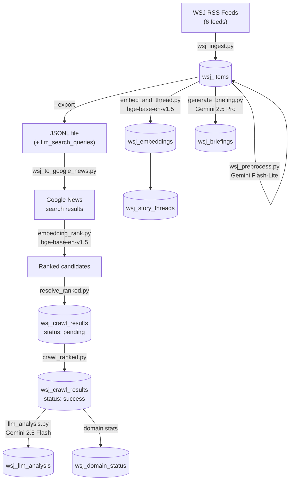
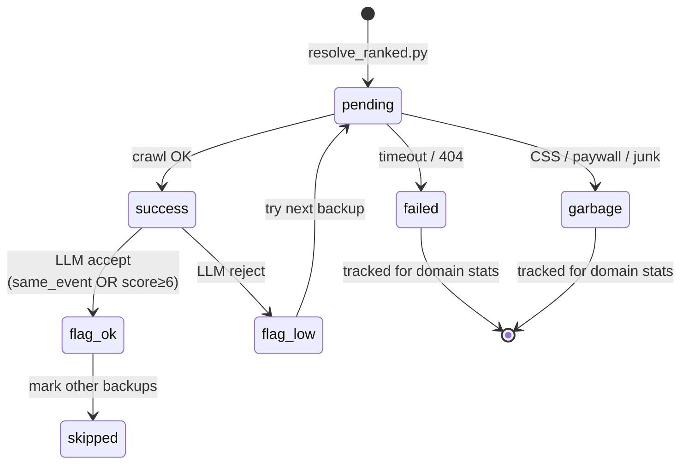

<!-- Updated: 2026-02-22 -->
# News Platform — Backend & Pipeline

Single source of truth for the finance news pipeline: ingestion, crawling, analysis, briefing generation.

---

## Pipeline Overview

```mermaid
flowchart LR
    subgraph "Phase 1: Ingest + Search"
        A[wsj_ingest.py] --> B[wsj_preprocess.py]
        B --> C[wsj_ingest.py --export]
        C --> D[wsj_to_google_news.py]
    end

    subgraph "Phase 2: Rank + Resolve"
        D --> E[embedding_rank.py]
        E --> F[resolve_ranked.py]
        F --> G[mark-searched]
    end

    subgraph "Phase 3: Crawl"
        G --> H[crawl_ranked.py]
    end

    subgraph "Phase 4: Post-process"
        H --> I[mark-processed]
        I --> J[update-domain-status]
    end

    subgraph "Phase 4.5: Embed"
        J --> K[embed_and_thread.py]
    end

    subgraph "Phase 5: Briefing"
        K --> L[generate_briefing.py]
    end
```



**Orchestration:** `scripts/run_pipeline.sh` (Mac Mini launchd cron, daily)

---

## Data Flow



---

## Pipeline Scripts

### Phase 1: Ingest + Search

#### `wsj_ingest.py`

RSS ingestion and export only.

| Flag | Action |
|------|--------|
| *(none)* | Ingest all 6 WSJ RSS feeds |
| `--export` | Export unsearched items to JSONL |
| `--export --all` | Export all recent items (bypass searched flag) |

- **Feeds:** BUSINESS, MARKETS, WORLD, TECH, ECONOMY, POLITICS (merged: BUSINESS+MARKETS → BUSINESS_MARKETS)
- **Dedup:** Title-based, keeps version from feed with fewer items
- **Category:** Extracted from URL path (~95% accuracy), fallback to `feed_name`

#### `wsj_preprocess.py`

Gemini Flash-Lite extracts metadata from title+description BEFORE search.

| Flag | Default | Action |
|------|---------|--------|
| *(none)* | — | Process unsearched items |
| `--limit N` | 200 | Max items |
| `--dry-run` | — | No DB writes |
| `--backfill` | — | Include already-searched items |

- **Model:** Gemini 2.5 Flash-Lite (JSON mode, temp 0.1)
- **Extracts:** entities, keywords, tickers, search_queries → saved to `wsj_items`
- **Cost:** ~$0.003/day, ~$0.10/month
- **vs `wsj_llm_analysis`:** Pre-process = title+desc (pre-search). LLM analysis = crawled content (post-crawl).

#### `wsj_to_google_news.py`

Searches Google News for free alternatives to each WSJ article.

| Flag | Default | Action |
|------|---------|--------|
| `--limit N` | all | Max items |
| `--delay-item S` | 2.0 | Delay between items |
| `--delay-query S` | 1.0 | Delay between queries |
| `--input PATH` | `output/wsj_items.jsonl` | Custom JSONL input |

- Uses LLM-generated queries when available, falls back to clean title
- Newsletters rely entirely on LLM queries
- Date filter: ±1 day from WSJ pubDate (3-day window)

### Phase 2: Rank + Resolve

#### `embedding_rank.py`

Ranks candidates by semantic similarity.

| Flag | Default | Action |
|------|---------|--------|
| `--top-k N` | 10 | Max results per item |
| `--min-score F` | 0.3 | Min cosine similarity |

- **Model:** BAAI/bge-base-en-v1.5 (768d)

#### `resolve_ranked.py`

Resolves Google News redirect URLs → actual article URLs.

| Flag | Default | Action |
|------|---------|--------|
| `--delay N` | 3.0 | Delay between requests |
| `--update-db` | — | Save to Supabase |

- **3 strategies:** base64 decode → `batchexecute` API → follow redirect

### Phase 3: Crawl

#### `crawl_ranked.py`

Crawls resolved URLs with quality + relevance verification.

| Flag | Default | Action |
|------|---------|--------|
| `--delay N` | 1.5 | Delay between crawls |
| `--update-db` | — | Save to Supabase |
| `--from-db` | — | Crawl pending from DB |
| `--concurrent N` | 1 | Parallel WSJ items via asyncio.Semaphore |

- Sorted by `weighted_score = embedding_score * laplace_smoothed_rate` where rate = (success+1)/(total+2)
- Per-article: crawl → garbage check → embedding relevance (≥ 0.25) → LLM verify (gemini-2.5-flash-lite) → accept/reject
- Short-but-real fallback: articles ≥150ch AND >1.5× WSJ description length bypass TOO_SHORT, still pass embedding+LLM gates
- `--concurrent 5` = 5 WSJ items processed in parallel (each item's candidates still sequential)
- Per-domain rate limiter: min 3s between requests to the same domain across concurrent items

#### `crawl_article.py`

Core crawling engine: newspaper4k first (fast HTTP), crawl4ai browser fallback.

| Flag | Default | Action |
|------|---------|--------|
| `<url>` | required | Article URL |
| `[mode]` | undetected | `basic` / `stealth` / `undetected` |
| `--save` | — | Save to file |

- 13 domains with site-specific CSS selectors
- Quality scoring: length, short_line_ratio, link_line_ratio, boilerplate_ratio

### Phase 4: Domain & Post-process

#### `domain_utils.py`

Domain status management, lifecycle flags, and recovery operations.

| Flag | Action |
|------|--------|
| `--mark-searched FILE` | Set `searched=true` for items in FILE |
| `--mark-processed FILE` | Mark items in JSONL/JSON as processed |
| `--mark-processed-from-db` | Set `processed=true` based on DB crawl results |
| `--update-domain-status` | Aggregate crawl results → domain stats, auto-block |
| `--retry-low-relevance` | Reactivate backup articles for low-relevance items |
| `--stats` | Show database statistics |
| `--seed-blocked-from-json` | One-time: migrate JSON blocked domains to DB |

- **Domain auto-block:** Wilson score < 0.15 (blockable n ≥ 5), only `http error` and `timeout or network error` count as blockable
- **Manual block protection:** Domains with non-"Auto-blocked:" block_reason are never overwritten
- **Failure tracking:** Per-reason JSONB (`fail_counts`) — see failure taxonomy below
- Also provides `load_blocked_domains()` and `is_blocked_domain()` used by other scripts

### Phase 4.5: Embed + Thread

#### `embed_and_thread.py`

Article embeddings + story thread clustering.

| Flag | Action |
|------|--------|
| *(none)* | Full run: embed + thread + deactivate stale |
| `--embed-only` | Skip thread matching |
| `--dry-run` | Preview only |

- **Model:** BAAI/bge-base-en-v1.5 (768d)
- Thread matching: cosine > 0.70 → existing thread, else LLM groups into new threads
- Threads deactivated after 7 days inactive

### Phase 5: Briefing

#### `generate_briefing.py`

Daily EN/KO finance briefings with TTS audio.

```bash
python generate_briefing.py                    # Full run (EN+KO)
python generate_briefing.py --date 2026-02-13  # Specific date
python generate_briefing.py --lang ko --skip-tts
python generate_briefing.py --dry-run
```

- **LLM:** Gemini 2.5 Pro (curation + generation, temp 0.6, think 4K)
- **TTS EN:** Google Cloud Chirp 3 HD (`en-US-Chirp3-HD-Alnilam`)
- **TTS KO:** Gemini 2.5 Pro Preview TTS (`Kore` voice)
- **Output:** `scripts/output/briefings/{date}/`

### Shared Utilities

| Script | Purpose |
|--------|---------|
| `domain_utils.py` | Domain status, lifecycle flags, recovery, stats (Phase 2/4) |
| `llm_analysis.py` | Gemini 2.5 Flash content verification + metadata extraction |
| `llm_backfill.py` | Backfill LLM analysis for existing articles |

---

## Crawl Status Flow



### Quality Gates

| Gate | Tool | Threshold |
|------|------|-----------|
| Garbage detection | crawl_ranked.py | unique_ratio ≥ 0.1, no CSS/JS/paywall |
| Content quality | crawl_article.py | ≥ 350 chars, ≤ 50K, link_ratio < 30%, boilerplate < 40% |
| Embedding relevance | crawl_ranked.py | cosine ≥ 0.25 (bge-base) |
| LLM verification | llm_analysis.py | `is_same_event=true` OR `score ≥ 6` |

### Domain Failure Taxonomy

`wsj_domain_status.fail_counts` tracks per-reason failures as JSONB. Only **infrastructure failures** count toward auto-blocking — parser/content issues are not the domain's fault.

| Key | Cause | Blockable? |
|-----|-------|-----------|
| `http error` | HTTP errors (403, 429, etc.) | **Yes** |
| `timeout or network error` | Timeout/network failure | **Yes** |
| `content too short` | Crawled but insufficient content (< 350ch) | No |
| `paywall` | Paywall detected | No |
| `css/js instead of content` | HTML/CSS/JS instead of article | No |
| `copyright or unavailable` | Copyright/unavailability message | No |
| `repeated content` | Same text repeated | No |
| `empty content` | Completely empty response | No |
| `social media` | Social media, no article | No |
| `too many links` | Link ratio > 30% | No |
| `navigation/menu content` | Menu/nav content > 55% | No |
| `boilerplate content` | Boilerplate > 40% | No |
| `content too long` | Content > 50K chars | No |
| `domain blocked` | Circular: already blocked | No |
| `low relevance` | Low embedding score (wrong article) | No |
| `llm rejected` | LLM says different event | No |

---

## Database Tables

> Full schema: [`docs/schema.md`](schema.md)

```mermaid
erDiagram
    wsj_items ||--o{ wsj_crawl_results : "1:N backups"
    wsj_crawl_results ||--o| wsj_llm_analysis : "1:1 analysis"
    wsj_items ||--o| wsj_embeddings : "1:1 embedding"
    wsj_items }o--|| wsj_story_threads : "N:1 thread"
    wsj_items }o--o{ wsj_briefings : "N:N via wsj_briefing_items"
    wsj_domain_status : "standalone"

    wsj_items {
        uuid id PK
        text title
        text description
        text[] extracted_entities
        text[] llm_search_queries
        bool searched
        bool processed
        bool briefed
    }

    wsj_crawl_results {
        uuid id PK
        uuid wsj_item_id FK
        float embedding_score
        text crawl_status
        text relevance_flag
        text content
    }

    wsj_llm_analysis {
        uuid id PK
        uuid crawl_result_id FK
        int relevance_score
        bool is_same_event
        text summary
    }
```

---

## Environment Variables

```env
NEXT_PUBLIC_SUPABASE_URL=        # Supabase project URL
SUPABASE_SERVICE_ROLE_KEY=       # Supabase service role key
GEMINI_API_KEY=                  # Gemini (preprocessing, LLM analysis, briefing, TTS)
GOOGLE_APPLICATION_CREDENTIALS=  # Google Cloud TTS service account (briefing audio only)
```

Mac Mini loads secrets from `.env.pipeline` or macOS Keychain.

---

## Python Dependencies

| Package | Purpose |
|---------|---------|
| `httpx` | HTTP client |
| `supabase` | Supabase client |
| `python-dotenv` | Environment variables |
| `sentence-transformers` | BAAI/bge-base-en-v1.5 (ranking + embeddings) |
| `numpy` | Array operations |
| `trafilatura` | Content extraction |
| `newspaper4k` | Fast HTTP extraction |
| `crawl4ai` | Browser-based crawling |
| `google-genai` | Gemini API (preprocessing, LLM analysis, briefing, TTS) |

---

## Cost Summary

| Component | Per Run | Monthly |
|-----------|---------|---------|
| Pre-processing (Flash-Lite, 60 items) | $0.003 | $0.10 |
| LLM analysis (2.5 Flash, per article) | $0.0002 | ~$0.30 |
| Curation (2.5 Pro) | $0.006 | $0.18 |
| EN Briefing (2.5 Pro) | $0.051 | $1.53 |
| KO Briefing (2.5 Pro) | $0.063 | $1.89 |
| EN TTS (Chirp 3 HD) | $0.144 | $4.32 |
| KO TTS (Gemini TTS) | $0.060 | $1.80 |
| **Total** | **~$0.33** | **~$10/month** |
