<!-- Updated: 2026-02-20 -->
# News Platform — Frontend

Technical guide for the `/news` page. WSJ-style 3-column layout with in-card thread carousels, bilingual audio briefing player, and keyword filtering. Powered by the existing news pipeline.

For backend pipeline & threading algorithm details, see `docs/4-news-backend.md` and `docs/4-news-threading.md`.

---

## Architecture Overview

```mermaid
graph TB
    subgraph "Supabase (Data)"
        DB_ITEMS[wsj_items<br/>title, feed_name, link, subcategory,<br/>slug, importance, keywords, thread_id]
        DB_CRAWL[wsj_crawl_results<br/>top_image, source, relevance_flag]
        DB_LLM[wsj_llm_analysis<br/>summary, keywords]
        DB_BRIEF[wsj_briefings<br/>briefing_text, audio_url, date,<br/>chapters JSONB, sentences JSONB]
        DB_JUNC[wsj_briefing_items<br/>briefing_id ↔ wsj_item_id]
        DB_THREADS[wsj_story_threads<br/>title, member_count, first_seen, last_seen]
        DB_EMBED[wsj_embeddings<br/>vector(768), BAAI/bge-base-en-v1.5]
    end

    subgraph "Server Layer"
        SVC[NewsService<br/>src/lib/news-service.ts]
        PAGE[news/page.tsx<br/>Server Component]
        LOCAL[Local FS fallback<br/>notebooks/tts_outputs/text/]
    end

    subgraph "Client Components"
        SHELL[NewsShell<br/>Header + Sidebar wrapper]
        PLAYER[BriefingPlayer<br/>HTML5 Audio + Framer Motion<br/>EN/KO toggle, chapters, transcript]
        CARDS[ArticleCard 🖥️<br/>featured / standard<br/>+ thread carousel]
        KWPILLS[KeywordPills<br/>Filterable keyword tags]
    end

    DB_ITEMS --> SVC
    DB_CRAWL --> SVC
    DB_LLM --> SVC
    DB_BRIEF --> SVC
    DB_JUNC --> SVC
    DB_THREADS --> SVC
    DB_EMBED --> SVC

    SVC --> PAGE
    LOCAL -.->|temp hack| PAGE
    PAGE --> SHELL
    PAGE --> PLAYER
    PAGE --> CARDS
    PAGE --> KWPILLS
```

---

## Component Tree


---

## Page Layout

### Primary: WSJ 3-Column with In-Card Thread Carousels

```
┌───────────────────────────────────────────────────────────────────┐
│ Header (shared) — Logo | Toggle | Search | Login                  │
├───────────────────────────────────────────────────────────────────┤
│ [Today]  [Stories (Soon)]  [Search (Soon)]                        │  ← tabs
│ [All] [Markets] [Tech] [Economy] [World] [Politics]               │  ← category pills
├───────────────────────────────────────────────────────────────────┤
│ Topics: [Fed(5)] [AI(4)] [Tariff(3)] [Nvidia(3)] [...]           │  ← keyword filter
├───────────────────────────────────────────────────────────────────┤
│                                                                    │
│  ┌─ Left 3/12 ──┐  ┌─ Center 6/12 ──────────┐  ┌─ Right 3/12 ─┐│
│  │ standard      │  │ BriefingPlayer          │  │ standard      ││
│  │ cards [1-5]   │  │ Featured hero card [0]  │  │ standard      ││
│  │ (no images)   │  │ + below-fold 2-col [12+]│  │ cards [6-11]  ││
│  │ + thread ◀▶   │  │ + thread ◀▶             │  │ + thread ◀▶   ││
│  └───────────────┘  └────────────────────────┘  └──────────────┘│
│                                                                    │
│  ── Below fold: 3-col grid of remaining stories [16+] ──────────  │
└───────────────────────────────────────────────────────────────────┘
```

#### Article Sorting (importance-based)

Articles are sorted before slicing into columns:
1. **Importance**: `must_read` → `worth_reading` → `optional` (null treated as optional)
2. **Crawled**: Articles with `summary` (crawled + LLM analyzed) rank higher — richer card content
3. **Thread preference**: Articles with `thread_id` rank higher (threaded stories are more significant)
4. **Recency**: Newer articles first within the same tier

This ensures the featured hero is always a `must_read` article (preferably threaded), and higher-importance articles fill the left column.

#### Card Slicing
- `featured = sortedItems[0]` → center hero (best must_read + threaded article)
- `leftStories = sortedItems[1..5]` → left column (5 cards, no images)
- `rightStories = sortedItems[6..11]` → right column (6 standard cards)
- `belowFold = sortedItems[12..]` → center 2-col grid (first 4) + 3-col grid (rest)

#### Thread Carousel (in-card)
Cards with `thread_id` show a thread indicator at the bottom:
```
┌─────────────────────────────────────┐
│ ★ ECONOMY  12h ago                  │
│ U.K. Inflation Slowed in January    │
│ UK inflation fell to 3.0%...        │
│ [inflation] [Bank of England]       │
│ via Global Banking & Finance Review │
│─────────────────────────────────────│
│ ◀  8/8  ▶  US Inflation Slows... 📰│  ← thread indicator
└─────────────────────────────────────┘
```
- Starts at **latest article** (end of timeline)
- ◀ navigates to older articles, ▶ to newer
- Framer Motion slide animation (0.25s)
- Disabled at boundaries (first/last)

### Mobile (partial — player done, article grid TBD)

```
Mobile (< 768px):
┌──────────────────────────┐
│ BriefingPlayer (order-first)│  ← full player at top
│ AI icon + title + EN/KO     │
│ ▼ Chapter dropdown (select) │  ← pills replaced by dropdown
│ ⏪ ▶ ⏩ 🔊 1.25x           │  ← controls + volume + speed
│ [───────●────────] 3:42     │  ← progress bar
│ Transcript (text-xs)         │  ← responsive font
│ Double-tap left/right = skip │
├──────────────────────────┤
│ Articles (single column)     │
├──────────────────────────┤
│ Mini-player (fixed bottom)   │  ← when scrolled past
│ Minimize/expand toggle       │
└──────────────────────────┘
```

---

## Data Flow

```mermaid
sequenceDiagram
    participant Browser
    participant Page as news/page.tsx
    participant Svc as NewsService
    participant DB as Supabase
    participant FS as Local FS (temp)

    Browser->>Page: GET /news?category=TECH&keyword=Fed

    par Parallel fetches (batch 1)
        Page->>Svc: getLatestBriefings()
        Svc->>DB: SELECT * FROM wsj_briefings<br/>WHERE category IN ('EN','KO')<br/>ORDER BY date DESC LIMIT 2
        DB-->>Svc: { en: Briefing | null, ko: Briefing | null }

        Page->>Svc: getNewsItems({ limit: 30, since: 24h_cutoff })
        Svc->>DB: SELECT wsj_items<br/>LEFT JOIN wsj_crawl_results<br/>LEFT JOIN wsj_llm_analysis<br/>WHERE published_at >= cutoff
        DB-->>Svc: todayItems: NewsItem[]

        Page->>Svc: getNewsItems({ limit: 30 })
        Svc->>DB: SELECT wsj_items (same query, no time filter)
        DB-->>Svc: allItems: NewsItem[]
    end

    Note over Page: Merge: today first, then older backfill (deduped)<br/>aggregateKeywords(items) → keyword counts

    par Parallel fetches (batch 2)
        Page->>Svc: getBriefingSources(briefingId)
        Svc->>DB: SELECT wsj_briefing_items JOIN wsj_items
        DB-->>Svc: BriefingSource[]

        Page->>Svc: getThreadsByIds(visibleThreadIds)
        Svc->>DB: SELECT id, title FROM wsj_story_threads WHERE id IN (...)
        DB-->>Svc: Map<string, StoryThread>

        Page->>Svc: getThreadTimeline(id) × N
        Svc->>DB: SELECT wsj_items WHERE thread_id=? ORDER BY published_at ASC
        DB-->>Svc: NewsItem[][] (one per thread)

        Page->>FS: readFile(chapters/sentences/transcript EN+KO)
        FS-->>Page: JSON/text (local fallback data)
    end

    Note over Page: Build threadTimelines Map + threadPropsFor() helper

    Page-->>Browser: SSR HTML with 3-col layout + carousel props
    Note over Browser: Client hydrates NewsShell,<br/>BriefingPlayer, ArticleCard (carousel)
```



---

## File Map

| File | Type | Purpose |
|------|------|---------|
| `src/app/news/layout.tsx` | Server | Metadata only (`title`, `description`) |
| `src/app/news/page.tsx` | Server | Data fetching, tabs, keyword filter, 3-col layout, thread timeline fetch |
| `src/app/news/[slug]/page.tsx` | Server | Article detail page with metadata, related articles, story timeline |
| `src/app/news/[slug]/_components/RelatedSection.tsx` | Server | Numbered list with similarity score bars (pgvector, 7-day, excludes timeline articles) |
| `src/app/news/[slug]/_components/TimelineSection.tsx` | Client | Collapsible vertical timeline — shows last 5, "Show N older..." expand, sticky "Show less" bar |
| `src/app/news/_components/NewsShell.tsx` | Client | Header + Sidebar wrapper (sidebar starts closed, shifts content on open) |
| `src/app/news/_components/BriefingPlayer.tsx` | Client | Bilingual audio player with chapters, transcript, sticky mini-player, theme object |
| `src/app/news/_components/ArticleCard.tsx` | Client | Article display (featured/standard) + framer-motion thread carousel |
| `src/app/news/_components/KeywordPills.tsx` | Server | Reusable keyword pills with optional link behavior + active state |
| ~~`src/app/news/_components/ThreadSection.tsx`~~ | ~~Client~~ | **Deleted** — replaced by in-card thread carousels |
| `src/lib/news-service.ts` | Server | `NewsService` class (Supabase queries, bilingual briefings, threads, related articles) |
| `src/app/globals.css` | Shared | WSJ design tokens (`--color-news-*`) |
| `next.config.ts` | Config | `remotePatterns` for external images |
| `public/audio/` | Static | TTS audio files (WAV, served statically) |
| `notebooks/tts_outputs/text/` | Local | Chapters, sentences, transcript JSON/text (temp fallback) |

---

## Page Helper Functions

Defined in `src/app/news/page.tsx` (server-side, not exported):

### `aggregateKeywords(items: NewsItem[])`
Collects keywords from all articles, counts occurrences, returns top 20 sorted by frequency.

### `threadPropsFor(item: NewsItem)`
Returns `{ id, threadTimeline, threadTitle }` for an article. Looks up pre-fetched `threadTimelines` Map and `threadMeta` Map. Returns `null` for articles without `thread_id`.

---

## URL Parameters

| Param | Example | Purpose |
|-------|---------|---------|
| `category` | `?category=TECH` | Filter articles by `feed_name` |
| `tab` | `?tab=stories` | Switch tab (default: `today`) |
| `keyword` | `?keyword=Fed` | Filter articles by keyword match |

All parameters are combinable: `/news?category=TECH&keyword=AI&tab=today`

### Tab Structure

| Tab | Content | Status |
|-----|---------|--------|
| **Today** | Audio player + thread groups + keyword filter + category filter | Implemented |
| **Stories** | Narrative timeline — story threads across days/weeks | Placeholder |
| **Search** | Semantic search over all articles via pgvector | Placeholder |

### Category Constants

```typescript
const CATEGORIES = [
  { label: 'All', slug: '' },
  { label: 'Markets', slug: 'BUSINESS_MARKETS' },
  { label: 'Tech', slug: 'TECH' },
  { label: 'Economy', slug: 'ECONOMY' },
  { label: 'World', slug: 'WORLD' },
  { label: 'Politics', slug: 'POLITICS' },
]
```

---

## Component Props

### BriefingPlayer

```typescript
interface BriefingPlayerProps {
  date: string              // "Feb 17, 2026"
  duration: number          // seconds (0 = auto-detect from metadata)
  sourceCount?: number      // from briefing.item_count
  sources?: BriefingSource[] // from wsj_briefing_items join
  en?: BriefingLangData     // English audio + chapters + transcript + sentences
  ko?: BriefingLangData     // Korean audio + chapters + transcript + sentences
  defaultLang?: 'en' | 'ko' // defaults to 'en'
}

interface BriefingLangData {
  audioUrl: string
  chapters?: BriefingChapter[]   // chapter markers on seek bar
  transcript?: string            // full text for plain reading view
  sentences?: BriefingSentence[] // sentence-level timestamps for highlighting
}

interface BriefingChapter {
  title: string
  position: number // 0.0–1.0 ratio into audio duration
}

interface BriefingSentence {
  text: string
  start: number // seconds
  end: number   // seconds
}

interface BriefingSource {
  title: string
  feed_name: string
  link: string
  source: string | null
}
```

#### Theme System
Uses a `const T` theme object with semantic color tokens (wrapper, text, muted, dim, surface, accent, etc.) replacing 52+ hardcoded Tailwind classes. Chrome metallic gradient accent: `from-gray-300 via-gray-500 to-gray-300`.

#### Player Controls
- **Play/Pause**: Large white circle button with scale animation
- **Skip +/-15s**: RotateCcw / RotateCw buttons with "15" overlay
- **Seek**: Click-to-seek gradient progress bar with YouTube-style segment dividers (no dots) + mouse-following hover tooltip showing time + chapter name
- **Speed**: Hover to show popup dropdown (above controls), click to cycle through 1x / 1.25x / 1.5x / 2x. Same pattern for full and mini player.
- **Volume**: Hover to show vertical popup slider (`writing-mode: vertical-lr`), click to mute/unmute. Same pattern for full and mini player.
- **EN/KO Toggle**: Switch between English and Korean audio (resets playback position)
- **Chapters**: Desktop: equal-width pill buttons with glow ring (`ring-2 ring-white/40 shadow-glow`) on active, `hover:scale-105 hover:-translate-y-0.5`. Mobile: dropdown select showing current chapter, tap to expand list.
- **Transcript**: Default open. Sentence-level highlighting grouped by chapter headings (gray-300 color). Click any sentence to seek to its start. Custom smooth scroll animation (800ms cubic ease-in-out, targets upper 1/3 of container). Auto-scroll works even when paused.
- **Sources**: Expandable scrollable list (Framer Motion) with numbered articles (larger font), categories, external links. Custom thin scrollbar styling.
- **Keyboard**: Space (play/pause), Arrow Left/Right (+/-15s), Arrow Up/Down (volume — updates UI state), M (mute)
- **Mobile**: Double-tap left/right side of controls area to skip -/+15s. Responsive font sizes (text-xs sm:text-sm).
- **Resume**: Saves playback position to localStorage per audio URL

#### Sticky Mini-Player
When the full player scrolls out of view (IntersectionObserver), a mini-player appears via `createPortal` to `document.body`:
- Fixed to bottom of viewport with Framer Motion spring animation
- Shows: AI icon, title (marquee on overflow), EN/KO toggle, progress bar, play/pause, volume mute, speed, transcript toggle, minimize/expand
- Minimize mode: hides title, speed, EN/KO, transcript; shows only icon + progress + play + volume + expand button
- Transcript: fixed height (`h-10`) to prevent layout shift, responsive font
- Volume and speed use same hover/click popup pattern as full player

#### Page Layout Change
`page.tsx`: BriefingPlayer rendered as a separate CSS grid item with `order-first` for mobile (player at top) and `lg:col-start-4 lg:col-span-6 lg:row-start-1` for desktop center column.


### ArticleCard (Client Component)

```typescript
interface ArticleCardProps {
  headline: string
  summary: string | null
  source: string | null
  category: string
  timestamp: string
  imageUrl: string | null
  link: string
  variant?: 'featured' | 'standard'
  slug?: string | null           // links to /news/[slug] if present
  importance?: string | null     // must_read / worth_reading / optional
  keywords?: string[] | null
  activeKeyword?: string | null
  id?: string                    // article ID for carousel position
  threadTimeline?: NewsItem[] | null  // full thread timeline
  threadTitle?: string | null    // thread display name
}
```

- **featured**: Large image, centered headline, full summary
- **standard**: Optional image, headline (line-clamp-2) + summary + keywords + source. Cards with thread carousel use fixed height (`h-44` + `overflow-hidden`) to prevent layout shift on arrow navigation.
- **Thread carousel**: When `threadTimeline.length > 1`, shows ◀ N/M ▶ indicator at card bottom. Starts at latest article (end of timeline). Framer Motion slide animation.
- **ImportanceBadge**: Star icon for `must_read` articles

### KeywordPills

```typescript
interface KeywordPillsProps {
  keywords: string[]
  activeKeyword?: string | null
  linkable?: boolean  // when true, pills are links with ?keyword= param
}
```

---

## NewsService API


### Method Details

| Method | Query | Returns |
|--------|-------|---------|
| `getLatestBriefings()` | `wsj_briefings WHERE category IN ('EN','KO') ORDER BY date DESC LIMIT 2` | `{ en: Briefing \| null, ko: Briefing \| null }` |
| `getNewsItems(opts)` | `wsj_items LEFT JOIN wsj_crawl_results LEFT JOIN wsj_llm_analysis` (no processed/relevance filter — shows all articles) | `NewsItem[]` (flattened; crawl/LLM fields are null for uncrawled articles) |
| `getNewsItemBySlug(slug)` | `wsj_items WHERE slug=? JOIN crawl+llm` | `NewsItem \| null` |
| `getRelatedArticles(itemId, limit)` | `match_articles` RPC (pgvector, ±7 days) | `RelatedArticle[]` |
| `getThreadTimeline(threadId)` | `wsj_items WHERE thread_id=? ORDER BY published_at ASC` | `NewsItem[]` |
| `getStoryThread(threadId)` | `wsj_story_threads WHERE id=?` | `StoryThread \| null` |
| `getThreadsByIds(threadIds)` | `wsj_story_threads WHERE id IN (...)` | `Map<string, StoryThread>` |
| `getBriefingSources(id)` | `wsj_briefing_items JOIN wsj_items JOIN wsj_crawl_results` | `BriefingSource[]` |
| `getCategories()` | `SELECT DISTINCT feed_name FROM wsj_items WHERE processed=true` | `string[]` |

---

## Design Decisions

### Layout & Navigation

| Decision | Original Plan | Actual Implementation | Rationale |
|----------|--------------|----------------------|-----------|
| Layout | Standalone masthead | Shared Header + Sidebar via `NewsShell` | User wanted consistent site feel |
| Primary layout | Thread-grouped single column | WSJ 3-column (3/6/3) with in-card thread carousels | Today's articles as priority; thread history is bonus UX via carousel |
| Thread display | Collapsible ThreadSection groups | In-card ◀▶ carousel per article | Less visual noise; thread is secondary info, not primary grouping |
| Sidebar behavior | N/A | Starts closed on `/news`, shifts content on open | News content takes full width by default |
| Header/Sidebar borders | Default borders | Removed `border-r` and `border-b` | Cleaner OpenAI-style look |
| Tab structure | Single view | Today / Stories / Search tabs | Progressive feature rollout |

### Filtering & Grouping

| Decision | Choice | Rationale |
|----------|--------|-----------|
| Category + Keyword coexistence | Categories filter articles, keywords filter within | Single unified view, not separate modes |
| Article ordering | Today (24h) first, then older backfill (deduped) | Fresh content always on top; layout always filled |
| DB query filter | No `processed` or `relevance_flag` filter | Show all articles including uncrawled (RSS title + description only) |
| Keyword filter | Top 20 keywords by frequency, clickable pills | Information scent — users spot topics instantly |
| Thread titles | From `wsj_story_threads.title` (Gemini-generated) | More meaningful than "N Related Articles" |

### Audio Player

| Decision | Choice | Rationale |
|----------|--------|-----------|
| Player style | Card player with theme object `T` (semantic color tokens) | Consistent dark theme, easy to restyle |
| Player placement | Separate grid item — `order-first` mobile, center column desktop | Always visible; mobile gets player at top |
| Sticky behavior | IntersectionObserver + createPortal mini-player with minimize/expand | Continuous playback while browsing articles |
| Language | EN/KO bilingual with toggle | Pipeline generates both; let user choose |
| Chapters | YouTube-style segment dividers on progress bar + desktop pills / mobile dropdown | Desktop: visual pills with glow. Mobile: dropdown saves space |
| Progress bar | Hover tooltip with time + chapter name, segment highlight | YouTube-inspired interaction pattern |
| Transcript | Default open, sentence-click-to-seek, custom 800ms smooth scroll | Reading-along UX, click to jump, smooth animation |
| Volume/Speed | Hover to show popup, click to act (mute/cycle). Vertical slider, popup dropdown | YouTube-style hover/click separation |
| Skip | 15s forward/back (was 30s) | Better for spoken content navigation |
| Speeds | [1, 1.25, 1.5, 2] (removed 0.75x) | Most users don't slow down; cleaner options |
| Resume | localStorage per audio URL | Avoid losing position on page refresh |
| Audio fallback | Always show with local file fallback | Audio pipeline not fully deployed yet |

### Article Detail Page (`/news/[slug]`)

| Decision | Choice | Rationale |
|----------|--------|-----------|
| URL scheme | Slug-based (`/news/fed-holds-rates`) | SEO-friendly, human-readable |
| Sections order | Article → Story Timeline → Related Articles | Timeline = same thread, Related = similar but different stories |
| External links | "Read on {source}" (primary) + "Read on WSJ" (secondary) | Transparent sourcing |
| Detail layout | Must Read inline with category, keywords under headline, bold first sentence in summary | Option A layout — clean hierarchy |
| Related articles | pgvector `match_articles` RPC (±7 day window), excludes Story Timeline articles | Semantic similarity, not just same category |

### Why Not Graph View?

The initial idea was an Obsidian-style graph view for article relationships. Rejected because:

| Obsidian (works) | News site (doesn't work) |
|-----------------|-------------------------|
| Personal notes — user knows the content | First-time articles — user has no context |
| Small corpus (tens to hundreds) | 30+ articles daily, changing every day |
| Permanent — spatial memory forms over time | Ephemeral — position resets daily |
| User-created links = meaningful connections | Auto-generated links = noise |
| Exploration is the goal | Quick scanning is the goal |

**Key insight**: The *value* of a graph view — discovering connections — is delivered through thread grouping + hub-spoke detail pages without the visual complexity.

---

## Known Temporary Hacks

These are workarounds that should be removed once the pipeline is fully deployed.

| Hack | Location | Description | Resolution |
|------|----------|-------------|------------|
| Local file reads | `page.tsx` lines 123-131 | Reads chapters, sentences, and transcript from `notebooks/tts_outputs/text/` via `fs/promises` | Remove once pipeline uploads to Supabase Storage and `wsj_briefings.chapters`/`sentences` are populated |
| JSONB double-stringify | `page.tsx` `parseJsonField()` | Pipeline stores chapters/sentences as JSON strings inside JSONB columns. `parseJsonField` detects string values and `JSON.parse()` them. | Fix pipeline to store native JSONB objects |
| Briefing date local TZ | `page.tsx` briefingDate | `new Date("YYYY-MM-DD")` parses as UTC → wrong day in KST. Uses `new Date(y, m-1, d)` to parse as local timezone. | Non-issue once pipeline stores full ISO timestamps |
| Hardcoded audio paths | `page.tsx` lines 294, 300 | Falls back to `/audio/chirp3-en-*.wav` and `/audio/gemini-tts-ko-*.wav` | Remove once `wsj_briefings.audio_url` is reliably populated |
| Hardcoded date suffix | `page.tsx` lines 126-131 | Local filenames include `2026-02-16` date suffix | Will be dynamic once pipeline writes to Supabase |
| `readFile` import | `page.tsx` line 10 | `fs/promises` imported in a Next.js page (server-only, works but non-standard) | Remove with the local file reads |

---

## Known Issues & TODOs

### Frontend Issues

| Issue | Description | Priority |
|-------|-------------|----------|
| Uncrawled article display | Articles without crawl results show only RSS title + description (no summary, keywords, source) | Low — acceptable |
| Mobile responsiveness | Partially done — player responsive, article grid still needs single-column collapse | Medium |
| Detail page components | RelatedSection, TimelineSection, MoreLikeThisSection exist but are minimal | Medium |

### Backend TODOs (tracked separately)

See `docs/4-news-threading.md` and `docs/workflow/1-ideas/4.2-idea-thread-grouping-rethink.md` for:
- Summary re-backfill with improved prompts
- Embedding re-generation with `title + summary`
- Threading re-run with improved embeddings

---

## Future Frontend Plans

### Article Detail Page Enhancements

The `/news/[slug]` page has the route and basic layout, but these sections need fuller implementation:

```
┌─────────────────────────────────────────────────────────┐
│  /news/[slug]                                   [← Back] │
│                                                           │
│  ┌─ Article ─────────────────────────────────────────┐  │
│  │ Headline, summary, keywords, source link           │  │
│  └───────────────────────────────────────────────────┘  │
│                                                           │
│  ┌─ Story Timeline (collapsible) ────────────────────┐  │
│  │ Last 5 articles shown, "Show N older..." expand   │  │
│  │ Sticky "Show less" bar when expanded              │  │
│  └───────────────────────────────────────────────────┘  │
│                                                           │
│  ┌─ Related Articles (7-day pgvector) ──────────────┐  │
│  │ Numbered list with similarity % bars              │  │
│  │ Excludes articles already in Story Timeline       │  │
│  └───────────────────────────────────────────────────┘  │
└─────────────────────────────────────────────────────────┘
```

### Stories Tab — Narrative Timeline

Cross-day thread timeline view. Backend data exists (`wsj_story_threads` with lifecycle), frontend not built.

```
┌─────────────────────────────────────────────────────────────────────────┐
│  🔴 Fed Rate Policy                              9 articles · 5 days   │
│  ───────────────────────────────────────────────────────────────────    │
│                                                                         │
│  Mon 2/10        Tue 2/11        Wed 2/12        Thu 2/13    Fri 2/14  │
│  ┌─────────┐    ┌─────────┐    ┌─────────┐                  ┌───────┐ │
│  │ Fed      │    │ Markets  │    │ Mortgage │                  │ Jobs  │ │
│  │ signals  │    │ react to │    │ rates    │    (no articles) │ report│ │
│  │ rate     │    │ Fed tone │    │ climb on │                  │ adds  │ │
│  │ pause    │    │          │    │ Fed hold │                  │ rate  │ │
│  │ 3 articles│    │ 4 articles│    │ 2 articles│                  │ pres- │ │
│  └─────────┘    └─────────┘    └─────────┘                  │ sure  │ │
│       │              │              │                         └───────┘ │
│       └──────────────┴──────────────┴────────────────────────────┘     │
└─────────────────────────────────────────────────────────────────────────┘
```

### Search Tab — Semantic Search

Embed user query → pgvector nearest neighbor → return matching articles. Model is already in place (BAAI/bge-base-en-v1.5), needs:
- API route: `POST /api/news/search` (embed query + pgvector query)
- Frontend: Search bar + results display on `/news?tab=search`

### Other Future Ideas

| Feature | Backend Ready? | Frontend Effort | Notes |
|---------|---------------|-----------------|-------|
| ~~Sticky BriefingPlayer~~ | ~~N/A~~ | ~~Done~~ | ~~Implemented with IntersectionObserver + createPortal~~ |
| Thread "(2 of 17)" indicator | `wsj_story_threads.member_count` exists | Small | Show total vs displayed count |
| Trending badges | Heat score exists | Small | "🔥 Trending" badge on hot threads |
| Personalized "For You" feed | Needs user reading history | Medium | Auth required; could start with localStorage |
| RAG / Q&A | pgvector + embeddings exist | Large | LLM call per query, streaming UI needed |

---

## WSJ Design Reference

Preserved from original design intent:

- **Colors**: midnight `#111`, coal `#333`, smoke `#ebebeb`, blue `#0274b6`, red `#e10000`, gold `#816d4d`
- **Typography**: 17px base, serif headlines (`font-serif`), sans-serif UI/meta
- **Layout**: Full-width with `px-6 md:px-12 lg:px-16` padding
- **Dividers**: `border-neutral-200` horizontal rules between sections
- **Category pills**: Rounded full, neutral-100 bg, neutral-900 when active
- **Thread sections**: `font-serif` title with `border-b-2 border-neutral-900`

---

## Implementation Phase Status


| Phase | Status | Description |
|-------|--------|-------------|
| 1. Keywords + Embeddings + Threading | ✅ Done | Pipeline: keywords, bge-base embeddings, thread algorithm v3.3 |
| 2. Article Detail Page | ✅ Done | `/news/[slug]` with metadata, basic related/timeline/MLT sections |
| 3. Thread UX | ✅ Done | In-card thread carousels (replaced ThreadSection groups) |
| 4. Detail Page Sections | 🔶 Partial | RelatedSection, TimelineSection, MoreLikeThisSection exist but need fuller UI |
| 5. Stories Tab | ❌ Not started | Cross-day narrative timeline |
| 6. Search Tab | ❌ Not started | Semantic search via pgvector |

### Pipeline Phase Status

| Phase | Status | Description |
|-------|--------|-------------|
| 1. Ingest + Crawl | ✅ Done | `wsj_items` + `wsj_crawl_results` + `wsj_llm_analysis` |
| 2. Briefing Generation | ✅ Done | `wsj_briefings` (EN + KO) + `wsj_briefing_items` |
| 3. TTS Audio | 🔶 Partial | Local generation works. Supabase Storage upload pending. |
| 4. Deployment | 🔶 In Progress | Mac Mini with launchd for pipeline cron |

---

## Verification Checklist

- [x] `npm run lint` — passes
- [x] `npm run build` — compiles, `/news` route is dynamic
- [x] Page renders with real data from Supabase
- [x] Thread groups show with titles, sorted by heat score
- [x] Thread expand/collapse works (first expanded, rest collapsed)
- [x] Keyword filter bar shows top keywords, clicking filters articles
- [x] Category pills filter articles by feed_name
- [x] Tab navigation (Today active, Stories/Search placeholder)
- [x] Audio player plays WAV files from `public/audio/`
- [x] EN/KO language toggle switches audio and transcript
- [x] Chapter markers appear on seek bar and as pill buttons
- [x] Sentence-highlighted transcript with auto-scroll
- [x] Volume control and mute toggle work (hover popup, click mute)
- [x] Sticky mini-player appears when full player scrolls out of view
- [x] Mini-player minimize/expand toggle works
- [x] Mobile chapter dropdown replaces pills on small screens
- [x] Mobile double-tap skip works
- [x] Click-to-seek on transcript sentences works
- [x] YouTube-style progress bar hover tooltip shows time + chapter
- [x] Sidebar starts closed, shifts content on toggle
- [x] External images load from arbitrary domains
- [x] Keyboard shortcuts (Space, arrows, M) work
- [x] Article detail page loads at `/news/[slug]`
- [ ] Mobile responsiveness (article grid single-column collapse)
- [ ] Supabase Storage audio URLs replace local files
- [ ] Pipeline auto-uploads chapters/sentences JSONB to `wsj_briefings`
- [ ] Detail page Related/Timeline/MLT sections fully built
- [ ] Stories tab implementation
- [ ] Search tab implementation
