<!-- Updated: 2026-02-17 -->
# News Platform — Frontend

Technical guide for the `/news` page. WSJ-inspired 3-column layout with bilingual audio briefing player, powered by the existing finance pipeline.

---

## Architecture Overview

```mermaid
graph TB
    subgraph "Supabase (Data)"
        DB_ITEMS[wsj_items<br/>title, feed_name, link, subcategory]
        DB_CRAWL[wsj_crawl_results<br/>top_image, source, relevance_flag]
        DB_LLM[wsj_llm_analysis<br/>summary]
        DB_BRIEF[wsj_briefings<br/>briefing_text, audio_url, date,<br/>chapters JSONB, sentences JSONB]
        DB_JUNC[wsj_briefing_items<br/>briefing_id ↔ wsj_item_id]
    end

    subgraph "Server Layer"
        SVC[NewsService<br/>src/lib/news-service.ts]
        PAGE[news/page.tsx<br/>Server Component]
        LOCAL[Local FS fallback<br/>notebooks/tts_outputs/text/]
    end

    subgraph "Client Components"
        SHELL[NewsShell<br/>Header + Sidebar wrapper]
        PLAYER[BriefingPlayer<br/>HTML5 Audio + Framer Motion<br/>EN/KO toggle, chapters, transcript]
        CARDS[ArticleCard<br/>featured / standard / compact]
    end

    DB_ITEMS --> SVC
    DB_CRAWL --> SVC
    DB_LLM --> SVC
    DB_BRIEF --> SVC
    DB_JUNC --> SVC

    SVC --> PAGE
    LOCAL -.->|temp hack| PAGE
    PAGE --> SHELL
    PAGE --> PLAYER
    PAGE --> CARDS
```



---

## Component Tree

```mermaid
graph LR
    subgraph "news/layout.tsx"
        LAYOUT["NewsLayout<br/>(metadata only)"]
    end

    subgraph "news/page.tsx (Server)"
        PAGE[NewsPage] --> SHELL[NewsShell 🖥️<br/>Client wrapper]
        SHELL --> HEADER[Header<br/>shared component]
        SHELL --> SIDEBAR[Sidebar<br/>shared component]

        PAGE --> NAV[Category Nav<br/>sticky tabs]
        PAGE --> BP[BriefingPlayer 🔊<br/>Client Component<br/>EN/KO + chapters + transcript]
        PAGE --> LEFT[Left Column<br/>3/12 text stories]
        PAGE --> CENTER[Center Column<br/>6/12 hero + grid]
        PAGE --> RIGHT[Right Column<br/>3/12 compact list]
        PAGE --> BELOW[Below Fold<br/>3-col grid]

        LEFT --> AC_STD[ArticleCard standard]
        CENTER --> AC_FEAT[ArticleCard featured]
        RIGHT --> AC_COMP[ArticleCard compact]
    end
```



---

## Page Layout (WSJ 3-Column)


---

## Data Flow


---

## File Map

| File | Type | Purpose |
|------|------|---------|
| `src/app/news/layout.tsx` | Server | Metadata only (`title`, `description`) |
| `src/app/news/page.tsx` | Server | Data fetching, tabs, keyword filter, thread grouping, 3-col fallback layout |
| `src/app/news/[slug]/page.tsx` | Server | Article detail page with metadata, related articles, story timeline |
| `src/app/news/[slug]/_components/RelatedSection.tsx` | Server | Horizontal card grid for related articles |
| `src/app/news/[slug]/_components/TimelineSection.tsx` | Server | Vertical timeline with date dots for story threads |
| `src/app/news/[slug]/_components/MoreLikeThisSection.tsx` | Server | 90-day similarity cards (wraps RelatedSection) |
| `src/app/news/_components/NewsShell.tsx` | Client | Header + Sidebar wrapper (sidebar starts closed, shifts content on open) |
| `src/app/news/_components/BriefingPlayer.tsx` | Client | Bilingual audio player with chapters, transcript, volume, download |
| `src/app/news/_components/ArticleCard.tsx` | Server | Article display with 3 variants + importance/keywords/slug support |
| `src/app/news/_components/KeywordPills.tsx` | Server | Reusable keyword pills with optional link behavior + active state |
| `src/lib/news-service.ts` | Server | `NewsService` class (Supabase queries, bilingual briefings, related articles) |
| `src/app/globals.css` | Shared | WSJ design tokens (`--color-news-*`) |
| `next.config.ts` | Config | `remotePatterns` for external images |
| `public/audio/` | Static | TTS audio files (WAV, served statically) |
| `notebooks/tts_outputs/text/` | Local | Chapters, sentences, transcript JSON/text (temp fallback) |

---

## BriefingPlayer Features


### Player Props

```typescript
interface BriefingPlayerProps {
  date: string              // "Feb 17, 2026"
  duration: number          // seconds (0 = auto-detect from metadata)
  sourceCount?: number      // from briefing.item_count
  sources?: BriefingSource[] // from wsj_briefing_items join
  en?: BriefingLangData     // English audio + chapters + transcript + sentences
  ko?: BriefingLangData     // Korean audio + chapters + transcript + sentences
  defaultLang?: 'en' | 'ko' // defaults to 'en'
}

interface BriefingLangData {
  audioUrl: string
  chapters?: BriefingChapter[]   // chapter markers on seek bar
  transcript?: string            // full text for plain reading view
  sentences?: BriefingSentence[] // sentence-level timestamps for highlighting
}

interface BriefingChapter {
  title: string
  position: number // 0.0–1.0 ratio into audio duration
}

interface BriefingSentence {
  text: string
  start: number // seconds
  end: number   // seconds
}

interface BriefingSource {
  title: string
  feed_name: string
  link: string
  source: string | null
}
```

### Controls
- **Play/Pause**: Large white circle button with scale animation
- **Skip +/-30s**: RotateCcw / RotateCw buttons with "30" overlay
- **Seek**: Click-to-seek gradient progress bar with hover dot and chapter markers
- **Speed**: Cycle through 0.75x / 1x / 1.25x / 1.5x / 2x
- **Volume**: Slider + mute/unmute toggle
- **Download**: Download current language audio file
- **EN/KO Toggle**: Switch between English and Korean audio (resets playback position)
- **Chapters**: Pill buttons below seek bar; dots on seek bar; click to jump
- **Transcript**: Sentence-level highlighting with auto-scroll during playback
- **Sources**: Expandable scrollable list (Framer Motion) with numbered articles, categories, external links
- **Keyboard**: Space (play/pause), Arrow Left/Right (+/-30s), Arrow Up/Down (volume), M (mute)
- **Resume**: Saves playback position to localStorage per audio URL

---

## NewsService API


### Method Details

| Method | Query | Returns |
|--------|-------|---------|
| `getLatestBriefings()` | `wsj_briefings WHERE category IN ('EN','KO') ORDER BY date DESC LIMIT 2` | `{ en: Briefing \| null, ko: Briefing \| null }` |
| `getNewsItems(opts)` | `wsj_items JOIN wsj_crawl_results JOIN wsj_llm_analysis WHERE processed=true` | `NewsItem[]` (flattened, includes slug, importance, keywords, thread_id, resolved_url) |
| `getNewsItemBySlug(slug)` | `wsj_items WHERE slug=? JOIN crawl+llm` | `NewsItem \| null` |
| `getRelatedArticles(itemId, limit)` | `match_articles` RPC (pgvector, ±1 day) | `RelatedArticle[]` |
| `getThreadTimeline(threadId)` | `wsj_items WHERE thread_id=? ORDER BY published_at ASC` | `NewsItem[]` |
| `getMoreLikeThis(itemId, limit)` | `match_articles_wide` RPC (pgvector, 90 days) | `RelatedArticle[]` |
| `getStoryThread(threadId)` | `wsj_story_threads WHERE id=?` | `StoryThread \| null` |
| `getBriefingSources(id)` | `wsj_briefing_items JOIN wsj_items JOIN wsj_crawl_results` | `BriefingSource[]` |
| `getCategories()` | `SELECT DISTINCT feed_name FROM wsj_items WHERE processed=true` | `string[]` |

---

## Design Decisions

| Decision | Original Plan | Actual Implementation | Rationale |
|----------|--------------|----------------------|-----------|
| Layout | Standalone masthead | Shared Header + Sidebar via `NewsShell` | User wanted consistent site feel, not a separate entity |
| Sidebar behavior | N/A | Starts closed on `/news`, shifts content on open | News content takes full width by default |
| Header/Sidebar borders | Default borders | Removed `border-r` and `border-b` | Cleaner OpenAI-style look |
| Audio player | Thin horizontal bar | Card player with expand/collapse sources | NotebookLM-inspired, richer UX |
| Player placement | Top of page (full width) | Center column, above hero | WSJ-style visual hierarchy |
| Audio fallback | Only show if `audio_url` exists | Always show with local file fallback | Audio pipeline not fully deployed yet |
| 3-column layout | 8/4 (main + sidebar) | 3/6/3 (left text + center hero + right compact) | Matches actual WSJ homepage layout |
| Image domains | HTTPS only | HTTPS + HTTP `remotePatterns` | Some crawled images use HTTP |
| Category nav | Dark background bar | Inline tabs with active underline | Matches site's neutral style |
| Briefing language | Single language | EN/KO bilingual with toggle | Pipeline generates both; let user choose |
| Player props | `audioUrl` as single string | `en` / `ko` `BriefingLangData` objects | Encapsulates per-language audio, chapters, transcript, sentences |
| Transcript | Not planned | Sentence-highlighted panel with auto-scroll | Accessibility + reading-along UX |
| Chapter markers | Not planned | Dots on seek bar + pill buttons | Quick navigation within long briefings |
| Volume control | Not planned | Slider + mute toggle + keyboard shortcuts | Standard audio player expectations |
| Download button | Not planned | Downloads current language audio file | Users requested offline listening |
| Resume playback | Not planned | localStorage per audio URL | Avoids losing position on page refresh |
| Deployment | GitHub Actions only | Mac Mini with launchd + GitHub Actions | Local pipeline for TTS generation |

---

## Known Temporary Hacks

These are workarounds that should be removed once the pipeline is fully deployed.

| Hack | Location | Description | Resolution |
|------|----------|-------------|------------|
| Local file reads | `src/app/news/page.tsx` lines 39-49 | Reads chapters, sentences, and transcript from `notebooks/tts_outputs/text/` via `fs/promises` | Remove once pipeline uploads to Supabase Storage and `wsj_briefings.chapters`/`sentences` are populated |
| Hardcoded audio paths | `src/app/news/page.tsx` lines 138, 143 | Falls back to `/audio/chirp3-en-*.wav` and `/audio/gemini-tts-ko-*.wav` in `public/audio/` | Remove once `wsj_briefings.audio_url` is reliably populated |
| Hardcoded date suffix | `src/app/news/page.tsx` lines 43-48 | Local filenames include `2026-02-16` date suffix | Will be dynamic once pipeline writes to Supabase |
| `readFile` import | `src/app/news/page.tsx` line 7 | `fs/promises` imported in a Next.js page (server-only, works but non-standard) | Remove with the local file reads |

---

## Pipeline Phase Status


| Phase | Status | Description |
|-------|--------|-------------|
| 1. Ingest + Crawl | Done | `wsj_items` + `wsj_crawl_results` + `wsj_llm_analysis` |
| 2. Briefing Generation | Done | `wsj_briefings` (EN + KO) + `wsj_briefing_items` via `generate_briefing.py` |
| 3. TTS Audio | Partial | Local generation works (Chirp3 EN, Gemini KO). Supabase Storage upload pending. Chapters/sentences generated locally. |
| 4. News Frontend | Done | `/news` page with 3-col layout, bilingual player, chapters, transcript, category filtering |
| 5. Deployment | In Progress | Mac Mini with launchd for pipeline cron (not just GitHub Actions) |

---

## Verification Checklist

- [x] `npm run lint` — passes
- [x] `npm run build` — compiles, `/news` route is dynamic
- [x] Page renders with real data from Supabase
- [x] Audio player plays WAV files from `public/audio/`
- [x] EN/KO language toggle switches audio and transcript
- [x] Chapter markers appear on seek bar and as pill buttons
- [x] Sentence-highlighted transcript with auto-scroll
- [x] Volume control and mute toggle work
- [x] Download button saves audio file
- [x] Category filtering works via `?category=TECH`
- [x] Sidebar starts closed, shifts content on toggle
- [x] External images load from arbitrary domains
- [x] Keyboard shortcuts (Space, arrows, M) work
- [ ] Mobile responsiveness (single-column collapse)
- [ ] Supabase Storage audio URLs replace local files
- [ ] Pipeline auto-uploads chapters/sentences JSONB to `wsj_briefings`
