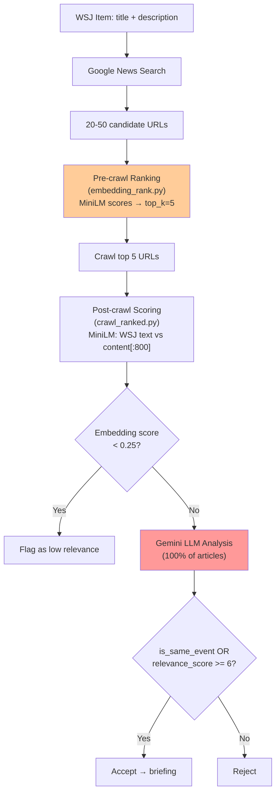
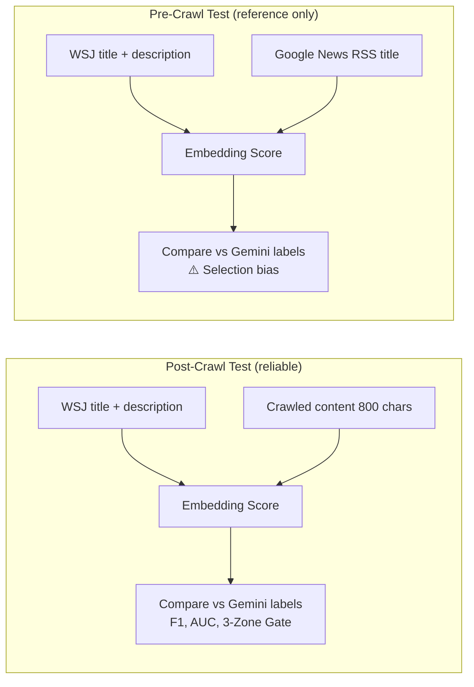
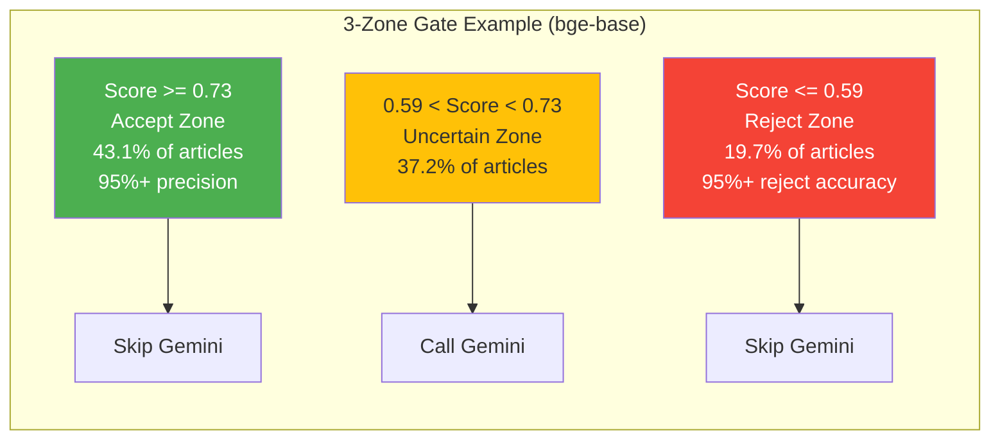
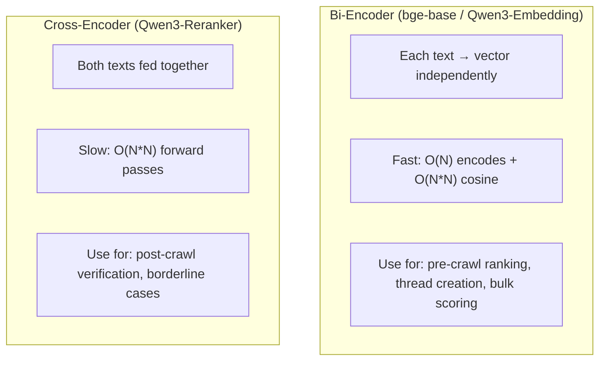
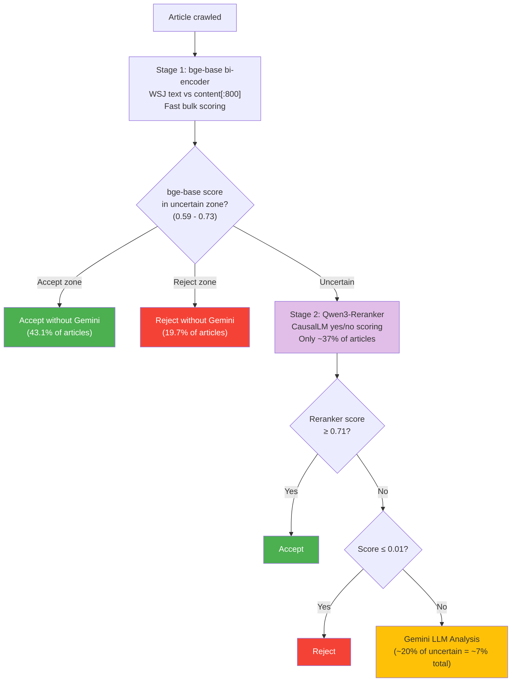
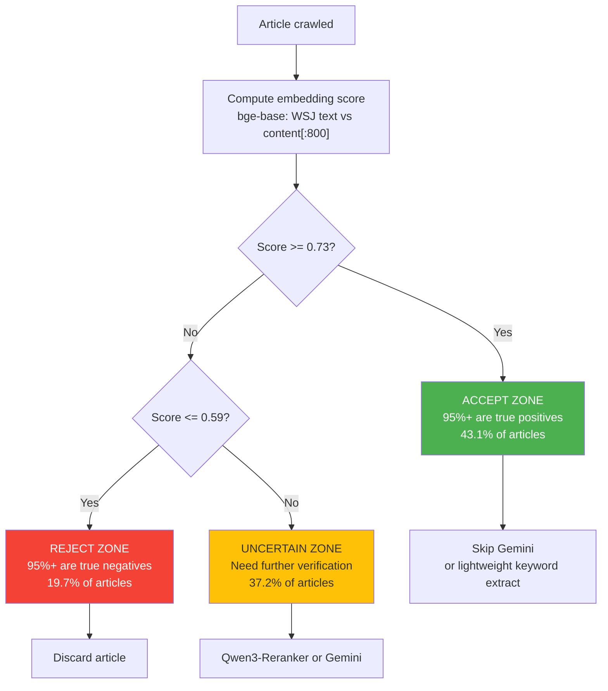
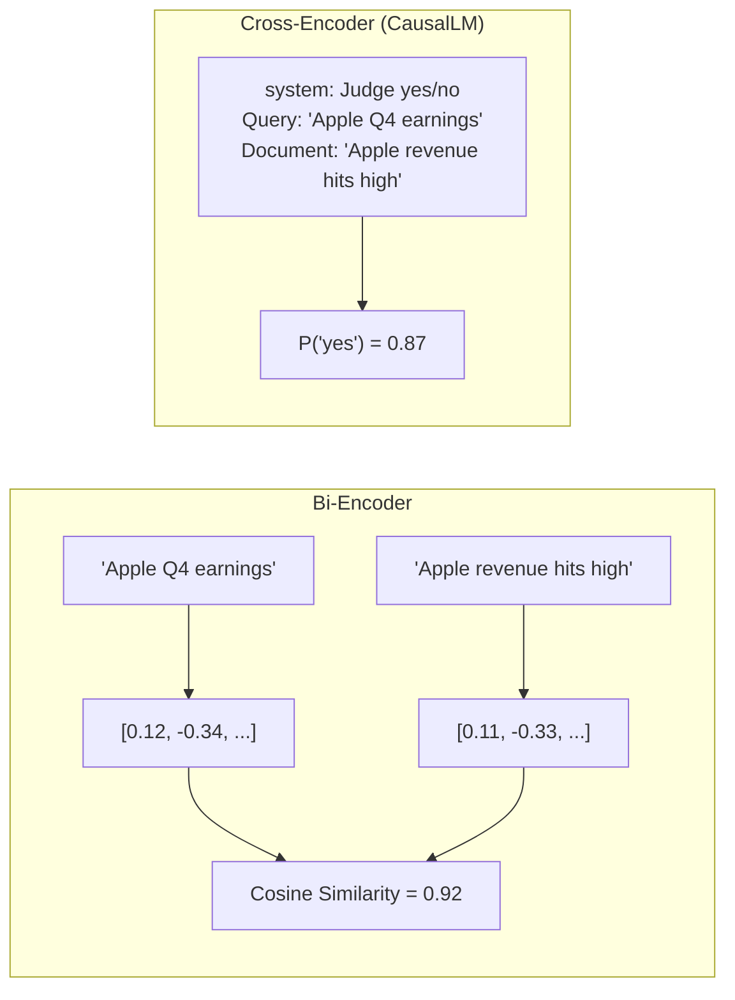

<!-- Updated: 2026-02-20 -->
# Embedding A/B Test Results

## Overview

WSJ 뉴스 파이프라인에서 크롤된 기사 ~35%가 "wrong event" (같은 주제, 다른 사건).
현재 `all-MiniLM-L6-v2` (22M params)로 임베딩 필터링 중.
더 나은 모델로 교체하면 Gemini 호출을 줄이고 정확도를 높일 수 있는지 실제 DB 데이터(1,951 labeled pairs)로 측정.

**Notebook**: `notebooks/embedding_ab_test.ipynb`
**PRD**: `docs/workflow/2-prds/5-prd-embedding-ab-test.md`

---

## Pipeline Context



**Problem**: Gemini is called for 100% of crawled articles. ~35% are rejected as wrong event.
**Goal**: Use better embeddings to skip Gemini calls for obvious accept/reject cases.

---

## What We Tested

### Models

| # | Model | Type | Params | MTEB-R | Role |
|---|-------|------|--------|--------|------|
| 1 | `all-MiniLM-L6-v2` | Bi-encoder | 22M | ~42 | Current baseline (pre/post-crawl) |
| 2 | `BAAI/bge-base-en-v1.5` | Bi-encoder | 110M | ~53 | Current thread model |
| 3 | `BAAI/bge-large-en-v1.5` | Bi-encoder | 335M | ~56 | bge upgrade candidate |
| 4 | `Qwen/Qwen3-Embedding-0.6B` | Bi-encoder | 600M | ~62 | Best under 1B |
| 5 | `cross-encoder/ms-marco-MiniLM-L-12-v2` | Cross-encoder | 33M | — | Light cross-encoder |
| 6 | `Qwen/Qwen3-Reranker-0.6B` | Cross-encoder (CausalLM) | 600M | — | Best under 1B CE |

### What We Measured



### Ground Truth Label
```python
label = (is_same_event == True) | (relevance_score >= 6)
# Matches crawl_ranked.py line 449 accept logic
```

---

## Dataset

- **Source**: `wsj_crawl_results` (crawl_status='success') + `wsj_items` + `wsj_llm_analysis`
- **Total merged rows**: 1,951
- **Label distribution**: 1,068 positive (54.7%) / 883 negative (45.3%)
- **Baseline stats** (DB `embedding_score`, all-MiniLM-L6-v2):
  - Positive mean: 0.6808 (std 0.138)
  - Negative mean: 0.4359 (std 0.133)

---

## Results

### Post-Crawl Performance (WSJ text vs crawled content 800 chars)

| Rank | Model | F1 | AUC | Precision | Recall | Threshold | Time (s) |
|------|-------|-----|-----|-----------|--------|-----------|----------|
| **1** | **CE: Qwen3-Reranker** | **0.8971** | **0.9556** | 0.8692 | 0.9270 | 0.0924 | 442 |
| 2 | Qwen3-Embedding-0.6B | 0.8994 | 0.9501 | 0.9257 | 0.8745 | 0.5681 | 203* |
| 3 | bge-large-en-v1.5 | 0.8827 | 0.9398 | 0.8844 | 0.8811 | 0.6856 | 99 |
| 4 | bge-base-en-v1.5 | 0.8783 | 0.9375 | 0.8958 | 0.8614 | 0.6926 | 30 |
| 5 | all-MiniLM-L6-v2 | 0.8574 | 0.9155 | 0.8590 | 0.8558 | 0.5207 | 8 |
| 6 | CE: ms-marco-MiniLM | 0.8472 | 0.8887 | 0.7997 | 0.9007 | 0.2801 | 32 |

*Qwen3-Embedding on MPS with batch_size=4 (fresh kernel). Previous CPU run: 530s.

Note: Qwen3-Reranker has highest AUC (best discrimination), Qwen3-Embedding has highest F1 (best balanced accuracy). Both are top-tier.

```mermaid
bar
    title Post-Crawl AUC Comparison
    "CE Qwen3-Reranker" : 0.9556
    "Qwen3-Embed" : 0.9501
    "bge-large" : 0.9398
    "bge-base" : 0.9375
    "MiniLM (current)" : 0.9155
    "CE ms-marco" : 0.8887
```

### Score Distribution Stats

| Model | Positive Mean | Negative Mean | Gap | Interpretation |
|-------|-------------|-------------|-----|----------------|
| CE: Qwen3-Reranker | 0.8418 | 0.0918 | **0.7500** | Best separation — nearly binary |
| CE: ms-marco | 0.8597 | 0.2415 | 0.6183 | Good separation |
| Qwen3-Embedding | 0.7070 | 0.4168 | 0.2902 | Clear separation |
| MiniLM | 0.6522 | 0.4136 | 0.2387 | Moderate overlap |
| bge-large | 0.7804 | 0.6082 | 0.1722 | Significant overlap |
| bge-base | 0.7788 | 0.6097 | 0.1691 | Significant overlap |

Larger gap = easier to set thresholds. Qwen3-Reranker's gap (0.75) is 3x larger than any bi-encoder.

### 3-Zone Gate Analysis (95% precision target)

| Model | Accept Thresh | Reject Thresh | Accept % | Reject % | Uncertain % | **Gemini Savings** |
|-------|--------------|--------------|----------|----------|-------------|-------------------|
| **CE: Qwen3-Reranker** | 0.7137 | 0.0115 | 47.7% | 31.9% | 20.5% | **79.5%** |
| Qwen3-Embedding | 0.5969 | 0.4155 | 47.5% | 24.2% | 28.2% | 71.8% |
| bge-large | 0.7325 | 0.6023 | 42.1% | 23.3% | 34.5% | 65.5% |
| **bge-base** | **0.7299** | **0.5907** | **43.1%** | **19.7%** | **37.2%** | **62.8%** |
| CE: ms-marco | 0.9996 | 0.0000 | 12.4% | 4.2% | 83.4% | 16.6% |
| all-MiniLM (current) | 0.6363 | — | 0% | 0% | 100% | **0%** |



### bge Prefix Test Result

bge models support an optional query prefix: `"Represent this sentence for searching relevant passages: "`

| Config | F1 | AUC |
|--------|-----|-----|
| bge-base **no prefix** | **0.8783** | **0.9375** |
| bge-base with prefix | 0.8774 | 0.9371 |

**Result**: No prefix is slightly better. Current `embed_and_thread.py` behavior (no prefix) is correct.

### Pre-Crawl Performance (reference only — selection bias)

| Rank | Model | F1 | AUC |
|------|-------|-----|-----|
| 1 | Qwen3-Embedding | 0.8705 | 0.9060 |
| 2 | CE: Qwen3-Reranker | 0.8671 | 0.9138 |
| 3 | bge-base | 0.8582 | 0.8996 |
| 4 | bge-large | 0.8574 | 0.9043 |
| 5 | all-MiniLM | 0.8532 | 0.8960 |
| 6 | CE: ms-marco | 0.8023 | 0.8164 |

Pre-crawl differences are much smaller (F1 range 0.80-0.87). Selection bias makes these unreliable — see Data Limitations.

---

## Technical Issues

### Qwen3-Embedding MPS OOM (Resolved)
```
MPS allocated: 10.62 GiB, other allocations: 7.38 GiB, max allowed: 18.13 GiB
```
- **Cause**: Default batch_size=32 too large for 800-char texts on M2 16GB
- **Fix**: Fresh kernel + `batch_size=4` for long texts, `batch_size=8` for short texts
- **Result**: MPS worked — 203s total (vs 530s on CPU, 2.6x speedup)

### Qwen3-Reranker Model Loading (Resolved)
```
Some weights of Qwen3ForSequenceClassification were not initialized from the model
checkpoint: ['score.weight']. You should probably TRAIN this model.
```
- **Cause**: `sentence-transformers.CrossEncoder` loaded the model as `AutoModelForSequenceClassification`, creating a random `score.weight` layer instead of using the pretrained CausalLM weights
- **Initial result**: AUC 0.4991 (random noise)
- **Fix**: Load via `transformers.AutoModelForCausalLM` and score using "yes"/"no" token probabilities per Qwen3-Reranker model card
- **Fixed result**: AUC 0.9556 (1st place!)

### Correct Qwen3-Reranker Loading Pattern
```python
from transformers import AutoModelForCausalLM, AutoTokenizer

tokenizer = AutoTokenizer.from_pretrained(model_name, padding_side='left')
reranker = AutoModelForCausalLM.from_pretrained(model_name, torch_dtype=torch.float32).to(DEVICE).eval()

token_true_id = tokenizer.convert_tokens_to_ids("yes")
token_false_id = tokenizer.convert_tokens_to_ids("no")

# Format: system prompt + <Instruct> + <Query> + <Document> + assistant think tags
# Score: softmax([false_logits, true_logits])[:, 1]
```

Key insight: Qwen3-Reranker is a **CausalLM** (generative model), NOT a SequenceClassification model. It "generates" a yes/no answer and the score comes from the probability distribution over those tokens.

---

## Key Findings

### 1. Current MiniLM Cannot Support 3-Zone Gate
Score distributions overlap too much. No threshold achieves 95% precision for either accept or reject. 0% Gemini savings.

### 2. bge-base Is the Best Value for Post-Crawl Gate
- Already installed (`embed_and_thread.py` uses it)
- F1: 0.857 → 0.878 (+2.1%p)
- Enables 62.8% Gemini savings via 3-zone gate
- Only 4x slower than MiniLM (30s vs 8s for 1,951 articles)

### 3. Qwen3-Reranker Is the Best Discriminator (Fixed)
- **AUC 0.9556** — highest of all models
- **79.5% Gemini savings** — highest of all models
- Score gap 0.75 (positive mean 0.84 vs negative mean 0.09) — nearly binary discrimination
- But: 442s for 1,951 pairs, requires CausalLM loading (not sentence-transformers compatible)
- Best suited as a **2nd-stage verifier**, not primary ranker

### 4. Qwen3-Embedding Works on MPS
- CPU 530s → MPS 203s (2.6x speedup with batch_size=4)
- F1: 0.899, AUC: 0.950, 71.8% Gemini savings
- Good balance of quality and speed for bi-encoder use case

### 5. bge-large Offers Minimal Gain Over bge-base
- F1 +0.004, AUC +0.002 over bge-base
- 3x slower (99s vs 30s)
- Not worth the upgrade

### 6. ms-marco Cross-Encoder Underperforms
- AUC 0.889 < bge-base 0.938
- Not useful for this task

---

## Role of Each Model in the Pipeline

### Bi-Encoder vs Cross-Encoder: When to Use Which



**Thread creation** requires comparing N articles pairwise:
- Bi-encoder: encode N articles once → cosine similarity matrix (fast)
- Cross-encoder: N x N forward passes (impractical for >50 articles)

**Post-crawl gate** compares 1 WSJ item vs 1 crawled article:
- Cross-encoder is feasible here (only ~5 pairs per WSJ item)
- Qwen3-Reranker's 79.5% Gemini savings makes it worthwhile

### Recommended 2-Stage Pipeline



**Expected combined savings**: bge-base handles 63% → Reranker handles most of remaining 37% → **~90%+ Gemini savings** (estimated, needs validation).

### Thread Creation Role

For thread creation (`embed_and_thread.py`), the workflow is:
1. **bge-base** (or Qwen3-Embedding) encodes all articles → embedding vectors
2. Cosine similarity matrix → cluster articles into threads
3. **Qwen3-Reranker** can verify borderline thread assignments (articles near the similarity threshold)

Cross-encoder cannot replace bi-encoder for threading — N x N pairwise scoring is too slow. But it can **refine** thread boundaries.

---

## Data Limitations

1. **Selection bias (pre-crawl)**: Dataset only contains candidates already selected by MiniLM top_k. MiniLM may appear artificially competitive in pre-crawl tests.
2. **No Recall@K/MRR**: Cannot measure ranking quality without full candidate pool (20-50 per WSJ item).
3. **Label coverage**: Only crawl-success rows (1,951 of 2,326) have LLM labels.

### Forbidden Conclusions
- "Model X improves Recall@K by Y%"
- "Results will generalize to full candidate distribution"
- "Production savings will exactly match test numbers"

---

## Recommendations

### Phase 1: Reject-Only Gate with bge-base (Immediate)
Most conservative approach — only filter out obvious negatives:

```python
# In crawl_ranked.py, after computing embedding score with bge-base:
if embedding_score <= 0.59:
    # 95% probability this is wrong event → skip Gemini
    continue
# else: call Gemini as usual
```

Expected savings: ~20% Gemini calls eliminated (reject zone only).

### Phase 2: Full 3-Zone Gate with bge-base
After validating reject-only gate in production:

```python
if embedding_score >= 0.73:
    # Accept without Gemini (but need alternative for keywords/summary)
    pass
elif embedding_score <= 0.59:
    # Reject without Gemini
    continue
else:
    # Uncertain → call Gemini
    llm_result = call_gemini(...)
```

Expected savings: ~63% Gemini calls eliminated.

### Phase 3: Add Qwen3-Reranker as 2nd-Stage Verifier
For uncertain-zone articles (37% of total), run Qwen3-Reranker:

```python
if bge_score >= 0.73:
    accept()  # bge accept zone
elif bge_score <= 0.59:
    reject()  # bge reject zone
else:
    # Uncertain → use Qwen3-Reranker instead of Gemini
    reranker_score = qwen3_rerank(wsj_text, crawled_content)
    if reranker_score >= 0.71:
        accept()
    elif reranker_score <= 0.01:
        reject()
    else:
        llm_result = call_gemini(...)  # only ~7% of articles reach here
```

Expected savings: ~90%+ Gemini calls eliminated (needs production validation).

### Phase 4: Qwen3-Reranker for Thread Verification
Use Qwen3-Reranker to verify borderline thread assignments:
- After bge-base clusters articles into threads, run reranker on articles near the cluster boundary
- Reduces false thread merges (different events incorrectly grouped)

### Future: Qwen3-Embedding on Mac Mini M4
- Already confirmed working on MPS (M2 MacBook Pro, batch_size=4)
- Mac Mini M4 16GB should run it with similar performance
- Consider replacing bge-base for higher accuracy (71.8% vs 62.8% savings)

### Future: Full Candidate Logging for Pre-Crawl Validation
- Store all N=20-50 Google News candidates per WSJ item (not just top_k)
- Re-run A/B test with unbiased pre-crawl data

---

## Appendix: How the 3-Zone Gate Works



## Appendix: Embedding Explained



- **Bi-encoder**: Each text → vector independently → compare vectors. Fast, can pre-compute. Use for bulk scoring and threading.
- **Cross-encoder (CausalLM)**: Both texts fed as a prompt → model generates yes/no → score from token probabilities. Slower, more accurate. Use for verification.
