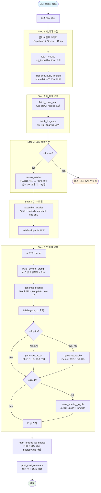

<!-- Updated: 2026-02-15 -->
# 브리핑 스크립트 가이드 — `scripts/generate_briefing.py`

WSJ 기사로부터 매일 금융 브리핑(EN/KO)을 생성하고, TTS 오디오와 Supabase 저장까지 처리하는 프로덕션 스크립트.

---

## 파이프라인 흐름도



---

## 단계별 설명

### Step 1 — 데이터 수집

**`fetch_articles(sb, target_date, hours)`** (line 320)
- `wsj_items` 테이블에서 lookback 윈도우(기본 48시간) 내에 발행된 기사를 조회
- `published_at` 내림차순으로 정렬된 기사 목록 반환

**`filter_previously_briefed(sb, items, target_date)`** (line 336)
- `wsj_items.briefed` 컬럼을 확인해서 이전 브리핑에 사용된 기사를 제외
- 브리핑 LLM에 입력된 전체 기사가 `briefed=true`로 마킹됨 (큐레이션된 기사뿐 아니라 전체)
- junction 테이블 조회 불필요 — 단순 컬럼 필터링으로 성능 향상

### Step 2 — 데이터 보강

**`fetch_crawl_map(sb, item_ids)`** (line 366)
- `wsj_crawl_results`를 조인해서 기사별 크롤링된 전체 텍스트를 가져옴
- `crawl_status = 'success'`인 것만 사용하고, 크롤 결과가 여러 개면 `llm_score`가 가장 높은 것을 선택
- 100개씩 배치 처리

**`fetch_llm_map(sb, crawl_ids)`** (line 390)
- `wsj_llm_analysis`를 조인해서 요약, 핵심 인물, 핵심 수치, 이벤트 유형 등 추출된 분석 데이터를 가져옴
- 이 보강 데이터 덕분에 브리핑 프롬프트가 제목+설명만으로는 불가능한 수준의 풍부함을 가짐

### Step 3 — LLM 큐레이션

**`curate_articles(gemini, items, crawl_map, llm_map, cost)`** (line 443)
- 번호가 매겨진 기사 목록을 만들어서 (제목, 설명, 엔티티 힌트 포함) LLM에게 전달
- Gemini 2.5 Pro에 낮은 temperature(0.1)와 thinking budget(4096)으로 호출
- Pro에서 최대 3번 시도 후 실패하면 Flash로 폴백
- JSON 배열 응답을 파싱해서 1-indexed 기사 번호를 추출
- "큐레이션된" 기사의 `wsj_item_id` set 반환 (상위 10-15개)

### Step 4 — 기사 조립

**`assemble_articles(items, crawl_map, llm_map, curated_ids)`** (line 539)
- `Article` 객체를 3단계 콘텐츠 깊이로 구성:

| 등급 | 조건 | 콘텐츠 |
|------|------|--------|
| **CURATED** | 큐레이션 선정 + 양질의 크롤 | 전체 크롤 콘텐츠 (길이 제한 없음) |
| **STANDARD** | 양질의 크롤이지만 큐레이션 미선정 | 800자로 잘림 |
| **TITLE-ONLY** | 양질의 크롤 없음 | 제목 + 설명만 |

- "양질의 크롤" = `relevance_score >= 0.6` 또는 `llm_same_event = true`
- 이 등급 구분으로 프롬프트 길이를 제어하면서도 핵심 기사에는 상세 내용을 보장

### Step 5 — 브리핑 생성 (언어별)

**`build_briefing_prompt(articles, target_date, lang)`** (line 617)
- 언어에 맞는 시스템 프롬프트 선택 (EN 또는 KO)
- 모든 기사를 구조화된 텍스트 블록으로 포맷 (제목, 설명, 콘텐츠, 엔티티, 수치 포함)
- 각 기사에 `published_at` 타임스탬프 포함 — LLM이 시장 데이터의 최신성을 판단할 수 있도록

**`generate_briefing(gemini, prompt, lang, cost)`** (line 626)
- Gemini 2.5 Pro 호출:
  - `temperature = 0.6` (EN/KO 동일하게 통일)
  - `thinking_budget = 4096` (32K에서 최적화 — 품질 동일, 비용 87% 절감)
  - `max_output_tokens = 8192`
- 토큰 사용량(input, output, thinking)을 `CostTracker`에 누적 기록
- 목표 출력: 1,800-2,000 단어, 팟캐스트 스타일 플레인 텍스트

### Step 6 — TTS 오디오 생성

**영어: `generate_tts_en(chirp, text, out_path, cost)`** (line 686)
- Google Cloud **Chirp 3 HD** 사용 (`en-US-Chirp3-HD-Alnilam` 음성)
- 4,000자 경계에서 문장 단위로 청크 분할
- 각 청크마다 최대 3회 재시도 (exponential backoff)
- WAV 청크들을 합친 후 ffmpeg로 MP3 변환 (128kbps)
- 재생 속도: 1.1x

**한국어: `generate_tts_ko(gemini, text, out_path, cost)`** (line 783)
- **Gemini 2.5 Pro Preview TTS** 사용 (`Kore` 음성)
- 단일 패스 생성 (청크 분할 API 미지원)
- 차분한 스타일 프리픽스를 텍스트 앞에 추가해서 톤 안내
- WAV → ffmpeg MP3 변환 (128kbps)

**왜 두 개의 TTS 프로바이더?** Chirp 3 HD에는 한국어 고품질 음성이 없고, Gemini TTS는 preview 전용이라 청크 분할 API가 없음. 언어별로 다른 도구를 쓰는 게 현실적인 선택.

### Step 7 — DB 저장

**`save_briefing_to_db(sb, target_date, category, result, articles, tts_result)`** (line 836)
- `wsj_briefings`에 upsert (conflict key: `date,category`) — 재실행해도 안전
- `wsj_briefing_items` junction 테이블로 모든 기사를 연결 (100개씩 배치, upsert)
- junction 테이블은 추적/감사 목적으로 유지

### Step 8 — 브리핑 기사 마킹

**`mark_articles_as_briefed(sb, articles)`**
- 브리핑 LLM에 입력된 전체 기사의 `wsj_items.briefed`를 `true`로 업데이트
- 100개씩 배치 처리
- 이 마킹이 다음 실행의 `filter_previously_briefed`를 구동하는 핵심
- junction 테이블(`wsj_briefing_items`)은 여전히 모든 기사를 연결 — 추적/감사 목적

### Step 9 — 비용 요약

**`print_cost_summary(cost)`** (line 875)
- 모든 API 비용의 구조화된 분석 출력:
  - 큐레이션 토큰 (Pro 또는 Flash)
  - 브리핑 토큰 (EN + KO 누적)
  - TTS 문자 수
  - 예상 총 비용 (USD)

---

## CLI 사용법

```bash
# 전체 실행 (EN + KO, TTS + DB 포함)
python scripts/generate_briefing.py

# 특정 날짜
python scripts/generate_briefing.py --date 2026-02-13

# 한국어만, 오디오 없이
python scripts/generate_briefing.py --lang ko --skip-tts

# 읽기 전용 드라이런 (LLM/TTS/DB 호출 없음)
python scripts/generate_briefing.py --dry-run

# 전체 옵션
python scripts/generate_briefing.py \
  --date YYYY-MM-DD \     # 대상 날짜 (기본: 오늘)
  --lang en ko \           # 언어 (기본: 둘 다)
  --skip-tts \             # 오디오 생성 건너뛰기
  --skip-db \              # Supabase 저장 건너뛰기
  --dry-run \              # 조회 + 조립만 수행
  --hours 48 \             # Lookback 윈도우 (기본: 48시간)
  --output-dir PATH        # 출력 디렉토리 (기본: scripts/output/briefings/)
```

---

## 출력 파일 구조

```
scripts/output/briefings/
  2026-02-14/
    articles-input-2026-02-14.txt    # 조립된 전체 기사 (디버그/감사용)
    briefing-en-2026-02-14.txt       # EN 브리핑 텍스트
    briefing-ko-2026-02-14.txt       # KO 브리핑 텍스트
    audio-en-2026-02-14.mp3          # EN 오디오 (Chirp 3 HD, 128kbps MP3)
    audio-ko-2026-02-14.mp3          # KO 오디오 (Gemini TTS, 128kbps MP3)
```

---

## 1회 실행 비용

| 구성요소 | 토큰/문자 | 비용 |
|----------|----------|------|
| 큐레이션 (Pro, 4K think) | ~2.5K in, 120 out, 1.2K think | ~$0.006 |
| EN 브리핑 (Pro, 4K think) | ~12.8K in, 2K out, 4K think | ~$0.051 |
| KO 브리핑 (Pro, 4K think) | ~13.4K in, 3.1K out, 4K think | ~$0.063 |
| EN TTS (Chirp 3 HD) | ~9,000 chars | ~$0.144 |
| KO TTS (Gemini) | ~6,000 chars | ~$0.060 |
| **합계** | | **~$0.324** |

**월간 비용**: 매일 ~$9.70/월 | 평일만 ~$7.10/월

---

## 사용하는 DB 테이블

| 테이블 | 역할 |
|--------|------|
| `wsj_items` | 소스 기사 (RSS 피드 항목) + `briefed` 플래그 |
| `wsj_crawl_results` | 크롤링된 전체 텍스트 |
| `wsj_llm_analysis` | 추출된 엔티티, 수치, 요약 |
| `wsj_briefings` | 생성된 브리핑 텍스트 + 메타데이터 |
| `wsj_briefing_items` | Junction: 어떤 기사가 어떤 브리핑에 포함됐는지 |
