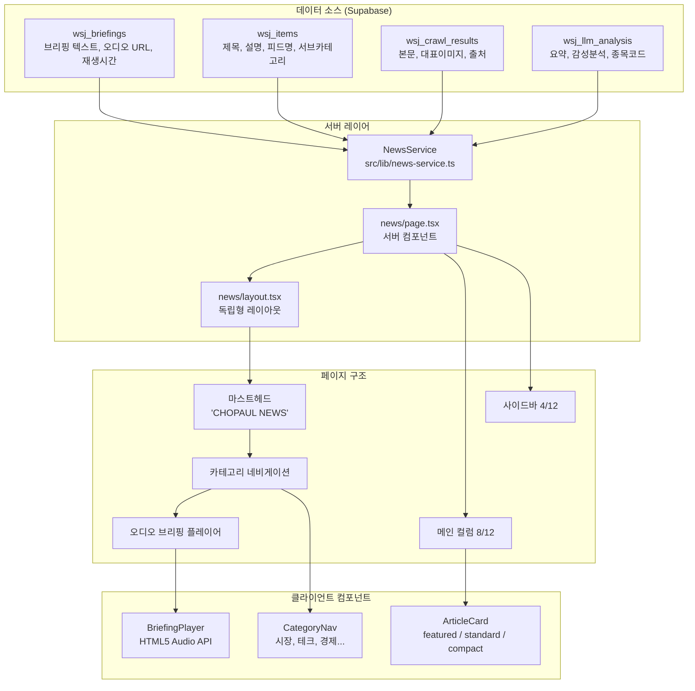
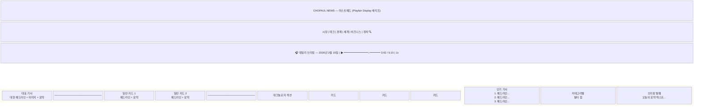
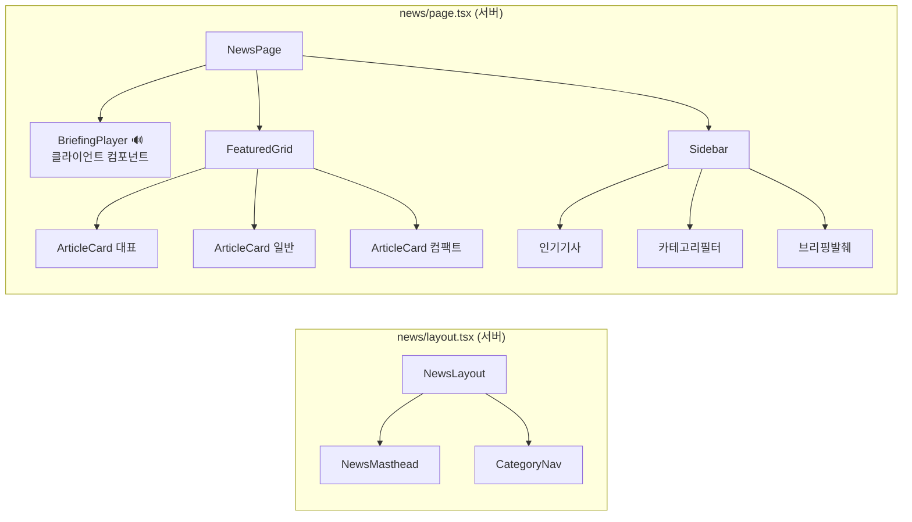
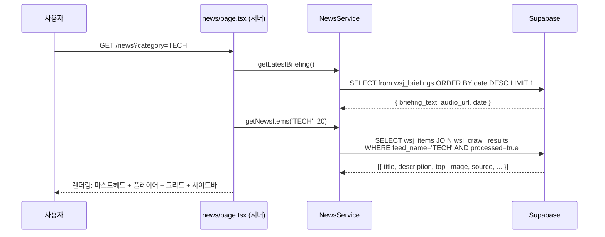

<!-- Created: 2026-02-15 -->
# 아이디어: 뉴스 프론트엔드 — WSJ 스타일 금융 뉴스 페이지

## 개요
`chopaul.com/news`를 WSJ 스타일의 독립형 뉴스 페이지로 구축. 기존 금융 파이프라인 데이터(기사, 브리핑, 오디오)를 전문적인 에디토리얼 레이아웃으로 표시.

---

## 아키텍처 다이어그램

## 페이지 레이아웃 와이어프레임

## 컴포넌트 트리

## 데이터 흐름

---

## 설계 결정

| 결정 사항 | 선택 | 이유 |
|----------|------|------|
| 오디오 플레이어 | 네이티브 HTML5 Audio API | 번들 비용 제로, 완전한 UI 제어, 단순한 요구사항 |
| 레이아웃 | 독립형 (사이트 쉘 미사용) | WSJ 스타일 에디토리얼 경험, 자체 마스트헤드 |
| 카드 스타일 | WSJ 에디토리얼 그리드 | 대표기사 + 2열 그리드 + 카테고리 섹션 |
| 스타일링 | `@theme`의 WSJ 토큰 (Tailwind v4) | `news-*` 네임스페이스, 전역 오염 방지 |
| 폰트 | Playfair Display (헤드라인) + Inter (UI) | 루트 레이아웃에 이미 로드됨 |
| 데이터 | 서버 컴포넌트 + NewsService | 클라이언트 사이드 패칭 없음, 빠른 TTFB |
| 카테고리 필터 | URL 검색 파라미터 (`?category=TECH`) | 공유 가능, SEO 친화적, 서버 컴포넌트 호환 |

## 구현 단계

1. **뉴스 레이아웃 + WSJ 디자인 토큰** — `news/layout.tsx` + globals.css `@theme` 추가
2. **오디오 브리핑 플레이어** — 커스텀 `BriefingPlayer` 클라이언트 컴포넌트
3. **뉴스 데이터 서비스** — Supabase에서 가져오는 `NewsService` 클래스
4. **기사 카드 컴포넌트** — 3가지 변형의 `ArticleCard`
5. **페이지 조립** — 실제 데이터로 그리드 레이아웃 연결
6. **카테고리 라우팅** — 검색 파라미터로 카테고리 필터링

## WSJ 디자인 레퍼런스
- 색상: midnight `#111`, coal `#333`, smoke `#ebebeb`, blue `#0274b6`, red `#e10000`, gold `#816d4d`
- 타이포그래피: 17px 기본, 세리프 헤드라인, 산세리프 UI/메타
- 레이아웃: 1280px 최대폭, 12열 그리드 (8+4 사이드바), 전체 1px 보더 구분선
- 헤더: 대형 세리프 타이틀 → 카테고리 네비 (다크 바) → 콘텐츠
