<!-- Created: 2026-02-15 -->
# Idea: News Frontend — WSJ-Inspired Finance News Page

## Overview
Build `chopaul.com/news` as a standalone, WSJ-inspired news page that surfaces the existing finance pipeline data (articles, briefings, audio) in a professional editorial layout.

---

## Architecture Diagram

## Page Layout Wireframe

## Component Tree

```mermaid
graph LR
    subgraph "news/layout.tsx (Server)"
        L[NewsLayout]
        L --> M[NewsMasthead]
        L --> CN[CategoryNav]
    end

    subgraph "news/page.tsx (Server)"
        P[NewsPage]
        P --> BP[BriefingPlayer 🔊<br/>Client Component]
        P --> FG[FeaturedGrid]
        P --> SB[Sidebar]

        FG --> AC1[ArticleCard featured]
        FG --> AC2[ArticleCard standard]
        FG --> AC3[ArticleCard compact]

        SB --> MR[MostRead]
        SB --> CF[CategoryFilter]
        SB --> BE[BriefingExcerpt]
    end
```

## Data Flow

---

## Design Decisions

| Decision | Choice | Rationale |
|----------|--------|-----------|
| Audio player | Native HTML5 Audio API | Zero bundle cost, full UI control, simple needs |
| Layout | Standalone (not reusing site shell) | WSJ-style editorial experience, own masthead |
| Card style | WSJ editorial grid | Featured hero + 2-col grid + category sections |
| Styling | WSJ tokens in `@theme` (Tailwind v4) | Namespaced `news-*` colors, no global pollution |
| Fonts | Playfair Display (headlines) + Inter (UI) | Already loaded in root layout |
| Data | Server Components + NewsService | No client-side fetching, fast TTFB |
| Category filter | URL search params (`?category=TECH`) | Shareable, SEO-friendly, Server Component compatible |

## Implementation Steps

1. **News Layout + WSJ Design Tokens** — `news/layout.tsx` + globals.css `@theme` additions
2. **Audio Briefing Player** — Custom `BriefingPlayer` client component
3. **News Data Service** — `NewsService` class fetching from Supabase
4. **Article Card Component** — `ArticleCard` with 3 variants
5. **Page Assembly** — Wire up grid layout with real data
6. **Category Routing** — Filter by category via search params

## WSJ Design Reference
- Colors: midnight `#111`, coal `#333`, smoke `#ebebeb`, blue `#0274b6`, red `#e10000`, gold `#816d4d`
- Typography: 17px base, serif headlines, sans-serif UI/meta
- Layout: 1280px max-width, 12-col grid (8+4 sidebar), 1px border dividers everywhere
- Header: Large serif title → category nav (dark bar) → content
