<!-- Created: 2026-02-17 -->
<!-- Updated: 2026-02-17 -->
# Proposal: News Page UX Enhancements

> **Goal**: Enhance user intuition — make it easier to navigate, scan, and discover connections between articles.

---

## Table of Contents

1. [Current State Analysis](#current-state-analysis)
2. [Why Not Graph View?](#why-not-graph-view)
3. [Phase 1: Keywords + Embedding + Clustering](#phase-1-keywords--embedding--clustering)
4. [Phase 2: Hub & Spoke Article Detail](#phase-2-hub--spoke-article-detail)
5. [Technical Strategy: Embeddings](#technical-strategy-embeddings)
6. [Model & Cost Decisions](#model--cost-decisions)
7. [Implementation Roadmap](#implementation-roadmap)

---

## Current State Analysis

### Existing Pipeline


**What exists in `wsj_llm_analysis`:**
- `summary` — LLM-generated 1-2 sentence summary
- `sentiment` — positive / negative / neutral
- `time_horizon` — immediate / short_term / long_term
- `relevance_score` — 0-10

**What does NOT exist yet:** keywords, embeddings, clusters.

### Current Frontend User Flow


### What's Wrong

```mermaid
graph TD
    subgraph "Current: Flat List — Every Card Looks Identical"
        A1["📰 Fed holds rates steady"]
        A2["📰 Nvidia earnings beat"]
        A3["📰 Mortgage rates tick up"]
        A4["📰 TSMC ramps production"]
        A5["📰 Housing market braces"]
        A6["📰 AI regulation debate"]
        A7["📰 ... 24 more articles"]
    end

    style A1 fill:#f5f5f5,stroke:#ccc
    style A2 fill:#f5f5f5,stroke:#ccc
    style A3 fill:#f5f5f5,stroke:#ccc
    style A4 fill:#f5f5f5,stroke:#ccc
    style A5 fill:#f5f5f5,stroke:#ccc
    style A6 fill:#f5f5f5,stroke:#ccc
    style A7 fill:#f5f5f5,stroke:#ccc
```



Users can't tell that articles 1, 3, 5 are all about the same "Fed impact on housing" story. They scroll, skim, and leave.

| Problem | Impact | Severity |
|---------|--------|----------|
| No visual differentiation between articles | Users skim past everything | High |
| Hidden relationships between articles | Miss the bigger picture | High |
| Click → external site → bounce | Zero retention, zero depth | Critical |
| 30 items = cognitive overload | Decision paralysis, early exit | High |
| Category tabs too broad (5 categories for 30 articles) | Filtering doesn't help enough | Medium |

---

## Why Not Graph View?

The initial idea was an Obsidian-style graph view. Here's why it doesn't work for news, and what we do instead:

| Obsidian (works) | News site (doesn't work) |
|-----------------|-------------------------|
| Personal notes — user knows the content | First-time articles — user has no context |
| Small corpus (tens to hundreds) | 30+ articles daily, changing every day |
| Permanent — spatial memory forms over time | Ephemeral — position resets daily |
| User-created links = meaningful connections | Auto-generated links = noise |
| Exploration is the goal | Quick scanning is the goal |

```mermaid
graph TD
    subgraph "Why Graph View Fails for News"
        GF1["30 nodes = visual spaghetti"]
        GF2["No spatial memory<br/>(articles change daily)"]
        GF3["Users want to scan,<br/>not explore a graph"]
    end

    subgraph "What Actually Solves It"
        HS1["Clustering: 30 → 8 chunks<br/>(cognitive load reduction)"]
        HS2["Keywords: visual scent signals<br/>(scanability)"]
        HS3["Hub & Spoke: focused graph<br/>(1 center + 5-8 spokes, not 30 nodes)"]
    end

    GF1 -.->|"solved by"| HS1
    GF2 -.->|"solved by"| HS2
    GF3 -.->|"solved by"| HS3

    style GF1 fill:#fee,stroke:#c00
    style GF2 fill:#fee,stroke:#c00
    style GF3 fill:#fee,stroke:#c00
    style HS1 fill:#efe,stroke:#0a0
    style HS2 fill:#efe,stroke:#0a0
    style HS3 fill:#efe,stroke:#0a0
```



**Key insight**: The *value* of a graph view — discovering connections — can be delivered through clustering + hub-spoke without the visual complexity.

---

## Phase 1: Keywords + Embedding + Clustering

> Merged from original proposals 1 (Keywords) and 2 (Clustering). They share the same data layer (embeddings + keywords), so building them together is more efficient.

### What This Phase Delivers

1. **Keyword pills** on every article card (2-4 tags like `[Fed] [Inflation] [Rate Cut]`)
2. **Keyword filter bar** at the top of the page
3. **Story clusters** that group related articles (30 items → 8-10 clusters)
4. **Embedding vectors** stored in DB (foundation for Phase 2's related articles + future search)

### Why It Works — Psychology


- **Recognition over recall**: Users spot "Fed" instantly instead of reading every headline
- **Chunking**: 30 items → 8 clusters = within human cognitive limits
- **Progressive disclosure**: Show clusters collapsed → expand to see individual articles
- **Active filtering**: Clicking keywords gives users agency over what they see

### Visual Example: Clustered View with Keywords

**Default state (collapsed clusters):**

```
┌─────────────────────────────────────────────────────────────────┐
│  FILTER BY TOPIC                                                │
│  ┌─────┐ ┌────────┐ ┌──────┐ ┌─────────┐ ┌────┐ ┌───────┐     │
│  │ Fed │ │ Nvidia │ │ AI   │ │ Tariff  │ │ Oil│ │Housing│     │
│  │ (5) │ │  (3)   │ │ (4)  │ │  (3)    │ │(2) │ │  (2)  │     │
│  └─────┘ └────────┘ └──────┘ └─────────┘ └────┘ └───────┘     │
└─────────────────────────────────────────────────────────────────┘

┌─ 🔴 Fed Rate Decision & Housing Impact ─── 5 articles ─ 2h ago ──┐
│                                                                     │
│  Fed holds rates steady amid inflation concerns                     │
│  The Federal Reserve kept benchmark rates unchanged, signaling...   │
│  [Fed] [Inflation] [Rate Cut]                       via Reuters     │
│                                                                     │
│  ┌──────────────────────────────────────────────────────────────┐   │
│  │  + Mortgage rates tick up after Fed announcement             │   │
│  │  + Housing market braces for prolonged high rates            │   │
│  │  + Bond yields surge on hawkish Fed tone                     │   │
│  │  + Dollar strengthens as Fed signals patience                │   │
│  │                                              ▼ Expand all    │   │
│  └──────────────────────────────────────────────────────────────┘   │
└─────────────────────────────────────────────────────────────────────┘

┌─ 🟣 AI Chip Race ──────────────────────── 4 articles ─ 3h ago ──┐
│                                                                    │
│  Nvidia earnings beat expectations on data center surge            │
│  Revenue jumped 78% year-over-year driven by AI chip demand...     │
│  [Nvidia] [AI] [Earnings]                          via Bloomberg   │
│                                                                    │
│  ┌─────────────────────────────────────────────────────────────┐   │
│  │  + TSMC ramps up CoWoS production for AI chips              │   │
│  │  + AMD unveils MI400 to challenge Nvidia dominance          │   │
│  │  + AI regulation debate heats up in Congress                │   │
│  │                                              ▼ Expand all   │   │
│  └─────────────────────────────────────────────────────────────┘   │
└────────────────────────────────────────────────────────────────────┘

┌─ 🟠 Trade & Tariff Tensions ──────────── 3 articles ─ 5h ago ──┐
│  ...                                                              │
└───────────────────────────────────────────────────────────────────┘
```

**After clicking `Fed` in the filter bar:**

```
┌─────────────────────────────────────────────────────────────────┐
│  FILTER BY TOPIC                                                │
│  ┌─────────┐ ┌────────┐ ┌──────┐ ┌─────────┐                   │
│  │● Fed (5)│ │ Nvidia │ │ AI   │ │ Tariff  │  ...              │
│  │ ACTIVE  │ │  dim   │ │ dim  │ │  dim    │                   │
│  └─────────┘ └────────┘ └──────┘ └─────────┘                   │
│  Showing 2 clusters (5 articles) matching "Fed"                  │
└─────────────────────────────────────────────────────────────────┘

┌─ 🔴 Fed Rate Decision & Housing Impact ─── 5 articles ──────────┐
│  (fully visible — all articles have [Fed] keyword)                │
└──────────────────────────────────────────────────────────────────┘

  🟣 AI Chip Race                                          (dimmed)
  🟠 Trade & Tariff Tensions                               (dimmed)
```

**Expanded cluster with keyword pills:**

```
┌─ 🔴 Fed Rate Decision & Housing Impact ─── 5 articles ─ EXPANDED ─┐
│                                                                      │
│  ┌────────────────────────────────────────────────────────────────┐  │
│  │ 📰 Fed holds rates steady amid inflation concerns             │  │
│  │ The Federal Reserve kept benchmark rates unchanged...          │  │
│  │ [Fed] [Inflation] [Rate Cut]          via Reuters · 2h ago    │  │
│  ├────────────────────────────────────────────────────────────────┤  │
│  │ 📰 Mortgage rates tick up after Fed announcement              │  │
│  │ 30-year fixed mortgage rates rose to 6.8% following...        │  │
│  │ [Fed] [Housing] [Mortgage]              via CNBC · 3h ago     │  │
│  ├────────────────────────────────────────────────────────────────┤  │
│  │ 📰 Housing market braces for prolonged high rates             │  │
│  │ Home sales fell 4.2% in January as buyers pulled back...      │  │
│  │ [Housing] [Fed] [Real Estate]       via Bloomberg · 4h ago    │  │
│  ├────────────────────────────────────────────────────────────────┤  │
│  │ 📰 Bond yields surge on hawkish Fed tone                      │  │
│  │ [Fed] [Bonds] [Yield]                    via WSJ · 3h ago     │  │
│  ├────────────────────────────────────────────────────────────────┤  │
│  │ 📰 Dollar strengthens as Fed signals patience                 │  │
│  │ [Fed] [Dollar] [Forex]                via Reuters · 4h ago    │  │
│  └────────────────────────────────────────────────────────────────┘  │
│                                                        ▲ Collapse    │
└──────────────────────────────────────────────────────────────────────┘
```

### User Flow (Phase 1)


---

## Phase 2: Hub & Spoke Article Detail

### The Idea

Instead of bouncing users to external sites, create an on-site article detail page (`/news/[id]`). When viewing an article, show 5-8 related articles in a "hub and spoke" layout — the practical, focused version of a graph view.

### Why This Is Separate From Phase 1

Phase 1 improves the list page. Phase 2 solves the **bounce problem** — users clicking an article and leaving the site forever. This requires:
- A new `/news/[id]` route
- "Related articles" computation (uses embeddings from Phase 1)
- Fundamentally different UX pattern (detail page vs list page)

### Visual Example: Desktop

```
┌─────────────────────────────────────────────────────────────────────┐
│  /news/abc123                                            [← Back]  │
│                                                                     │
│  ┌──────────────────────────────────────────────────────────────┐   │
│  │                                                              │   │
│  │  MARKETS · 2h ago                                            │   │
│  │                                                              │   │
│  │  Fed holds rates steady amid                                 │   │
│  │  inflation concerns                                          │   │
│  │                                                              │   │
│  │  The Federal Reserve kept benchmark interest rates            │   │
│  │  unchanged at 5.25-5.50% on Wednesday, as policymakers       │   │
│  │  signaled they need more evidence that inflation is          │   │
│  │  sustainably moving toward the 2% target before cutting...   │   │
│  │                                                              │   │
│  │  [Fed] [Inflation] [Rate Cut] [Monetary Policy]              │   │
│  │                                                              │   │
│  │  📎 Read original on Reuters →                               │   │
│  │                                                              │   │
│  └──────────────────────────────────────────────────────────────┘   │
│                                                                     │
│  ── Related Articles ───────────────────────────────────────────    │
│                                                                     │
│       ┌──────────┐   ┌──────────┐   ┌──────────┐                   │
│       │ Mortgage │   │  Bond    │   │  Dollar  │                   │
│       │ rates    │   │  yields  │   │ strength │                   │
│       │ tick up  │   │  surge   │   │ ens on   │                   │
│       │          │   │          │   │  Fed     │                   │
│       │ [Fed]    │   │ [Fed]    │   │ [Fed]    │                   │
│       │ [Housing]│   │ [Bonds]  │   │ [Forex]  │                   │
│       └─────┬────┘   └────┬─────┘   └────┬─────┘                   │
│             │              │              │                          │
│             └──────────────┼──────────────┘                         │
│                            │                                        │
│                     shared: [Fed]                                    │
│                                                                     │
│  ── From Same Cluster ──────────────────────────────────────────    │
│                                                                     │
│  📰 Housing market braces for prolonged high rates      4h ago     │
│  📰 Consumer confidence dips on rate uncertainty        5h ago     │
│                                                                     │
└─────────────────────────────────────────────────────────────────────┘
```

### User Flow (Phase 2)

```mermaid
graph TD
    A["/news — see clusters"] --> B["Click: 'Fed holds rates steady'"]
    B --> C["/news/abc123 — article detail"]
    C --> D["Read summary + keywords"]
    D --> E{"Explore more?"}
    E -->|"Related article"| F["Click spoke: 'Mortgage rates'"]
    F --> G["/news/def456 — new hub"]
    G --> H["New set of related articles"]
    E -->|"Back to list"| I["← Back to /news"]
    E -->|"Read original"| J["External link (secondary)"]

    style C fill:#efe,stroke:#0a0
    style G fill:#efe,stroke:#0a0
    style J fill:#ffe,stroke:#aa0
```



Key insight: Each article click creates a **new hub** with its own spokes. The user naturally traverses the article graph without ever seeing an overwhelming 30-node graph.

### How "Related" Is Computed

```mermaid
flowchart LR
    subgraph "Signals (weighted)"
        S1["Embedding cosine similarity<br/>(strongest — semantic match)"]
        S2["Same cluster<br/>(strong — same story)"]
        S3["Shared keywords<br/>(medium — topic overlap)"]
        S4["Same category + temporal proximity<br/>(weak — fallback)"]
    end

    S1 --> SCORE["Relevance Score"]
    S2 --> SCORE
    S3 --> SCORE
    S4 --> SCORE
    SCORE --> TOP["Top 5-8 = spoke articles"]
```



With embeddings stored (from Phase 1), this is a single SQL query:

```sql
-- Find 8 most related articles to article X
SELECT wi.*, wla.summary, wla.keywords
FROM wsj_embeddings we
JOIN wsj_items wi ON wi.id = we.item_id
JOIN wsj_llm_analysis wla ON wla.crawl_result_id = ...
WHERE we.item_id != 'article-x-id'
ORDER BY we.embedding <=> (SELECT embedding FROM wsj_embeddings WHERE item_id = 'article-x-id')
LIMIT 8;
```

---

## Technical Strategy: Embeddings

### What Is an Embedding?

A text embedding converts a sentence into a fixed-size array of numbers (a "vector") that captures its **meaning**. Similar meanings = similar vectors.

```
"Fed holds rates steady amid inflation"
                    │
                    ▼
         ┌─────────────────┐
         │  Embedding Model │
         │  (all-MiniLM-L6) │
         └────────┬────────┘
                  │
                  ▼
    [0.023, -0.187, 0.445, ..., 0.091]   ← 384 numbers (vector)
```

### Concrete Example

```
Article A: "Fed holds rates steady amid inflation"
  → vector: [0.82, -0.15, 0.44, ...]

Article B: "Mortgage rates rise after Fed decision"
  → vector: [0.79, -0.12, 0.41, ...]     ← similar to A! (both about Fed + rates)

Article C: "Nvidia beats earnings on AI chip demand"
  → vector: [-0.31, 0.67, -0.22, ...]    ← very different from A (different topic)
```

**Distance calculation (cosine similarity):**

```
A ↔ B = 0.91  (very similar → same cluster!)
A ↔ C = 0.12  (very different → different cluster)
B ↔ C = 0.15  (very different)
```

### One Embedding Powers Everything

```mermaid
graph TD
    E["One embedding vector<br/>per article<br/>(stored once in DB)"]
    E --> CL["Clustering<br/>Group nearby vectors → story clusters"]
    E --> RA["Related Articles<br/>Nearest 5-8 vectors = related"]
    E --> SE["Search (future)<br/>Embed user query → find nearest articles"]
    E --> DD["Dedup (bonus)<br/>Nearly identical vectors = same news"]

    style E fill:#def,stroke:#06c,stroke-width:2px
```



### What Text to Embed?

| Option | Available? | Quality | Notes |
|--------|-----------|---------|-------|
| `title` only | Yes | Weak — too short, lacks context | |
| `title + description` | Yes | Medium — current approach in `embedding_rank.py` | |
| **`title + summary`** | **Yes** | **Best** — LLM summary captures article essence | **Recommended** |
| `title + summary + content` | Yes (crawled) | Highest but noisy, needs truncation | Overkill for 384-dim vector |

**Decision: Embed `title + summary`** — the LLM-generated summary is the highest signal-to-noise representation of the article.

### Where Embeddings Are Stored

**Separate table using Supabase pgvector:**

```sql
-- Enable pgvector extension
CREATE EXTENSION IF NOT EXISTS vector;

-- New table
CREATE TABLE wsj_embeddings (
    id          UUID PRIMARY KEY DEFAULT gen_random_uuid(),
    item_id     UUID NOT NULL REFERENCES wsj_items(id) UNIQUE,
    embedding   vector(384),       -- 384 dims for MiniLM, 768 for bge-base
    model_name  TEXT NOT NULL,      -- track which model generated it
    input_text  TEXT,               -- what was embedded (for debugging / re-embedding)
    created_at  TIMESTAMPTZ DEFAULT now()
);

-- Index for fast similarity search
CREATE INDEX ON wsj_embeddings USING ivfflat (embedding vector_cosine_ops) WITH (lists = 20);
```

**Why separate table (not a column on `wsj_llm_analysis`):**
- Different lifecycle — can re-embed without re-running LLM analysis
- Model upgrades require re-generating all embeddings
- `model_name` column lets us track which vectors need refreshing

### Where Keywords Are Stored

Add to existing LLM analysis — keywords come from the same LLM call that generates the summary:

```sql
-- Add column to existing table
ALTER TABLE wsj_llm_analysis ADD COLUMN keywords TEXT[];  -- e.g., {'Fed', 'Inflation', 'Rate Cut'}
```

### Where Clusters Are Stored

```sql
-- New table for daily story clusters
CREATE TABLE wsj_story_clusters (
    id          UUID PRIMARY KEY DEFAULT gen_random_uuid(),
    date        DATE NOT NULL,
    headline    TEXT NOT NULL,       -- LLM-generated cluster title
    color       TEXT,                -- UI color code
    article_count INT,
    created_at  TIMESTAMPTZ DEFAULT now()
);

-- Link articles to clusters
ALTER TABLE wsj_items ADD COLUMN cluster_id UUID REFERENCES wsj_story_clusters(id);
```

### Updated Pipeline Flow

```mermaid
flowchart TD
    subgraph "Existing Pipeline (no changes)"
        A["WSJ RSS → wsj_ingest.py"] --> B["Google News search"]
        B --> C["embedding_rank.py<br/>(article matching)"]
        C --> D["crawl_ranked.py"]
        D --> E["LLM analysis<br/>(gpt-4o-mini)"]
    end

    subgraph "Modified Step"
        E --> E2["Add keywords[] to LLM prompt<br/>(minimal change — same API call)"]
    end

    subgraph "New Steps (Phase 1)"
        E2 --> F["Generate embedding<br/>all-MiniLM-L6-v2<br/>input: title + summary"]
        F --> G["Store in wsj_embeddings"]
        G --> H["Cluster assignment<br/>(group by embedding similarity)"]
        H --> I["Store in wsj_story_clusters<br/>+ wsj_items.cluster_id"]
    end

    subgraph "New Steps (Phase 2 — later)"
        G --> J["Related articles query<br/>(pgvector nearest neighbor)"]
        J --> K["/news/[id] detail page"]
    end

    style E2 fill:#ffe,stroke:#aa0
    style F fill:#dfe,stroke:#0a0
    style G fill:#dfe,stroke:#0a0
    style H fill:#dfe,stroke:#0a0
    style I fill:#dfe,stroke:#0a0
    style J fill:#edf,stroke:#60c
    style K fill:#edf,stroke:#60c
```



### Clustering Algorithm

Two options for grouping articles by embedding similarity:

**Option A: Agglomerative clustering (recommended)**
```python
from sklearn.cluster import AgglomerativeClustering

# embeddings = array of shape (N, 384)
clustering = AgglomerativeClustering(
    n_clusters=None,
    distance_threshold=0.5,  # tune this
    metric='cosine',
    linkage='average'
)
labels = clustering.fit_predict(embeddings)
# labels = [0, 1, 0, 1, 0, 2, 1, ...]  → cluster assignments
```
- No need to predefine cluster count
- Automatically decides how many clusters based on similarity threshold
- Works well for small datasets (30 articles)

**Option B: LLM-based clustering**
- Send all titles + summaries to LLM, ask it to group them
- More expensive but produces human-readable cluster headlines
- Could be used just for headline generation after embedding-based clustering

**Recommended hybrid**: Embedding clustering for grouping → LLM for cluster headline generation.

---

## Model & Cost Decisions

### Embedding Model: Keep or Upgrade?

| Model | Params | Size | Speed | Retrieval Accuracy | Mac Mini OK? |
|-------|--------|------|-------|--------------------|-------------|
| **all-MiniLM-L6-v2** (current) | 22M | ~80MB | 14.7ms/1K tok | baseline | Yes (very light) |
| **bge-base-en-v1.5** | 110M | ~440MB | ~25ms/1K tok | +15% vs MiniLM | Yes |
| **e5-base-v2** | 110M | ~440MB | ~25ms/1K tok | +12% vs MiniLM | Yes |
| **nomic-embed-text-v1** | ~137M | ~500MB | 41.9ms/1K tok | +18% vs MiniLM (highest) | Yes (heavier) |

**Decision: Keep `all-MiniLM-L6-v2` for now.**

Rationale:
- We're clustering ~30 articles. At this scale, **input text quality matters more than model quality**.
- Switching from `title` to `title + summary` as input will give a bigger quality boost than upgrading the model.
- Swap is trivial if needed later (one line change):

```python
# Current
MODEL = SentenceTransformer('all-MiniLM-L6-v2')       # 384 dims
# Upgrade path (if clustering quality is insufficient)
MODEL = SentenceTransformer('BAAI/bge-base-en-v1.5')  # 768 dims
```

> **Note**: If upgrading to bge-base, the embedding dimension changes from 384 → 768. The `wsj_embeddings` table column and index would need updating, and all existing embeddings re-generated.

### LLM: gpt-4o-mini vs Gemini 2.0 Flash

| | gpt-4o-mini (current) | Gemini 2.0 Flash |
|---|---|---|
| Input cost | $0.15 / 1M tokens | $0.10 / 1M tokens |
| Output cost | $0.60 / 1M tokens | $0.40 / 1M tokens |
| Price difference | baseline | **~33% cheaper** |
| Daily cost (30 articles) | ~$0.02-0.05 | ~$0.01-0.03 |

**Decision: Keep gpt-4o-mini for now. Gemini migration is a separate task.**

Rationale:
- Daily cost difference is cents — not a blocker
- LLM migration requires prompt rewriting + output format testing
- Mixing it into the UX project adds risk
- Can migrate independently later without affecting the UX feature

---

## Implementation Roadmap

### Two Phases


### Phase 1 Breakdown

| Step | What | Changes |
|------|------|---------|
| 1a | Add `keywords[]` to LLM prompt | Modify `llm_analysis.py` prompt, add column to `wsj_llm_analysis` |
| 1b | Generate + store embeddings | New script or add to existing pipeline, create `wsj_embeddings` table with pgvector |
| 1c | Clustering algorithm | New script: read embeddings → agglomerative clustering → store clusters |
| 1d | Cluster headline generation | LLM call with cluster article titles → generate headline per cluster |
| 1e | Frontend: cluster layout | Replace flat list with collapsible cluster groups |
| 1f | Frontend: keyword pills | Add keyword tags to `ArticleCard` component |
| 1g | Frontend: keyword filter bar | New filter bar component, highlight/dim clusters by keyword |

### Phase 2 Breakdown

| Step | What | Changes |
|------|------|---------|
| 2a | Article detail page | New `/news/[id]/page.tsx` — show summary, keywords, source link |
| 2b | Related articles query | pgvector nearest-neighbor query from `wsj_embeddings` |
| 2c | Hub-spoke UI | Related articles component on detail page |
| 2d | Update article links | Cards link to `/news/[id]` instead of external URL |

### Full User Journey (Both Phases)


### Bonus: RSS Feed (Independent)

Can be built at any time, no dependency on Phase 1 or 2:

- `app/news/feed.xml/route.ts` — generate RSS 2.0 feed from `wsj_items`
- `<link rel="alternate" type="application/rss+xml">` in `<head>`
- Submit to Google News Publisher Center for search discoverability
- Add `sitemap.xml` for broader SEO

---

## Future Possibilities (Embedding-Powered)

Once embeddings are stored in `wsj_embeddings`, the same vector data unlocks many additional features. Grouped by effort and whether the current embedding model (`all-MiniLM-L6-v2`) is sufficient.

### Model Sufficiency Guide


**When to upgrade the embedding model:**

| Scenario | Recommended Model | Why |
|----------|------------------|-----|
| All current features (Phase 1, 2, most futures) | **MiniLM (current)** — no change needed | 30 articles/day is small; input quality matters more than model quality |
| RAG with long documents | **bge-base-en-v1.5** or **nomic-embed-text-v1** | Longer context window and better retrieval accuracy for Q&A |
| Knowledge graph / entity relationships | **bge-base + NER model** (separate concern) | Need entity extraction, not just better embeddings |

> **Note**: Korean is only needed for the audio briefing pipeline (TTS). All articles, embeddings, search, and UI features operate in English only.

### Tier 1: Near-Free (No new backend, no model change)

#### Semantic Search

```
User types: "impact of interest rates on housing"
  → embed query with MiniLM (same model, runtime)
  → pgvector: ORDER BY embedding <=> query_vector LIMIT 10
  → Return matching articles
```

| Aspect | Detail |
|--------|--------|
| Model change | None — same MiniLM |
| Backend | 1 API route: `POST /api/news/search` that embeds query + pgvector query |
| DB | None — uses existing `wsj_embeddings` |
| Frontend | Search bar component on `/news` |
| Key difference from keyword filter | Finds articles even without exact keyword match. "housing crisis" finds articles tagged `[Real Estate] [Mortgage]` |

#### Deduplication

```
Pipeline step (after embedding generation):
  → For each new article, check: any existing embedding with cosine > 0.95?
  → If yes: mark as duplicate, skip or merge
```

| Aspect | Detail |
|--------|--------|
| Model change | None |
| Backend | Add check in pipeline script (Python, ~20 lines) |
| DB | Add `duplicate_of UUID` column on `wsj_items` |
| Frontend | None — duplicates are filtered before reaching UI |

#### Trend Detection

```
Compare cluster sizes across days:
  Day 1: "AI" cluster = 2 articles
  Day 2: "AI" cluster = 5 articles
  Day 3: "AI" cluster = 9 articles  → 🔥 Trending!
```

| Aspect | Detail |
|--------|--------|
| Model change | None |
| Backend | Query `wsj_story_clusters` by date, compare counts |
| DB | Already have `wsj_story_clusters.date` — just query it |
| Frontend | "Trending" badge on clusters, or a small trend sparkline |

#### Auto-tagging (Refined Categories)

The current 5 categories (Markets, Tech, Economy, World, Politics) are too broad. Auto-tagging creates a finer-grained topic layer (target: **12-20 topics**).

**The right number of topics:**
- 5 (current) → too broad, filtering barely helps
- 12-20 → sweet spot: specific enough to be useful, few enough to scan in a filter bar
- 50+ → overwhelming, becomes a tag cloud nobody reads

**How to discover the right topics — data-first approach:**

```
Step 1: Collect 1 month of article keywords (from Phase 1 LLM extraction)
Step 2: Run embedding clustering on ALL keywords across all articles
Step 3: Identify recurring keyword clusters → these become topics
Step 4: Human review — merge overlapping, drop rare ones
Step 5: Freeze as topic taxonomy, use going forward
```


**Example topic taxonomy (hypothetical — must be validated with real data):**

| Current Category | Possible Sub-topics (data-dependent) |
|-----------------|--------------------------------------|
| Markets | Earnings, IPO/M&A, Commodities |
| Tech | AI/Chips, Software, Regulation |
| Economy | Monetary Policy, Labor, Housing |
| World | Trade Policy, Geopolitics, Energy |
| Politics | Legislation, Elections |

> **Important**: This list is speculative. The actual topics MUST emerge from analyzing real article data. Running clustering on the first month of keywords will reveal the true distribution.

**Once topics are known, auto-assignment is simple:**

```python
# Pre-compute topic vectors once (after data analysis)
TOPICS = {
    "Monetary Policy": embed("Federal Reserve interest rate monetary policy inflation"),
    "Semiconductors":  embed("semiconductor chip TSMC Nvidia AMD AI accelerator"),
    # ... discovered from data
}

# For each new article: find nearest topic vector
article_vec = embed(title + summary)
best_topic = max(TOPICS, key=lambda t: cosine(article_vec, TOPICS[t]))
```

| Aspect | Detail |
|--------|--------|
| Model change | None |
| Backend | One-time topic discovery (after 1 month of keyword data) + assignment in pipeline |
| DB | Add `topic TEXT` column on `wsj_llm_analysis` (or use keywords) |
| Frontend | Could replace or supplement current `feed_name` categories |
| **Prerequisite** | **Phase 1 must run for ~1 month first** to collect enough keyword data for topic discovery |

---

### Tier 2: Moderate Effort (Some backend work)

#### "More Like This" (Cross-time)

Phase 2's hub-spoke finds related articles from **today**. This extends it to **all historical articles**.

```sql
-- "More Like This" across all time
SELECT wi.*, we.embedding <=> target_embedding AS distance
FROM wsj_embeddings we
JOIN wsj_items wi ON wi.id = we.item_id
WHERE wi.published_at > now() - interval '90 days'
ORDER BY we.embedding <=> target_embedding
LIMIT 10;
```

| Aspect | Detail |
|--------|--------|
| Model change | None |
| Backend | Same pgvector query but without date filter (or wider window) |
| DB | Need enough historical embeddings — backfill existing articles |
| Frontend | "This story over time" section on article detail page |

**Scale projection at ~50 articles/day:**

| Timeframe | Total rows | Storage (384-dim float32) | Query concern |
|-----------|-----------|--------------------------|---------------|
| 1 month | ~1,500 | ~2.3 MB | None |
| 6 months | ~9,000 | ~14 MB | None |
| 1 year | ~18,000 | ~27 MB | ivfflat still OK |
| 2 years | ~36,000 | ~55 MB | ivfflat slowing, plan HNSW |
| 3 years | ~55,000 | ~84 MB | **Switch to HNSW** |
| 5 years | ~91,000 | ~140 MB | HNSW required |

> Storage calculation: 384 dims × 4 bytes × N rows + index overhead (~2-3x raw size)

**ivfflat vs HNSW — what's the difference:**

| | ivfflat | HNSW |
|---|---|---|
| How it works | Divides vectors into N buckets ("lists"), searches only nearby buckets | Builds a multi-layer graph of vectors, navigates graph to find neighbors |
| Build speed | Fast | Slower (minutes for 50K+ rows) |
| Query speed (<10K) | Fast (~5ms) | Fast (~3ms) |
| Query speed (50K+) | **Degrades** — must increase `lists` param, returns approximate results | **Stays fast** (~5-10ms) |
| Accuracy | Approximate (misses some results if `lists` too low) | More accurate |
| Memory | Lower | Higher (~2-3x more than ivfflat) |
| Rebuild needed? | Yes, when data grows significantly | No, self-balancing |

**Recommended strategy:**


**The switch is not scary** — it's a single SQL command:

```sql
-- Drop old index
DROP INDEX wsj_embeddings_embedding_idx;

-- Create HNSW index (takes a few minutes at 50K rows)
CREATE INDEX ON wsj_embeddings
  USING hnsw (embedding vector_cosine_ops)
  WITH (m = 16, ef_construction = 64);

-- Tune query-time accuracy (set in connection/session)
SET hnsw.ef_search = 40;  -- higher = more accurate but slower
```

**Practical concerns for Supabase specifically:**

| Concern | Detail |
|---------|--------|
| Storage limits | Free tier: 500MB. At 50 articles/day, embedding table + index stays under 500MB for **~5 years**. Not a bottleneck. |
| Index build time | HNSW at 50K rows: ~2-3 minutes. Can run during off-peak (e.g., after daily pipeline). |
| Concurrent queries | pgvector queries don't block writes. Pipeline can insert new embeddings while frontend queries. |
| Query tuning | For "More Like This" across all time, **always add a time window** unless user explicitly asks for all-time. `WHERE published_at > now() - interval '90 days'` reduces search space dramatically. |

**TL;DR**: Start with ivfflat, monitor query times, switch to HNSW around the 1-2 year mark. The migration is a single SQL command — not a rewrite.

#### Personalized Feed

```
User reads 5 articles → average their embeddings = "interest vector"
New articles ranked by distance to interest vector → "For You" feed
```

| Aspect | Detail |
|--------|--------|
| Model change | None |
| Backend | Track reading history, compute running average embedding |
| DB | New table: `user_reading_history (user_id, item_id, read_at)` |
| Frontend | "For You" tab on `/news` |
| ⚠️ Watch out | **Auth required** — need user accounts to track reading history. Currently the site has auth (`useAuth` hook exists) but news page is public. Decision: anonymous local storage vs authenticated tracking? |

#### Narrative Timeline

The idea: track how a story **evolves over days/weeks**. Not just "here are today's Fed articles" but "here's how the Fed rate story has unfolded over the past month."

**Core concept: Story Threads**

A "story thread" is a persistent entity that lives across multiple days. Each day's cluster may or may not belong to an existing thread.

```mermaid
graph TD
    subgraph "Day 1 (Monday)"
        D1C1["Cluster: Fed signals rate pause<br/>3 articles"]
        D1C2["Cluster: Nvidia earnings<br/>2 articles"]
    end

    subgraph "Day 2 (Tuesday)"
        D2C1["Cluster: Markets react to Fed<br/>4 articles"]
        D2C2["Cluster: AI chip demand surge<br/>3 articles"]
    end

    subgraph "Day 3 (Wednesday)"
        D3C1["Cluster: Mortgage rates climb<br/>2 articles"]
        D3C2["Cluster: TSMC expansion plans<br/>2 articles"]
        D3C3["Cluster: Oil prices spike<br/>3 articles"]
    end

    subgraph "Story Threads (persistent)"
        ST1["🔴 Fed Rate Policy<br/>(9 articles over 3 days)"]
        ST2["🟣 AI Chip Race<br/>(7 articles over 3 days)"]
        ST3["🟠 Oil & Energy<br/>(3 articles, 1 day — new)"]
    end

    D1C1 --> ST1
    D2C1 --> ST1
    D3C1 --> ST1

    D1C2 --> ST2
    D2C2 --> ST2
    D3C2 --> ST2

    D3C3 --> ST3

    style ST1 fill:#fde,stroke:#c06
    style ST2 fill:#edf,stroke:#60c
    style ST3 fill:#fed,stroke:#c60
```



**How cross-day matching works:**

Each cluster has a **centroid** — the average embedding of all its articles. To determine if today's cluster belongs to an existing story thread:

```python
# Centroid = average of all article embeddings in a cluster
cluster_centroid = np.mean([embed(article) for article in cluster_articles], axis=0)

# Compare to existing story thread centroids
for thread in active_story_threads:
    similarity = cosine(cluster_centroid, thread.centroid)
    if similarity > 0.70:
        # Same story! Link this cluster to the thread
        link_cluster_to_thread(cluster, thread)
        # Update thread centroid (rolling average)
        thread.centroid = weighted_average(thread.centroid, cluster_centroid)
        break
else:
    # No match — this is a new story thread
    create_new_thread(cluster)
```

**Key thresholds:**

| Threshold | Meaning | Too low → | Too high → |
|-----------|---------|-----------|------------|
| **0.70** match | Cluster belongs to existing thread | Unrelated stories merged | Related stories split |
| **7 days** inactive | Thread goes dormant | Old dead stories clutter UI | Stories that pause briefly get lost |
| **3 articles** minimum | Thread is significant enough to show | Noise threads shown | Small but important stories hidden |

> These thresholds need tuning with real data. Start with these defaults, adjust after observing results.

**Story thread lifecycle:**


**Edge cases that will happen:**

| Case | Example | How to handle |
|------|---------|---------------|
| **Story splits** | "Trade war" becomes "China tariffs" + "EU tariffs" | Both child clusters match parent thread (cosine > 0.7). Keep in same thread, or fork if centroids diverge enough (<0.6 between children) |
| **Stories merge** | "Fed rates" + "inflation data" converge | Two threads with increasing centroid similarity. Auto-merge if centroids > 0.85, or flag for review |
| **Story dies** | No new articles for 7+ days | Mark dormant. Still queryable, just not shown in active timeline |
| **Story resurges** | "Debt ceiling" quiet for 2 weeks, then explodes | Dormant thread reactivates when new cluster matches its centroid |
| **Gradual drift** | "AI regulation" slowly shifts from tech → politics | Rolling centroid average naturally drifts with the story. Thread stays coherent as long as daily shifts are small |

**DB schema:**

```sql
-- Story threads persist across days
CREATE TABLE wsj_story_threads (
    id              UUID PRIMARY KEY DEFAULT gen_random_uuid(),
    headline        TEXT NOT NULL,           -- LLM-generated, updated as story evolves
    centroid        vector(384),             -- rolling average of cluster centroids
    status          TEXT DEFAULT 'active',   -- active | cooling | dormant
    first_seen      DATE NOT NULL,
    last_seen       DATE NOT NULL,
    article_count   INT DEFAULT 0,
    cluster_count   INT DEFAULT 0,
    created_at      TIMESTAMPTZ DEFAULT now(),
    updated_at      TIMESTAMPTZ DEFAULT now()
);

-- Link daily clusters to threads
ALTER TABLE wsj_story_clusters
    ADD COLUMN thread_id UUID REFERENCES wsj_story_threads(id);
```

**Visual example — Timeline UI:**

```
┌─────────────────────────────────────────────────────────────────────────┐
│  🔴 Fed Rate Policy                              9 articles · 5 days   │
│  ───────────────────────────────────────────────────────────────────    │
│                                                                         │
│  Mon 2/10        Tue 2/11        Wed 2/12        Thu 2/13    Fri 2/14  │
│  ┌─────────┐    ┌─────────┐    ┌─────────┐                  ┌───────┐ │
│  │ Fed      │    │ Markets  │    │ Mortgage │                  │ Jobs  │ │
│  │ signals  │    │ react to │    │ rates    │    (no articles) │ report│ │
│  │ rate     │    │ Fed tone │    │ climb on │                  │ adds  │ │
│  │ pause    │    │          │    │ Fed hold │                  │ rate  │ │
│  │          │    │ 4 articles│    │          │                  │ pres- │ │
│  │ 3 articles│    │          │    │ 2 articles│                  │ sure  │ │
│  └─────────┘    └─────────┘    └─────────┘                  └───────┘ │
│       │              │              │                             │     │
│       └──────────────┴──────────────┴─────────────────────────────┘     │
│                                                                         │
│  📈 Story arc: Fed holds → market reaction → housing impact → jobs data │
│                                                                         │
│  ▼ Expand to see all 9 articles                                         │
└─────────────────────────────────────────────────────────────────────────┘

┌─────────────────────────────────────────────────────────────────────────┐
│  🟣 AI Chip Race                                  12 articles · 8 days  │
│  ───────────────────────────────────────────────────────────────────    │
│                                                                         │
│  Mon 2/3   Tue 2/4   ...   Thu 2/13   Fri 2/14                        │
│  ┌──────┐  ┌──────┐        ┌──────┐   ┌──────┐                        │
│  │Nvidia│  │TSMC  │  ...   │AMD   │   │Export│                        │
│  │Q4    │  │ramps │        │MI400 │   │curbs │                        │
│  └──────┘  └──────┘        └──────┘   └──────┘                        │
│                                                                         │
│  ▼ Expand to see all 12 articles                                        │
└─────────────────────────────────────────────────────────────────────────┘
```

**On expand — full article list within timeline:**

```
┌─ 🔴 Fed Rate Policy ─────────────────────────── EXPANDED ──────────────┐
│                                                                          │
│  📅 Monday, Feb 10                                                       │
│  ├── Fed signals rate pause amid mixed economic data     [Fed][Rates]    │
│  ├── Powell testimony: "We need more confidence"         [Fed][Congress] │
│  └── Treasury yields dip on dovish Fed comments          [Fed][Bonds]   │
│                                                                          │
│  📅 Tuesday, Feb 11                                                      │
│  ├── S&P 500 rallies on Fed rate pause expectations      [Fed][Markets] │
│  ├── Bank stocks surge as rate outlook stabilizes        [Fed][Banking] │
│  ├── Dollar weakens against major currencies             [Fed][Forex]   │
│  └── Emerging markets benefit from Fed pause signal      [Fed][EM]      │
│                                                                          │
│  📅 Wednesday, Feb 12                                                    │
│  ├── 30-year mortgage rate holds at 6.7%                 [Fed][Housing] │
│  └── Housing starts tick up on rate stability hopes      [Housing]      │
│                                                                          │
│  📅 Friday, Feb 14                                                       │
│  └── January jobs report adds pressure on Fed timeline   [Fed][Jobs]    │
│                                                                          │
│                                                          ▲ Collapse      │
└──────────────────────────────────────────────────────────────────────────┘
```

**Why this is powerful:**

| Benefit | Explanation |
|---------|-------------|
| **Context** | User sees not just "Fed holds rates" but the full story arc: signal → market reaction → housing impact → jobs data |
| **Catch-up** | Missed a few days? Timeline shows what happened while you were away |
| **Depth** | More than a search result — it's a narrative, organized by time |
| **Differentiation** | Most news sites show today's articles. This shows **how stories evolve** — closer to analyst research than a news feed |

**When to build this:**


Narrative Timeline requires:
1. Phase 1 running (embeddings + clusters)
2. At least 1 month of accumulated cluster data to have meaningful story threads
3. Phase 2's article detail page (timeline entries link to detail pages)

| Aspect | Detail |
|--------|--------|
| Model change | None |
| Backend | Daily pipeline step: compute cluster centroid → match to existing threads → update or create |
| DB | New `wsj_story_threads` table + `thread_id` on `wsj_story_clusters` |
| Frontend | Timeline UI component (horizontal scroll on desktop, vertical thread on mobile) |
| Prerequisite | Phase 1 + 1 month of data |

---

### Tier 3: Major Projects

#### RAG — Q&A Over News

```
User: "What's the outlook for tech stocks this quarter?"
  → Embed question
  → Retrieve top 10 relevant articles from pgvector
  → Send to LLM: "Based on these articles, answer: ..."
  → LLM generates answer with citations
```

| Aspect | Detail |
|--------|--------|
| Model change | MiniLM works, but **bge-base** improves retrieval accuracy for Q&A |
| Backend | New API route: embed query → pgvector search → LLM call → stream response |
| DB | None new — uses existing `wsj_embeddings` |
| Frontend | Chat/Q&A UI component |
| ⚠️ Watch out | **LLM cost per query** — each question triggers an LLM call with ~5K tokens of context. At scale: $0.01-0.05 per question. Need rate limiting or auth. |
| ⚠️ Watch out | **Hallucination** — LLM may generate claims not in the source articles. Must include source citations and "Based on N articles" disclaimer. |
| ⚠️ Watch out | **Latency** — embed query + pgvector search + LLM generation = 2-5 seconds. Need streaming UI. |


#### Alert / Notification System

```
User sets interest: "Nvidia earnings" → store as embedding
New article arrives → compare with user interest embeddings
If cosine > 0.8 → push notification
```

| Aspect | Detail |
|--------|--------|
| Model change | None |
| Backend | Background job comparing new article embeddings vs saved interest vectors |
| DB | `user_alerts (user_id, label, embedding vector(384), threshold FLOAT)` |
| Infra | **Push notification service** — web push (Service Worker), or email, or Slack webhook |
| ⚠️ Watch out | **Always-on background process** — need a worker that runs when new articles are ingested. Mac Mini cron can handle this, but it's a new daemon pattern. |

#### Knowledge Graph

```
Extract entities: "Jerome Powell" (person), "Federal Reserve" (org), "inflation" (concept)
  → Each entity gets an embedding
  → Relationships: Powell --chairs--> Fed, Fed --targets--> inflation
  → Graph of entities, not articles
```

| Aspect | Detail |
|--------|--------|
| **Model change** | **Yes — need NER (Named Entity Recognition) model in addition to embedding model** |
| Recommended | spaCy NER (`en_core_web_sm`) for entity extraction + embeddings for entity linking |
| Backend | NER pipeline step + entity dedup + relationship extraction |
| DB | New tables: `entities (id, name, type, embedding)`, `entity_relationships (entity_a, entity_b, relation_type)`, `article_entities (item_id, entity_id)` |
| Frontend | Graph visualization (D3.js or similar) |
| ⚠️ Watch out | **This is a fundamentally different product** — shifts from "news reader" to "knowledge base." Large scope, but could be the ultimate differentiator. |

---

### Future Possibilities Summary

```mermaid
graph TD
    subgraph "Tier 1 — Near Free"
        T1A["Semantic Search"]
        T1B["Deduplication"]
        T1C["Trend Detection"]
        T1D["Auto-tagging"]
    end

    subgraph "Tier 2 — Moderate"
        T2A["More Like This (historical)"]
        T2B["Personalized Feed"]
        T2C["Narrative Timeline"]
    end

    subgraph "Tier 3 — Major"
        T3A["RAG / Q&A"]
        T3B["Alerts"]
        T3C["Knowledge Graph"]
    end

    EMBED["wsj_embeddings<br/>(Phase 1 deliverable)"] --> T1A
    EMBED --> T1B
    EMBED --> T1C
    EMBED --> T1D
    EMBED --> T2A
    EMBED --> T2B
    EMBED --> T2C
    EMBED --> T3A
    EMBED --> T3B

    T3C -.->|"needs NER + new schema"| NER["Entity Extraction"]

    style EMBED fill:#def,stroke:#06c,stroke-width:2px
    style NER fill:#fee,stroke:#c00
```



### Backend Awareness Checklist

Things to keep in mind when building the embedding infrastructure (Phase 1) to avoid rework later:

| Concern | Why It Matters | What To Do Now |
|---------|---------------|----------------|
| **pgvector index type** | ivfflat is fast for <10K rows but degrades. HNSW is better for larger datasets | Start with ivfflat (simple). Plan to switch to HNSW if article count exceeds 10K |
| **Embedding dimension lock-in** | Changing models (384 → 768 dims) requires re-generating ALL embeddings | `model_name` column already tracks this. Build a `backfill_embeddings.py` script from day 1 |
| **Supabase pgvector limits** | Free tier: pgvector is available but index size counts toward storage. Pro tier: no issues | Monitor storage usage. 30 articles/day × 384 floats × 4 bytes = ~46KB/day = negligible |
| **API route for search** | Embedding a query requires the model to be loaded — can't do this in a serverless Next.js function easily | Options: (a) Python API endpoint on Mac Mini, (b) Supabase Edge Function, (c) pre-built search via Supabase RPC |
| **Backfill strategy** | Existing articles (~hundreds?) have no embeddings yet | Build `backfill_embeddings.py` that reads `title + summary` from DB → embeds → stores. Run once, then pipeline handles new articles |
| **Auth for personalization** | Personalized feed + alerts need user identity | News page is currently public. Could start with localStorage (anonymous) and upgrade to auth later |
| **LLM cost scaling** | RAG = LLM call per user query. 100 users × 5 questions/day = 500 LLM calls/day | Not a concern yet, but add rate limiting from the start if building RAG |
| **Real-time vs batch** | Clustering + embeddings run in daily batch. Search + related articles need real-time queries | pgvector queries are fast (<50ms for 10K rows). No real-time embedding generation needed except for search |

---

## Open Questions

| # | Question | Impact |
|---|----------|--------|
| 1 | How many keywords per article? 2-4 feels right, but should LLM decide? | UI density |
| 2 | Cluster threshold tuning — what cosine distance cutoff produces good groups? | Cluster quality |
| 3 | Articles spanning multiple stories — allow multi-cluster membership? | DB schema |
| 4 | Mobile UX for clusters — accordion? horizontal scroll? | Frontend |
| 5 | Legal: how much crawled content to show on `/news/[id]`? Summary only vs excerpts? | Phase 2 scope |
| 6 | Should keyword filter also work as search (free text input)? | Phase 1 scope |
