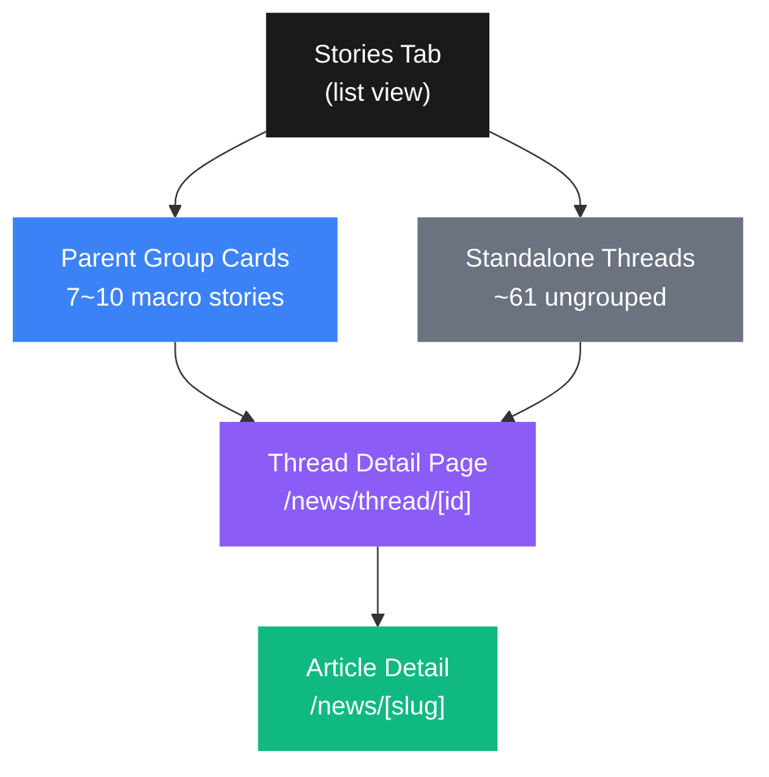
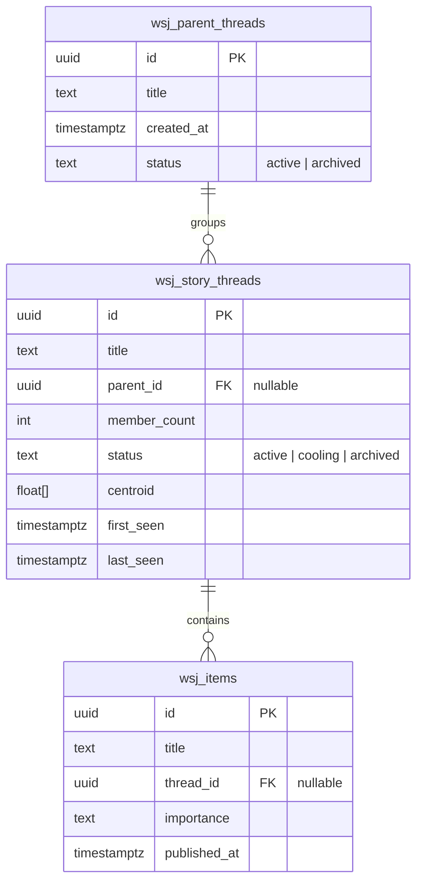
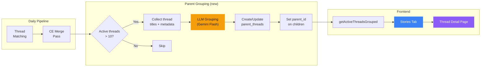
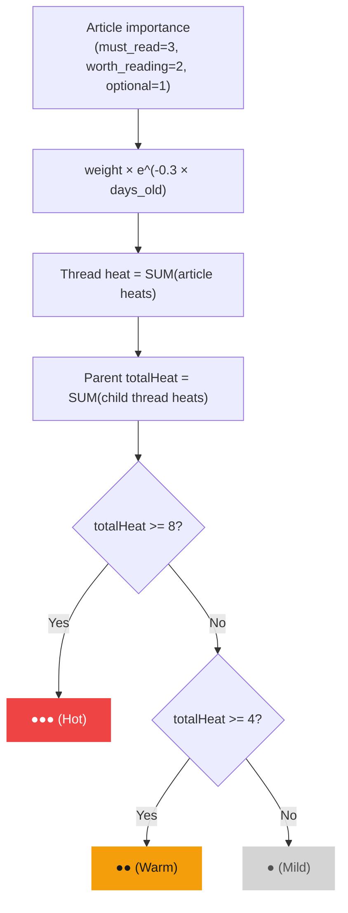
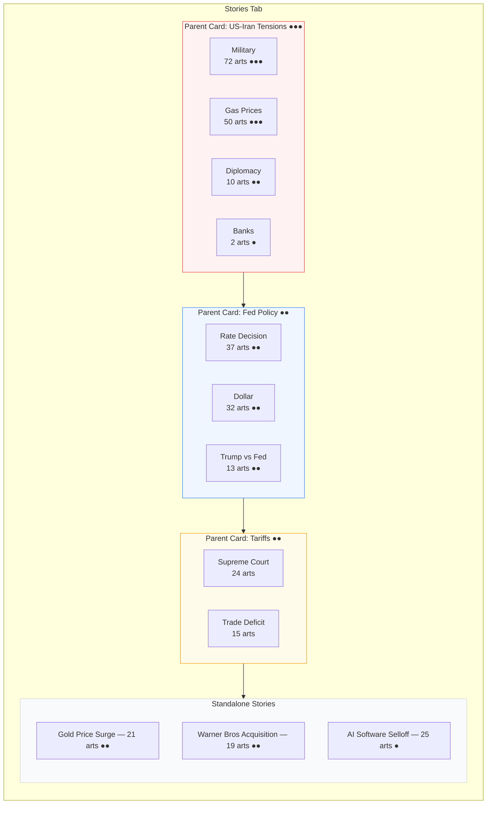
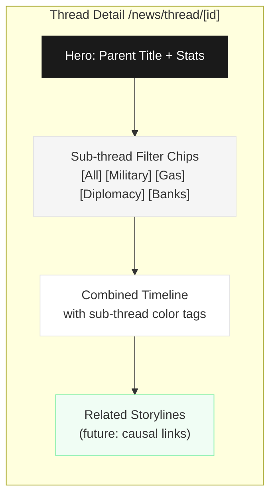
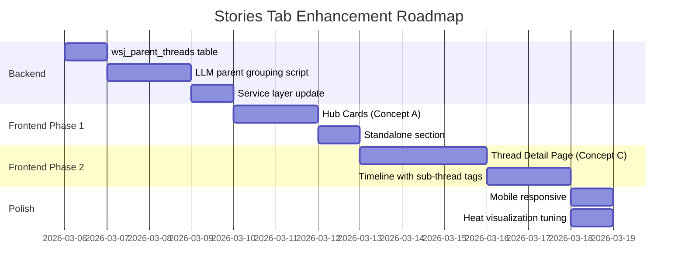

<!-- Created: 2026-03-05 -->
# Stories Tab Architecture Diagrams

> Open in VS Code with "Markdown Preview Enhanced" or "Mermaid Preview" extension to render.

## 1. Information Hierarchy

## 2. Parent Thread Data Model

## 3. Parent Grouping Pipeline

## 4. Heat Score Flow

## 5. Stories Tab Layout — Concept A (Hub Cards)

## 6. Thread Detail Page Layout

## 7. Implementation Phases

