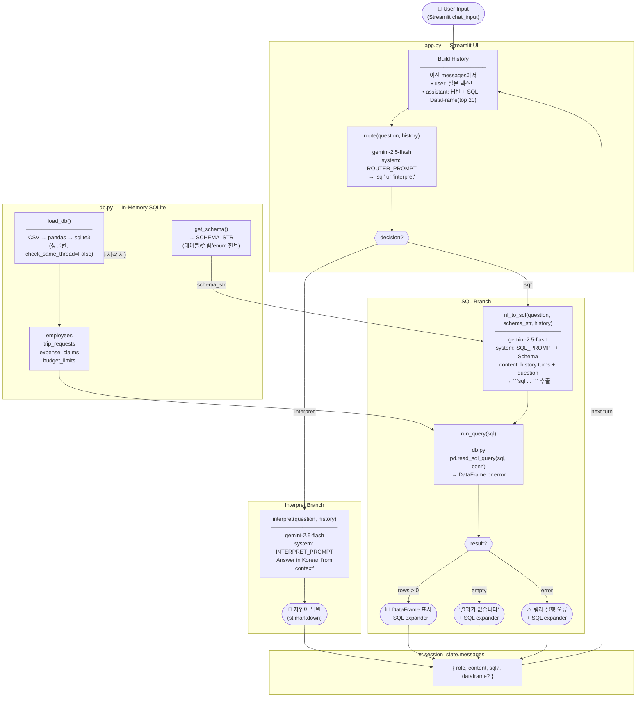

<!-- Created: 2026-02-28 -->
# Business Trip NL→SQL Chatbot — Architecture

## Overview

Streamlit 채팅 UI에서 자연어 질문을 받아 Gemini가 SQL로 변환하거나 이전 결과로 직접 답변하는 출장 데이터 조회 챗봇.

---

## Workflow Diagram



---

## Component Breakdown

### `app.py` — Streamlit UI

| 역할 | 설명 |
|------|------|
| 채팅 UI | `st.chat_message` 기반 대화 인터페이스 |
| 세션 상태 | `st.session_state.messages` — 전체 대화 히스토리 누적 |
| History 빌더 | 이전 턴의 user 질문 + assistant 답변/SQL/DataFrame(top 20)을 텍스트로 조합 |
| Router 호출 | `route()` → `"sql"` or `"interpret"` 분기 |
| 사이드바 | 스키마 참조 + 예시 질문 버튼 |

**메시지 구조:**
```python
{
    "role": "user" | "assistant",
    "content": str,          # 표시 텍스트
    "sql": str | None,       # 생성된 SQL (sql branch만)
    "dataframe": DataFrame | None  # 쿼리 결과 (sql branch만)
}
```

---

### `llm.py` — Agent Layer

세 개의 LLM 함수가 각각 하나의 역할만 담당.

#### `route(question, history)` — Router Agent

```
입력: 질문 + 대화 히스토리
출력: "sql" | "interpret"
모델: gemini-2.5-flash
역할: DB 조회 필요 여부 판단
```

판단 기준:
- `"sql"` → 새로운 데이터 조회가 필요한 질문 (e.g. "부서별 출장 건수 보여줘")
- `"interpret"` → 이전 결과로 답할 수 있는 질문 (e.g. "마케팅팀이 제일 적게 한 거야?")

#### `nl_to_sql(question, schema_str, history)` — SQL Agent

```
입력: 질문 + 스키마 문자열 + 대화 히스토리
출력: SQL 쿼리 문자열
모델: gemini-2.5-flash
역할: 자연어 → SQLite SQL 변환
```

주요 규칙:
- SELECT only (DDL/DML 금지)
- 동점 처리: `LIMIT 1` 대신 `HAVING COUNT(*) = (SELECT MAX(cnt) FROM (...))` 사용
- 한국어 값: `LIKE '%keyword%'` 패턴 사용
- Multi-turn: history를 `user/model` 교대 content로 Gemini에 전달

#### `interpret(question, history)` — Interpreter Agent

```
입력: 질문 + 대화 히스토리 (DataFrame 텍스트 포함)
출력: 자연어 답변 (한국어)
모델: gemini-2.5-flash
역할: 이전 조회 결과 기반 자연어 답변
```

---

### `db.py` — Data Layer

#### 초기화 흐름

```
앱 시작
  → load_db()
  → CSV 4개 읽기 (pandas)
  → in-memory SQLite에 적재 (pandas.to_sql)
  → 싱글턴 커넥션 캐싱 (check_same_thread=False)
```

#### 스키마 주입

`get_schema()` → `SCHEMA_STR` 반환 — 매 SQL Agent 호출 시 system prompt에 삽입.
실제 데이터(행)는 포함하지 않고 **구조와 enum 힌트만** 포함.

---

## Data Schema

```
employees
├── id          INTEGER  PK
├── name        TEXT     직원 이름
├── dept        TEXT     부서 (영업팀|개발팀|마케팅팀|인사팀|경영진)
├── level       TEXT     직급 (사원|대리|과장|부장|팀장|이사|대표)
└── approver_id INTEGER  FK → employees.id

trip_requests
├── id          INTEGER  PK
├── employee_id INTEGER  FK → employees.id
├── destination TEXT     출장지
├── purpose     TEXT     출장 목적
├── start_date  TEXT     YYYY-MM-DD
├── end_date    TEXT     YYYY-MM-DD
├── status      TEXT     pending|approved|rejected
└── approved_by INTEGER  FK → employees.id (NULL if pending)

expense_claims
├── id          INTEGER  PK
├── trip_id     INTEGER  FK → trip_requests.id
├── employee_id INTEGER  FK → employees.id
├── category    TEXT     transport|hotel|meal|etc
├── amount      INTEGER  KRW
└── status      TEXT     pending|approved|rejected

budget_limits
├── dept        TEXT     부서
├── level       TEXT     직급
├── annual_budget   INTEGER  연간 예산 (KRW)
└── per_trip_limit  INTEGER  출장당 한도 (KRW)
```

---

## File Structure

```
sandbox/
├── app.py               # Streamlit UI + router 분기 로직
├── llm.py               # route / nl_to_sql / interpret agents
├── db.py                # CSV → SQLite 로딩, SQL 실행, 스키마 정의
├── requirements.txt     # streamlit, pandas, google-genai
├── .env.example         # GEMINI_API_KEY 안내
├── data/
│   ├── employees.csv
│   ├── trip_requests.csv
│   ├── expense_claims.csv
│   └── budget_limits.csv
└── docs/
    └── architecture.md  # 이 파일
```

---

## Environment Setup

```bash
cd sandbox
python3 -m venv .venv
source .venv/bin/activate
pip install -r requirements.txt

export GEMINI_API_KEY=your-api-key
streamlit run app.py --server.headless true
```

---

## Design Decisions

| 결정 | 이유 |
|------|------|
| in-memory SQLite | 외부 DB 불필요, CSV만으로 self-contained 구성 |
| Router Agent 분리 | 단순 확인 질문도 SQL로 변환하는 문제 해결 |
| History에 DataFrame 포함 | Interpreter가 실제 숫자 기반으로 답변 가능 |
| `check_same_thread=False` | Streamlit 멀티스레드 환경에서 SQLite 커넥션 재사용 |
| `gemini-2.5-flash` | router/interpret는 간단한 작업 — pro 대비 빠르고 저렴 |
| HAVING 동점 처리 | `LIMIT 1`은 동점 시 일부 결과 누락 |
